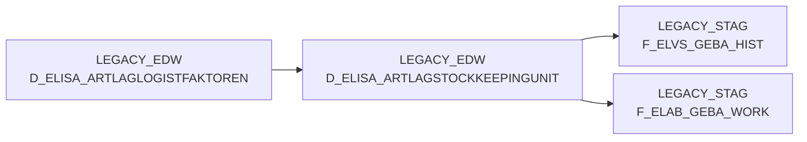

# D_ELISA_ARTLAGSTOCKKEEPINGUNIT (Table)

## Table Description

_No description available_

## Lineage / Impact

## References

The table D_ELISA_ARTLAGSTOCKKEEPINGUNIT is used in the following SAS programs:

| Application | SAS Program |
|---|---|
| [BDWH_ELABGEBA](../../Applications/BDWH_ELABGEBA) | [snow_elabgeba_100_geba_artlag_zusammenf.sas](../../Applications/BDWH_ELABGEBA/snow_elabgeba_100_geba_artlag_zusammenf.sas) |
## Table Schema

| Field Name | Datatype | Precision | Scale | Is Nullable | Constraint | Description |
|---|---|---|---|---|---|---|
| MA_LAG_ID | NUMBER | 38 | 0 | FALSE | PRIMARY KEY | Mandant-Lager-ID |
| LAGERNUMMER | NUMBER | 38 | 0 | TRUE |   | Lagernummer |
| NAN_ART_ID | NUMBER | 38 | 0 | FALSE | PRIMARY KEY | Artikel-ID |
| AKT_KZ | VARCHAR | 16777216 | 0 | FALSE | PRIMARY KEY | Aktivitätskennzeichen |
| WAEINHEIT | VARCHAR | 16777216 | 0 | TRUE | PRIMARY KEY | Warenausgangseinheit |
| SKU_GUELTIG_VON | DATE | 0 | 0 | TRUE |   | StockKeepingUnit gültig von Datum |
| SKU_GUELTIG_BIS | DATE | 0 | 0 | TRUE |   | StockKeepingUnit gültig bis Datum |
| LAENGE | NUMBER | 38 | 0 | TRUE |   | Länge in mm |
| BREITE | NUMBER | 38 | 0 | TRUE |   | Breite in mm |
| HOEHE | NUMBER | 38 | 0 | TRUE |   | Höhe in mm |
| BRUTTOGEWICHT | NUMBER | 38 | 10 | TRUE |   | Bruttogewicht in kg |
| PALETTENHOEHE | NUMBER | 38 | 0 | TRUE |   | Palettenhöhe |
| VERSORGUNG_TS | TIMESTAMP_NTZ | 9 | 0 | TRUE |   | Versorgung Timestamp |
| LAG_ID | NUMBER | 38 | 0 | TRUE |   | Lager-ID |