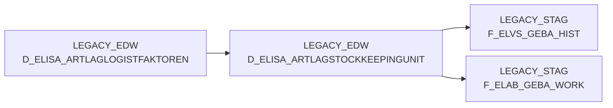

# D_ELISA_ARTLAGSTOCKKEEPINGUNIT (Table)

## Table Description

**BDWH_ELABGEBA** is a data warehouse application that manages the **ELVS core replacement** process, specifically handling the integration of ELVS GEBA data with new ELISA data sources for article warehouse management.

This dimension table contains **StockKeepingUnit (SKU) data** from ELISA article warehouse supply XML messages. It serves as a primary data source for warehouse article information including packaging units, dimensions, weights, and validity periods. The table stores detailed logistics information such as warehouse IDs, article numbers, packaging units, dimensions (length, width, height), weights (gross/net), and temporal validity ranges.

The application processes this table through a **three-step ETL pipeline** (DW013803-DW013805) that:
1. **Consolidates** ELISA SKU data with legacy ELVS GEBA data, prioritizing newer ELISA records
2. **Transfers** processed data from staging to production DMA tables
3. **Cleans up** temporary staging tables

This table is essential for **logistics operations**, providing current packaging and warehouse information that supports inventory management, shipping calculations, and warehouse optimization processes within the legacy data warehouse infrastructure.

## Lineage / Impact



## Statements

The following statements create/modify this table:

<Util>INSERT</Util> inside [BDWH_ELABGEBA/snow_elabgeba_100_geba_artlag_zusammenf.sas](../../Applications/BDWH_ELABGEBA/snow_elabgeba_100_geba_artlag_zusammenf.sas):
```sql:line-numbers
INSERT INTO PRODUCT_LSP_LEGACY_PROD.LEGACY_STAG.F_ELAB_GEBA_WORK
( MA_LAG_ID, LAGNR, NAN_ART_ID , AKT_KZ
, WAEINH, LOKAL_KZ, ZUSATZTEXT , HKLASSE, UPDKZ, GUEVDAT, GUEBDAT
, GEFAHRENGUT_KZ, LAGSTRKZ, VPEINH, GEWICHT , UPDDAT, LAENGE, BREITE, HOEHE
, VOLUMEN , BRUTTO_GEWICHT, PAL_HOEHE, ERZ_LAND , TARA_KG, TARA_PROZ
, ANZ_JE_ROLLC, RAEUMDAT, ZUGANGSDAT, RESTLZ, VERFALLDAT, CHEM_BEH
, AENDDAT, LAG_ID , ROWNUM, GUELT_VON , GUELT_BIS , ACTIVE, AKTUELL, HERKUNFT_BASIS
)
SELECT
T1.MA_LAG_ID MA_LAG_ID
, ltrim(to_char(T1.LAGERNUMMER, '000')) LAGNR
, T1.NAN_ART_ID NAN_ART_ID
, T1.AKT_KZ AKT_KZ
, COALESCE (T1.WAEINHEIT, T2.WEEINHEIT) WAEINH
, ' ' LOKAL_KZ
, ' ' ZUSATZTEXT
, ' ' HKLASSE
, ' ' UPDKZ
, T1.SKU_GUELTIG_VON GUEVDAT
, T1.SKU_GUELTIG_BIS GUEBDAT
, ' ' GEFAHRENGUT_KZ
, ' ' LAGSTRKZ
, ' ' VPEINH
, COALESCE(T2.NETTOGEWICHT*1000, T2.GEWICHT) GEWICHT
, '1900-01-01' UPDDAT
, COALESCE(T1.LAENGE, T2.TIEFE ) LAENGE
, COALESCE(T1.BREITE, T2.BREITE) BREITE
, COALESCE(T1.HOEHE, T2.HOEHE) HOEHE
, COALESCE(CAST(T1.LAENGE AS FLOAT), CAST(T2.TIEFE AS FLOAT))*COALESCE(CAST(T1.BREITE AS FLOAT), CAST(T2.BREITE AS FLOAT))*COALESCE(CAST(T1.HOEHE AS FLOAT), CAST(T2.HOEHE AS FLOAT))/1000000000 VOLUMEN
, COALESCE(T1.BRUTTOGEWICHT*1000, T2.GEWICHT) BRUTTO_GEWICHT
, COALESCE(T1.PALETTENHOEHE, T2.PALETTENHOEHE) PAL_HOEHE
, ' ' ERZ_LAND
, 0 TARA_KG
, 0 TARA_PROZ
, 0 ANZ_JE_ROLLC
, '2999-12-31' RAEUMDAT
, '1900-01-01' ZUGANGSDAT
, 0 RESTLZ
, '1900-01-01' VERFALLDAT
, ' ' CHEM_BEH
, CAST (T1.VERSORGUNG_TS AS DATE) AENDDAT
, T1.LAG_ID LAG_ID
, ROW_NUMBER() OVER(PARTITION BY T1.MA_LAG_ID, T1.NAN_ART_ID, T1.AKT_KZ, T1.WAEINHEIT
ORDER BY T1.SKU_GUELTIG_VON DESC, T1.SKU_GUELTIG_BIS DESC, T1.VERSORGUNG_TS DESC) ROWNUM
, CURRENT_DATE GUELT_VON
, '9999-12-31' GUELT_BIS
, 0 ACTIVE
, 1 AKTUELL
, 'ELAB' HERKUNFT_BASIS
FROM PRODUCT_LSP_LEGACY_PROD.LEGACY_EDW.D_ELISA_ARTLAGSTOCKKEEPINGUNIT T1
LEFT JOIN (SELECT MA_LAG_ID MA_LAG_ID, NAN_ART_ID NAN_ART_ID, AKT_KZ AKT_KZ, WEEINHEIT
, MAX(TIEFE) TIEFE, MAX(BREITE) BREITE, MAX(HOEHE) HOEHE, MAX(NETTOGEWICHT) NETTOGEWICHT
, MAX(GEWICHT) GEWICHT, MAX(PALETTENHOEHE) PALETTENHOEHE
FROM PRODUCT_LSP_LEGACY_PROD.LEGACY_EDW.D_ELISA_ARTLAGLOGISTFAKTOREN
GROUP BY MA_LAG_ID, NAN_ART_ID, AKT_KZ, WEEINHEIT) T2
ON T1.MA_LAG_ID = T2.MA_LAG_ID
AND T1.NAN_ART_ID = T2. NAN_ART_ID
AND T1.AKT_KZ = T2.AKT_KZ
AND T1.WAEINHEIT = T2.WEEINHEIT
QUALIFY ROWNUM=1
```

## References

The table D_ELISA_ARTLAGSTOCKKEEPINGUNIT is used in the following SAS programs:

| Application | SAS Program |
|---|---|
| [BDWH_ELABGEBA](../../Applications/BDWH_ELABGEBA) | [snow_elabgeba_100_geba_artlag_zusammenf.sas](../../Applications/BDWH_ELABGEBA/snow_elabgeba_100_geba_artlag_zusammenf.sas) |
## Table Schema

| Field Name | Datatype | Precision | Scale | Is Nullable | Constraint | Description |
|---|---|---|---|---|---|---|
| MA_LAG_ID | NUMBER | 38 | 0 | FALSE | PRIMARY KEY | Mandant-Lager-ID |
| LAGERNUMMER | NUMBER | 38 | 0 | TRUE |   | Lagernummer |
| NAN_ART_ID | NUMBER | 38 | 0 | FALSE | PRIMARY KEY | Artikel-ID |
| AKT_KZ | VARCHAR | 16777216 | 0 | FALSE | PRIMARY KEY | Aktivitätskennzeichen |
| WAEINHEIT | VARCHAR | 16777216 | 0 | TRUE | PRIMARY KEY | Warenausgangseinheit |
| SKU_GUELTIG_VON | DATE | 0 | 0 | TRUE |   | StockKeepingUnit gültig von Datum |
| SKU_GUELTIG_BIS | DATE | 0 | 0 | TRUE |   | StockKeepingUnit gültig bis Datum |
| LAENGE | NUMBER | 38 | 0 | TRUE |   | Länge in mm |
| BREITE | NUMBER | 38 | 0 | TRUE |   | Breite in mm |
| HOEHE | NUMBER | 38 | 0 | TRUE |   | Höhe in mm |
| BRUTTOGEWICHT | NUMBER | 38 | 10 | TRUE |   | Bruttogewicht in kg |
| PALETTENHOEHE | NUMBER | 38 | 0 | TRUE |   | Palettenhöhe |
| VERSORGUNG_TS | TIMESTAMP_NTZ | 9 | 0 | TRUE |   | Versorgung Timestamp |
| LAG_ID | NUMBER | 38 | 0 | TRUE |   | Lager-ID |