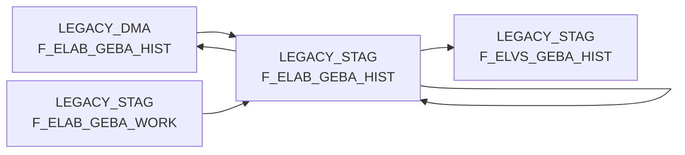

# F_ELAB_GEBA_HIST (Table)

## Table Description

_No description available_

## Lineage / Impact

## References

The table F_ELAB_GEBA_HIST is used in the following SAS programs:

| Application | SAS Program |
|---|---|
| [BDWH_ELABGEBA](../../Applications/BDWH_ELABGEBA) | [snow_elabgeba_200_nach_dma.sas](../../Applications/BDWH_ELABGEBA/snow_elabgeba_200_nach_dma.sas) |
| [BDWH_ELABGEBA](../../Applications/BDWH_ELABGEBA) | [snow_elabgeba_100_geba_artlag_zusammenf.sas](../../Applications/BDWH_ELABGEBA/snow_elabgeba_100_geba_artlag_zusammenf.sas) |
## Table Schema

| Field Name | Datatype | Precision | Scale | Is Nullable | Constraint | Description |
|---|---|---|---|---|---|---|
| MA_LAG_ID | INTEGER |  |  | FALSE | PRIMARY KEY | Lager ID |
| LAGNR | VARCHAR | 3 |  | FALSE | PRIMARY KEY | Lagernummer |
| NAN_ART_ID | INTEGER |  |  | FALSE | PRIMARY KEY | Artikel ID |
| AKT_KZ | VARCHAR | 1 |  | FALSE | PRIMARY KEY | Aktionskennzeichen |
| WAEINH | VARCHAR | 10 |  | FALSE | PRIMARY KEY | Warenausgangseinheit |
| LOKAL_KZ | VARCHAR | 1 |  | TRUE |   | Lokalkennzeichen |
| ZUSATZTEXT | VARCHAR | 255 |  | TRUE |   | Zusatztext |
| HKLASSE | VARCHAR | 10 |  | TRUE |   | Handelsklasse |
| UPDKZ | VARCHAR | 1 |  | TRUE |   | Update-Kennzeichen |
| GUEVDAT | DATE |  |  | TRUE |   | Gueltig von Datum |
| GUEBDAT | DATE |  |  | TRUE |   | Gueltig bis Datum |
| GEFAHRENGUT_KZ | VARCHAR | 1 |  | TRUE |   | Gefahrengut-Kennzeichen |
| LAGSTRKZ | VARCHAR | 10 |  | TRUE |   | Lagerstruktur-Kennzeichen |
| VPEINH | VARCHAR | 10 |  | TRUE |   | Verpackungseinheit |
| GEWICHT | DECIMAL | 15 | 3 | TRUE |   | Gewicht |
| UPDDAT | DATE |  |  | TRUE |   | Update-Datum |
| LAENGE | DECIMAL | 15 | 3 | TRUE |   | Laenge in mm |
| BREITE | DECIMAL | 15 | 3 | TRUE |   | Breite in mm |
| HOEHE | DECIMAL | 15 | 3 | TRUE |   | Hoehe in mm |
| VOLUMEN | DECIMAL | 15 | 9 | TRUE |   | Volumen in m3 |
| BRUTTO_GEWICHT | DECIMAL | 15 | 3 | TRUE |   | Bruttogewicht |
| PAL_HOEHE | DECIMAL | 15 | 3 | TRUE |   | Palettenhoehe |
| ERZ_LAND | VARCHAR | 3 |  | TRUE |   | Erzeugerland |
| TARA_KG | DECIMAL | 15 | 3 | TRUE |   | Tara in kg |
| TARA_PROZ | DECIMAL | 5 | 2 | TRUE |   | Tara in Prozent |
| ANZ_JE_ROLLC | INTEGER |  |  | TRUE |   | TRUE |
| RAEUMDAT | DATE |  |  | TRUE |   | Raeumungsdatum |
| ZUGANGSDAT | DATE |  |  | TRUE |   | Zugangsdatum |
| RESTLZ | INTEGER |  |  | TRUE |   | TRUE |
| VERFALLDAT | DATE |  |  | TRUE |   | Verfallsdatum |
| CHEM_BEH | VARCHAR | 10 |  | TRUE |   | Chemische Behandlung |
| AENDDAT | DATE |  |  | TRUE |   | Aenderungsdatum |
| LAG_ID | INTEGER |  |  | TRUE |   | TRUE |
| GUELT_VON | DATE |  |  | TRUE |   | Gueltigkeitsbeginn |
| GUELT_BIS | DATE |  |  | TRUE |   | Gueltigkeitsende |
| ACTIVE | INTEGER |  |  | TRUE |   | TRUE |
| AKTUELL | INTEGER |  |  | TRUE |   | TRUE |
| HERKUNFT_BASIS | VARCHAR | 10 |  | TRUE |   | Herkunftsbasis ELVS oder ELAB |