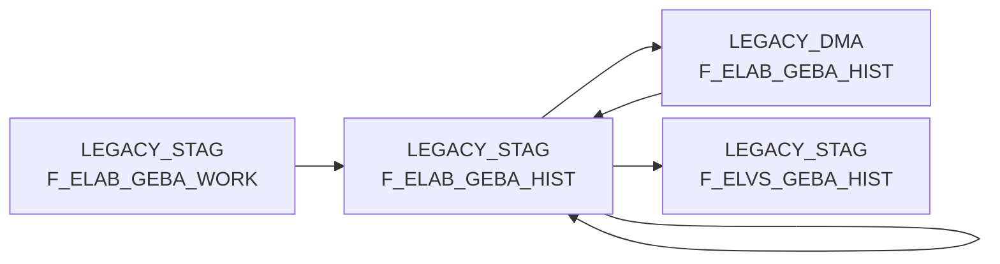

# F_ELAB_GEBA_HIST (Table)

## Table Description

**F_ELAB_GEBA_HIST** is a historical staging table within the **BDWH_ELABGEBA** application that supports the migration from legacy ELVS (Electronic Logistics and Supply System) to the new ELISA article warehouse supply system.

This table serves as an **intermediate staging layer** for historical GEBA (container unit data for goods issue) records during the data transformation process. It maintains historical versions of container unit information including dimensions, weights, validity periods, and logistics factors.

The table is populated through a **three-step ETL process**: first combining ELISA stockkeeping unit data with logistics factors, then supplementing with legacy ELVS data where new data is unavailable, and finally implementing historization logic to preserve data lineage. Key fields include warehouse and article identifiers, container dimensions, weights, validity dates, and source system indicators.

This staging table supports the **core business requirement** of maintaining continuous access to container unit data during the system migration, ensuring that downstream processes like warehouse management and logistics planning remain operational. The historization approach preserves both current and historical data states, enabling audit trails and supporting business processes that depend on historical container specifications.

## Lineage / Impact



## Statements

The following statements create/modify this table:

<Util>DELETE</Util> inside [BDWH_ELABGEBA/snow_elabgeba_100_geba_artlag_zusammenf.sas](../../Applications/BDWH_ELABGEBA/snow_elabgeba_100_geba_artlag_zusammenf.sas):
```sql:line-numbers
DELETE FROM PRODUCT_LSP_LEGACY_PROD.LEGACY_STAG.F_ELAB_GEBA_HIST
```
<Util>UPDATE</Util> inside [BDWH_ELABGEBA/snow_elabgeba_100_geba_artlag_zusammenf.sas](../../Applications/BDWH_ELABGEBA/snow_elabgeba_100_geba_artlag_zusammenf.sas):
```sql:line-numbers
UPDATE PRODUCT_LSP_LEGACY_PROD.LEGACY_STAG.F_ELAB_GEBA_HIST
SET AKTUELL = 0 ,
GUELT_BIS =
CASE WHEN (GUELT_BIS = DATE '9999-12-31') THEN (CURRENT_DATE -1)
ELSE GUELT_BIS
END
```
<Util>DELETE</Util> inside [BDWH_ELABGEBA/snow_elabgeba_300_stag_loeschen.sas](../../Applications/BDWH_ELABGEBA/snow_elabgeba_300_stag_loeschen.sas):
```sql:line-numbers
delete from PRODUCT_LSP_LEGACY_PROD.LEGACY_STAG.F_ELAB_GEBA_HIST
```
<Util>INSERT</Util> inside [BDWH_ELABGEBA/snow_elabgeba_200_nach_dma.sas](../../Applications/BDWH_ELABGEBA/snow_elabgeba_200_nach_dma.sas):
```sql:line-numbers
insert into PRODUCT_LSP_LEGACY_PROD.LEGACY_DMA.F_ELAB_GEBA_HIST select * from PRODUCT_LSP_LEGACY_PROD.LEGACY_STAG.F_ELAB_GEBA_HIST
```
<Util>MERGE</Util> inside [BDWH_ELABGEBA/snow_elabgeba_100_geba_artlag_zusammenf.sas](../../Applications/BDWH_ELABGEBA/snow_elabgeba_100_geba_artlag_zusammenf.sas):
```sql:line-numbers
MERGE INTO PRODUCT_LSP_LEGACY_PROD.LEGACY_STAG.F_ELAB_GEBA_HIST HIST
USING PRODUCT_LSP_LEGACY_PROD.LEGACY_STAG.F_ELAB_GEBA_WORK GEBA
ON
HIST.LAGNR = GEBA.LAGNR AND
HIST.MA_LAG_ID = GEBA.MA_LAG_ID AND
HIST.NAN_ART_ID = GEBA.NAN_ART_ID AND
HIST.AKT_KZ = GEBA.AKT_KZ AND
HIST.WAEINH = GEBA.WAEINH
WHEN MATCHED THEN
UPDATE SET
LOKAL_KZ = GEBA.LOKAL_KZ,
ZUSATZTEXT = GEBA.ZUSATZTEXT,
HKLASSE = GEBA.HKLASSE,
UPDKZ = GEBA.UPDKZ,
GUEVDAT = GEBA.GUEVDAT,
GUEBDAT = GEBA.GUEBDAT,
GEFAHRENGUT_KZ = GEBA.GEFAHRENGUT_KZ,
LAGSTRKZ = GEBA.LAGSTRKZ,
VPEINH = GEBA.VPEINH,
GEWICHT = GEBA.GEWICHT,
UPDDAT = GEBA.UPDDAT,
LAENGE = GEBA.LAENGE,
BREITE = GEBA.BREITE,
HOEHE = GEBA.HOEHE,
VOLUMEN = GEBA.VOLUMEN,
BRUTTO_GEWICHT = GEBA.BRUTTO_GEWICHT,
PAL_HOEHE = GEBA.PAL_HOEHE,
ERZ_LAND = GEBA.ERZ_LAND,
TARA_KG = GEBA.TARA_KG,
TARA_PROZ = GEBA.TARA_PROZ,
ANZ_JE_ROLLC = GEBA.ANZ_JE_ROLLC,
RAEUMDAT = GEBA.RAEUMDAT,
ZUGANGSDAT = GEBA.ZUGANGSDAT,
RESTLZ = GEBA.RESTLZ,
VERFALLDAT = GEBA.VERFALLDAT,
CHEM_BEH = GEBA.CHEM_BEH,
AENDDAT = GEBA.AENDDAT,
LAG_ID = GEBA.LAG_ID,
GUELT_BIS = GEBA.GUELT_BIS,
ACTIVE = GEBA.ACTIVE,
AKTUELL = GEBA.AKTUELL,
HERKUNFT_BASIS = GEBA.HERKUNFT_BASIS
WHEN NOT MATCHED THEN
INSERT VALUES
(
GEBA.MA_LAG_ID,
GEBA.LAGNR,
GEBA.NAN_ART_ID ,
GEBA.AKT_KZ,
GEBA.WAEINH ,
GEBA.LOKAL_KZ,
GEBA.ZUSATZTEXT ,
GEBA.HKLASSE,
GEBA.UPDKZ,
GEBA.GUEVDAT,
GEBA.GUEBDAT,
GEBA.GEFAHRENGUT_KZ,
GEBA.LAGSTRKZ,
GEBA.VPEINH,
GEBA.GEWICHT,
GEBA.UPDDAT,
GEBA.LAENGE,
GEBA.BREITE,
GEBA.HOEHE,
GEBA.VOLUMEN,
GEBA.BRUTTO_GEWICHT,
GEBA.PAL_HOEHE,
GEBA.ERZ_LAND,
GEBA.TARA_KG,
GEBA.TARA_PROZ,
GEBA.ANZ_JE_ROLLC,
GEBA.RAEUMDAT,
GEBA.ZUGANGSDAT,
GEBA.RESTLZ,
GEBA.VERFALLDAT,
GEBA.CHEM_BEH,
GEBA.AENDDAT,
GEBA.LAG_ID,
GEBA.GUELT_VON,
GEBA.GUELT_BIS,
GEBA.ACTIVE,
GEBA.AKTUELL,
GEBA.HERKUNFT_BASIS)
```
<Util>INSERT</Util> inside [BDWH_ELABGEBA/snow_elabgeba_100_geba_artlag_zusammenf.sas](../../Applications/BDWH_ELABGEBA/snow_elabgeba_100_geba_artlag_zusammenf.sas):
```sql:line-numbers
INSERT INTO PRODUCT_LSP_LEGACY_PROD.LEGACY_STAG.F_ELAB_GEBA_HIST
SELECT T1.* FROM PRODUCT_LSP_LEGACY_PROD.LEGACY_DMA.F_ELAB_GEBA_HIST T1
```

## References

The table F_ELAB_GEBA_HIST is used in the following SAS programs:

| Application | SAS Program |
|---|---|
| [BDWH_ELABGEBA](../../Applications/BDWH_ELABGEBA) | [snow_elabgeba_200_nach_dma.sas](../../Applications/BDWH_ELABGEBA/snow_elabgeba_200_nach_dma.sas) |
| [BDWH_ELABGEBA](../../Applications/BDWH_ELABGEBA) | [snow_elabgeba_100_geba_artlag_zusammenf.sas](../../Applications/BDWH_ELABGEBA/snow_elabgeba_100_geba_artlag_zusammenf.sas) |
## Table Schema

| Field Name | Datatype | Precision | Scale | Is Nullable | Constraint | Description |
|---|---|---|---|---|---|---|
| MA_LAG_ID | INTEGER |  |  | FALSE | PRIMARY KEY | Lager ID |
| LAGNR | VARCHAR | 3 |  | FALSE | PRIMARY KEY | Lagernummer |
| NAN_ART_ID | INTEGER |  |  | FALSE | PRIMARY KEY | Artikel ID |
| AKT_KZ | VARCHAR | 1 |  | FALSE | PRIMARY KEY | Aktionskennzeichen |
| WAEINH | VARCHAR | 10 |  | FALSE | PRIMARY KEY | Warenausgangseinheit |
| LOKAL_KZ | VARCHAR | 1 |  | TRUE |   | Lokalkennzeichen |
| ZUSATZTEXT | VARCHAR | 255 |  | TRUE |   | Zusatztext |
| HKLASSE | VARCHAR | 10 |  | TRUE |   | Handelsklasse |
| UPDKZ | VARCHAR | 1 |  | TRUE |   | Update-Kennzeichen |
| GUEVDAT | DATE |  |  | TRUE |   | Gueltig von Datum |
| GUEBDAT | DATE |  |  | TRUE |   | Gueltig bis Datum |
| GEFAHRENGUT_KZ | VARCHAR | 1 |  | TRUE |   | Gefahrengut-Kennzeichen |
| LAGSTRKZ | VARCHAR | 10 |  | TRUE |   | Lagerstruktur-Kennzeichen |
| VPEINH | VARCHAR | 10 |  | TRUE |   | Verpackungseinheit |
| GEWICHT | DECIMAL | 15 | 3 | TRUE |   | Gewicht |
| UPDDAT | DATE |  |  | TRUE |   | Update-Datum |
| LAENGE | DECIMAL | 15 | 3 | TRUE |   | Laenge in mm |
| BREITE | DECIMAL | 15 | 3 | TRUE |   | Breite in mm |
| HOEHE | DECIMAL | 15 | 3 | TRUE |   | Hoehe in mm |
| VOLUMEN | DECIMAL | 15 | 9 | TRUE |   | Volumen in m3 |
| BRUTTO_GEWICHT | DECIMAL | 15 | 3 | TRUE |   | Bruttogewicht |
| PAL_HOEHE | DECIMAL | 15 | 3 | TRUE |   | Palettenhoehe |
| ERZ_LAND | VARCHAR | 3 |  | TRUE |   | Erzeugerland |
| TARA_KG | DECIMAL | 15 | 3 | TRUE |   | Tara in kg |
| TARA_PROZ | DECIMAL | 5 | 2 | TRUE |   | Tara in Prozent |
| ANZ_JE_ROLLC | INTEGER |  |  | TRUE |   | TRUE |
| RAEUMDAT | DATE |  |  | TRUE |   | Raeumungsdatum |
| ZUGANGSDAT | DATE |  |  | TRUE |   | Zugangsdatum |
| RESTLZ | INTEGER |  |  | TRUE |   | TRUE |
| VERFALLDAT | DATE |  |  | TRUE |   | Verfallsdatum |
| CHEM_BEH | VARCHAR | 10 |  | TRUE |   | Chemische Behandlung |
| AENDDAT | DATE |  |  | TRUE |   | Aenderungsdatum |
| LAG_ID | INTEGER |  |  | TRUE |   | TRUE |
| GUELT_VON | DATE |  |  | TRUE |   | Gueltigkeitsbeginn |
| GUELT_BIS | DATE |  |  | TRUE |   | Gueltigkeitsende |
| ACTIVE | INTEGER |  |  | TRUE |   | TRUE |
| AKTUELL | INTEGER |  |  | TRUE |   | TRUE |
| HERKUNFT_BASIS | VARCHAR | 10 |  | TRUE |   | Herkunftsbasis ELVS oder ELAB |