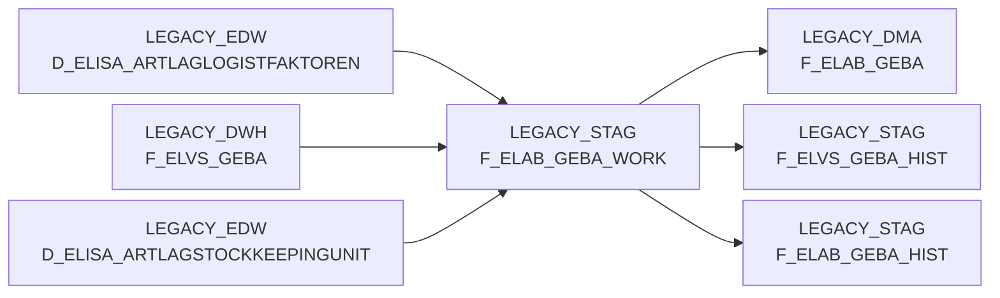

# F_ELAB_GEBA_WORK (Table)

## Table Description

_No description available_

## Lineage / Impact

## References

The table F_ELAB_GEBA_WORK is used in the following SAS programs:

| Application | SAS Program |
|---|---|
| [BDWH_ELABGEBA](../../Applications/BDWH_ELABGEBA) | [snow_elabgeba_100_geba_artlag_zusammenf.sas](../../Applications/BDWH_ELABGEBA/snow_elabgeba_100_geba_artlag_zusammenf.sas) |
| [BDWH_ELABGEBA](../../Applications/BDWH_ELABGEBA) | [snow_elabgeba_200_nach_dma.sas](../../Applications/BDWH_ELABGEBA/snow_elabgeba_200_nach_dma.sas) |
## Table Schema

| Field Name | Datatype | Precision | Scale | Is Nullable | Constraint | Description |
|---|---|---|---|---|---|---|
| MA_LAG_ID | INTEGER |  |  | FALSE | PRIMARY KEY | Warehouse ID |
| LAGNR | VARCHAR | 3 |  | FALSE | PRIMARY KEY | Warehouse number |
| NAN_ART_ID | INTEGER |  |  | FALSE | PRIMARY KEY | Article ID |
| AKT_KZ | VARCHAR | 1 |  | FALSE | PRIMARY KEY | Active indicator |
| WAEINH | VARCHAR | 10 |  | FALSE | PRIMARY KEY | Goods issue unit |
| LOKAL_KZ | VARCHAR | 1 |  | TRUE |   | Local indicator |
| ZUSATZTEXT | VARCHAR | 255 |  | TRUE |   | Additional text |
| HKLASSE | VARCHAR | 10 |  | TRUE |   | Hazard class |
| UPDKZ | VARCHAR | 1 |  | TRUE |   | Update indicator |
| GUEVDAT | DATE |  |  | TRUE |   | TRUE |
| GUEBDAT | DATE |  |  | TRUE |   | TRUE |
| GEFAHRENGUT_KZ | VARCHAR | 1 |  | TRUE |   | Dangerous goods indicator |
| LAGSTRKZ | VARCHAR | 10 |  | TRUE |   | Storage structure indicator |
| VPEINH | VARCHAR | 10 |  | TRUE |   | Packaging unit |
| GEWICHT | FLOAT | 15 | 3 | TRUE |   | Weight |
| UPDDAT | DATE |  |  | TRUE |   | TRUE |
| LAENGE | FLOAT | 15 | 3 | TRUE |   | Length |
| BREITE | FLOAT | 15 | 3 | TRUE |   | Width |
| HOEHE | FLOAT | 15 | 3 | TRUE |   | Height |
| VOLUMEN | FLOAT | 15 | 9 | TRUE |   | Volume |
| BRUTTO_GEWICHT | FLOAT | 15 | 3 | TRUE |   | Gross weight |
| PAL_HOEHE | FLOAT | 15 | 3 | TRUE |   | Pallet height |
| ERZ_LAND | VARCHAR | 3 |  | TRUE |   | Country of origin |
| TARA_KG | FLOAT | 15 | 3 | TRUE |   | Tare weight in kg |
| TARA_PROZ | FLOAT | 15 | 3 | TRUE |   | Tare percentage |
| ANZ_JE_ROLLC | INTEGER |  |  | TRUE |   | TRUE |
| RAEUMDAT | DATE |  |  | TRUE |   | TRUE |
| ZUGANGSDAT | DATE |  |  | TRUE |   | TRUE |
| RESTLZ | INTEGER |  |  | TRUE |   | TRUE |
| VERFALLDAT | DATE |  |  | TRUE |   | TRUE |
| CHEM_BEH | VARCHAR | 10 |  | TRUE |   | Chemical treatment |
| AENDDAT | DATE |  |  | TRUE |   | TRUE |
| LAG_ID | INTEGER |  |  | TRUE |   | TRUE |
| ROWNUM | INTEGER |  |  | TRUE |   | TRUE |
| GUELT_VON | DATE |  |  | TRUE |   | TRUE |
| GUELT_BIS | DATE |  |  | TRUE |   | TRUE |
| ACTIVE | INTEGER |  |  | TRUE |   | TRUE |
| AKTUELL | INTEGER |  |  | TRUE |   | TRUE |
| HERKUNFT_BASIS | VARCHAR | 10 |  | TRUE |   | Source basis (ELAB or ELVS) |