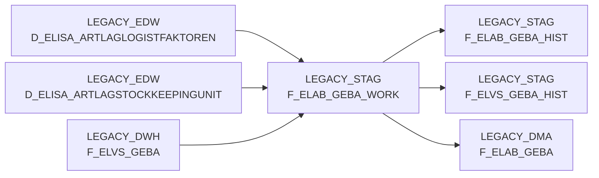

# F_ELAB_GEBA_WORK (Table)

## Table Description

**F_ELAB_GEBA_WORK** is a staging work table within the **BDWH_ELABGEBA** application that serves as the primary processing workspace for the ELVS core replacement initiative. This table consolidates **ELVS GEBA** (container unit data for goods issue) with new data sources from **ELISA** article warehouse supply system.

The table combines data from two main sources: XML messages from ELISA article warehouse logistics containing logistic factors and stockkeeping units, and legacy ELVS GEBA data. It processes container unit information including warehouse locations, article IDs, dimensions, weights, and validity periods. The application implements a sophisticated merge logic where newer ELISA data takes precedence, with legacy ELVS data used as fallback when no corresponding ELISA records exist.

This staging table supports the migration from original ELVS tables (DWH.F_ELVS_GEBA, DWH.F_ELVS_GEBA_HIST) to new target tables (DMA.F_ELAB_GEBA, DMA.F_ELAB_GEBA_HIST). The processing includes deduplication logic, historization capabilities, and data quality enhancements. The table structure maintains compatibility with existing MSI_DWH views that will be redirected to the new target tables upon completion of the core replacement process.

## Lineage / Impact



## Statements

The following statements create/modify this table:


<Util>DELETE</Util> inside [BDWH_ELABGEBA/snow_elabgeba_300_stag_loeschen.sas](../../Applications/BDWH_ELABGEBA/snow_elabgeba_300_stag_loeschen.sas):
```sql:line-numbers
delete from PRODUCT_LSP_LEGACY_PROD.LEGACY_STAG.F_ELAB_GEBA_WORK
```
<Util>DELETE</Util> inside [BDWH_ELABGEBA/snow_elabgeba_100_geba_artlag_zusammenf.sas](../../Applications/BDWH_ELABGEBA/snow_elabgeba_100_geba_artlag_zusammenf.sas):
```sql:line-numbers
DELETE FROM PRODUCT_LSP_LEGACY_PROD.LEGACY_STAG.F_ELAB_GEBA_WORK
```
<Util>INSERT</Util> inside [BDWH_ELABGEBA/snow_elabgeba_100_geba_artlag_zusammenf.sas](../../Applications/BDWH_ELABGEBA/snow_elabgeba_100_geba_artlag_zusammenf.sas):
```sql:line-numbers
INSERT INTO
  PRODUCT_LSP_LEGACY_PROD.LEGACY_STAG.F_ELAB_GEBA_WORK (
    MA_LAG_ID,
    LAGNR,
    NAN_ART_ID,
    AKT_KZ,
    WAEINH,
    LOKAL_KZ,
    ZUSATZTEXT,
    HKLASSE,
    UPDKZ,
    GUEVDAT,
    GUEBDAT,
    GEFAHRENGUT_KZ,
    LAGSTRKZ,
    VPEINH,
    GEWICHT,
    UPDDAT,
    LAENGE,
    BREITE,
    HOEHE,
    VOLUMEN,
    BRUTTO_GEWICHT,
    PAL_HOEHE,
    ERZ_LAND,
    TARA_KG,
    TARA_PROZ,
    ANZ_JE_ROLLC,
    RAEUMDAT,
    ZUGANGSDAT,
    RESTLZ,
    VERFALLDAT,
    CHEM_BEH,
    AENDDAT,
    LAG_ID,
    ROWNUM,
    GUELT_VON,
    GUELT_BIS,
    ACTIVE,
    AKTUELL,
    HERKUNFT_BASIS
  )
SELECT
  T1.MA_LAG_ID MA_LAG_ID,
  ltrim(to_char(T1.LAGERNUMMER, '000')) LAGNR,
  T1.NAN_ART_ID NAN_ART_ID,
  T1.AKT_KZ AKT_KZ,
  COALESCE (T1.WAEINHEIT, T2.WEEINHEIT) WAEINH,
  ' ' LOKAL_KZ,
  ' ' ZUSATZTEXT,
  ' ' HKLASSE,
  ' ' UPDKZ,
  T1.SKU_GUELTIG_VON GUEVDAT,
  T1.SKU_GUELTIG_BIS GUEBDAT,
  ' ' GEFAHRENGUT_KZ,
  ' ' LAGSTRKZ,
  ' ' VPEINH,
  COALESCE(T2.NETTOGEWICHT * 1000, T2.GEWICHT) GEWICHT,
  '1900-01-01' UPDDAT,
  COALESCE(T1.LAENGE, T2.TIEFE) LAENGE,
  COALESCE(T1.BREITE, T2.BREITE) BREITE,
  COALESCE(T1.HOEHE, T2.HOEHE) HOEHE,
  COALESCE(
    CAST(T1.LAENGE AS FLOAT),
    CAST(T2.TIEFE AS FLOAT)
  ) * COALESCE(
    CAST(T1.BREITE AS FLOAT),
    CAST(T2.BREITE AS FLOAT)
  ) * COALESCE(CAST(T1.HOEHE AS FLOAT), CAST(T2.HOEHE AS FLOAT)) / 1000000000 VOLUMEN,
  COALESCE(T1.BRUTTOGEWICHT * 1000, T2.GEWICHT) BRUTTO_GEWICHT,
  COALESCE(T1.PALETTENHOEHE, T2.PALETTENHOEHE) PAL_HOEHE,
  ' ' ERZ_LAND,
  0 TARA_KG,
  0 TARA_PROZ,
  0 ANZ_JE_ROLLC,
  '2999-12-31' RAEUMDAT,
  '1900-01-01' ZUGANGSDAT,
  0 RESTLZ,
  '1900-01-01' VERFALLDAT,
  ' ' CHEM_BEH,
  CAST (T1.VERSORGUNG_TS AS DATE) AENDDAT,
  T1.LAG_ID LAG_ID,
  ROW_NUMBER() OVER(
    PARTITION BY T1.MA_LAG_ID,
    T1.NAN_ART_ID,
    T1.AKT_KZ,
    T1.WAEINHEIT
    ORDER BY
      T1.SKU_GUELTIG_VON DESC,
      T1.SKU_GUELTIG_BIS DESC,
      T1.VERSORGUNG_TS DESC
  ) ROWNUM,
  CURRENT_DATE GUELT_VON,
  '9999-12-31' GUELT_BIS,
  0 ACTIVE,
  1 AKTUELL,
  'ELAB' HERKUNFT_BASIS
FROM
  PRODUCT_LSP_LEGACY_PROD.LEGACY_EDW.D_ELISA_ARTLAGSTOCKKEEPINGUNIT T1
  LEFT JOIN (
    SELECT
      MA_LAG_ID MA_LAG_ID,
      NAN_ART_ID NAN_ART_ID,
      AKT_KZ AKT_KZ,
      WEEINHEIT,
      MAX(TIEFE) TIEFE,
      MAX(BREITE) BREITE,
      MAX(HOEHE) HOEHE,
      MAX(NETTOGEWICHT) NETTOGEWICHT,
      MAX(GEWICHT) GEWICHT,
      MAX(PALETTENHOEHE) PALETTENHOEHE
    FROM
      PRODUCT_LSP_LEGACY_PROD.LEGACY_EDW.D_ELISA_ARTLAGLOGISTFAKTOREN
    GROUP BY
      MA_LAG_ID,
      NAN_ART_ID,
      AKT_KZ,
      WEEINHEIT
  ) T2 ON T1.MA_LAG_ID = T2.MA_LAG_ID
  AND T1.NAN_ART_ID = T2.NAN_ART_ID
  AND T1.AKT_KZ = T2.AKT_KZ
  AND T1.WAEINHEIT = T2.WEEINHEIT QUALIFY ROWNUM = 1
```

## References

The table F_ELAB_GEBA_WORK is used in the following SAS programs:

| Application | SAS Program |
|---|---|
| [BDWH_ELABGEBA](../../Applications/BDWH_ELABGEBA) | [snow_elabgeba_100_geba_artlag_zusammenf.sas](../../Applications/BDWH_ELABGEBA/snow_elabgeba_100_geba_artlag_zusammenf.sas) |
| [BDWH_ELABGEBA](../../Applications/BDWH_ELABGEBA) | [snow_elabgeba_200_nach_dma.sas](../../Applications/BDWH_ELABGEBA/snow_elabgeba_200_nach_dma.sas) |
## Table Schema

| Field Name | Datatype | Precision | Scale | Is Nullable | Constraint | Description |
|---|---|---|---|---|---|---|
| MA_LAG_ID | INTEGER |  |  | FALSE | PRIMARY KEY | Warehouse ID |
| LAGNR | VARCHAR | 3 |  | FALSE | PRIMARY KEY | Warehouse number |
| NAN_ART_ID | INTEGER |  |  | FALSE | PRIMARY KEY | Article ID |
| AKT_KZ | VARCHAR | 1 |  | FALSE | PRIMARY KEY | Active indicator |
| WAEINH | VARCHAR | 10 |  | FALSE | PRIMARY KEY | Goods issue unit |
| LOKAL_KZ | VARCHAR | 1 |  | TRUE |   | Local indicator |
| ZUSATZTEXT | VARCHAR | 255 |  | TRUE |   | Additional text |
| HKLASSE | VARCHAR | 10 |  | TRUE |   | Hazard class |
| UPDKZ | VARCHAR | 1 |  | TRUE |   | Update indicator |
| GUEVDAT | DATE |  |  | TRUE |   | TRUE |
| GUEBDAT | DATE |  |  | TRUE |   | TRUE |
| GEFAHRENGUT_KZ | VARCHAR | 1 |  | TRUE |   | Dangerous goods indicator |
| LAGSTRKZ | VARCHAR | 10 |  | TRUE |   | Storage structure indicator |
| VPEINH | VARCHAR | 10 |  | TRUE |   | Packaging unit |
| GEWICHT | FLOAT | 15 | 3 | TRUE |   | Weight |
| UPDDAT | DATE |  |  | TRUE |   | TRUE |
| LAENGE | FLOAT | 15 | 3 | TRUE |   | Length |
| BREITE | FLOAT | 15 | 3 | TRUE |   | Width |
| HOEHE | FLOAT | 15 | 3 | TRUE |   | Height |
| VOLUMEN | FLOAT | 15 | 9 | TRUE |   | Volume |
| BRUTTO_GEWICHT | FLOAT | 15 | 3 | TRUE |   | Gross weight |
| PAL_HOEHE | FLOAT | 15 | 3 | TRUE |   | Pallet height |
| ERZ_LAND | VARCHAR | 3 |  | TRUE |   | Country of origin |
| TARA_KG | FLOAT | 15 | 3 | TRUE |   | Tare weight in kg |
| TARA_PROZ | FLOAT | 15 | 3 | TRUE |   | Tare percentage |
| ANZ_JE_ROLLC | INTEGER |  |  | TRUE |   | TRUE |
| RAEUMDAT | DATE |  |  | TRUE |   | TRUE |
| ZUGANGSDAT | DATE |  |  | TRUE |   | TRUE |
| RESTLZ | INTEGER |  |  | TRUE |   | TRUE |
| VERFALLDAT | DATE |  |  | TRUE |   | TRUE |
| CHEM_BEH | VARCHAR | 10 |  | TRUE |   | Chemical treatment |
| AENDDAT | DATE |  |  | TRUE |   | TRUE |
| LAG_ID | INTEGER |  |  | TRUE |   | TRUE |
| ROWNUM | INTEGER |  |  | TRUE |   | TRUE |
| GUELT_VON | DATE |  |  | TRUE |   | TRUE |
| GUELT_BIS | DATE |  |  | TRUE |   | TRUE |
| ACTIVE | INTEGER |  |  | TRUE |   | TRUE |
| AKTUELL | INTEGER |  |  | TRUE |   | TRUE |
| HERKUNFT_BASIS | VARCHAR | 10 |  | TRUE |   | Source basis (ELAB or ELVS) |