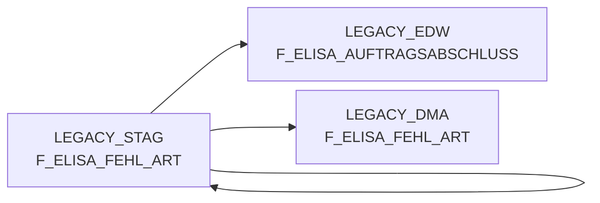

# F_ELISA_FEHL_ART (Table)

## Table Description

_No description available_

## Lineage / Impact

## References

The table F_ELISA_FEHL_ART is used in the following SAS programs:

| Application | SAS Program |
|---|---|
| [DWELISAAUFTRAB](../../Applications/DWELISAAUFTRAB) | [snow_auftragsabschlussmeldung_fa_n_edw.sas](../../Applications/DWELISAAUFTRAB/snow_auftragsabschlussmeldung_fa_n_edw.sas) |
| [DWELISAAUFTRAB](../../Applications/DWELISAAUFTRAB) | [snow_auftragsabschlussmeldung_fa_mapping.sas](../../Applications/DWELISAAUFTRAB/snow_auftragsabschlussmeldung_fa_mapping.sas) |
## Table Schema

| Field Name | Datatype | Precision | Scale | Is Nullable | Constraint | Description |
|---|---|---|---|---|---|---|
| MA_LAG_ID | NUMBER | 19 | 0 | FALSE | PRIMARY KEY | Market warehouse ID combining warehouse number and calendar date |
| NAN_ART_ID | NUMBER | 19 | 0 | FALSE | PRIMARY KEY | Article ID derived from NAN (national article number) and calendar date |
| AKT_KZ | VARCHAR | 1 | 0 | FALSE | PRIMARY KEY | Action indicator flag for promotional articles |
| MA_HPT_ABT_ID | NUMBER | 19 | 0 | FALSE | PRIMARY KEY | Market main department ID |
| KAL_TAG_ID | DATE | 0 | 0 | FALSE | PRIMARY KEY | Calendar date ID for the delivery date |
| BEST_MG | NUMBER | 19 | 0 | TRUE |   | Ordered quantity in pieces |
| LIEF_MG | NUMBER | 19 | 0 | TRUE |   | Delivered quantity in pieces |
| FEHL_MG | NUMBER | 19 | 0 | TRUE |   | Missing quantity calculated as ordered minus delivered |
| ERS_LIEF_MG | NUMBER | 19 | 0 | TRUE |   | Replacement delivered quantity |
| ERS_FEHL_MG | NUMBER | 19 | 0 | TRUE |   | Replacement missing quantity |
| POS_LEERGUTKZ | VARCHAR | 1 | 0 | TRUE |   | Position empty container indicator |
| POS_FRISCHEKZ | VARCHAR | 1 | 0 | TRUE |   | Position fresh goods indicator |
| POS_WAEINH | NUMBER | 19 | 0 | FALSE | PRIMARY KEY | Position goods unit for packaging |
| POS_KMMNG | NUMBER | 19 | 0 | TRUE |   | Position commissioning quantity in units |
| POS_DIFFMNG | NUMBER | 19 | 0 | TRUE |   | Position difference quantity for adjustments |
| POS_GEWICHT | NUMBER | 15 | 3 | TRUE |   | Position weight per piece in kilograms |
| LFD_NUMMER | NUMBER | 19 | 0 | TRUE |   | Sequential number for data processing |
| AUSLIEF_LAGNR | VARCHAR | 3 | 0 | TRUE |   | Outbound warehouse number |
| LAGNR | VARCHAR | 3 | 0 | TRUE |   | Warehouse number |
| POS_WA_IST | NUMBER | 19 | 0 | TRUE |   | Position actual goods quantity |
| POS_LADEGEWICHT | NUMBER | 19 | 0 | TRUE |   | Position loading weight in grams |
| KOPF_LIFSCHN_NR | NUMBER | 19 | 0 | FALSE | PRIMARY KEY | Header delivery note number |
| KOPF_LIFART | VARCHAR | 2 | 0 | TRUE |   | Header delivery type |
| LIF_NVE | NUMBER | 19 | 0 | TRUE |   | Delivery NVE (shipping unit identifier) |
| LIEF_ID | VARCHAR | 6 | 0 | TRUE |   | Supplier ID |
| POS_KV_URSACHE | VARCHAR | 2 | 0 | TRUE |   | Position shortage reason code |
| POS_KST8_AUFNR | NUMBER | 19 | 0 | FALSE | PRIMARY KEY | Position cost center 8 order number |
| VK_BTO | NUMBER | 15 | 2 | TRUE |   | Sales price gross amount |
| VK_NTO | NUMBER | 15 | 2 | TRUE |   | Sales price net amount |
| EINKAUFSPREIS | NUMBER | 15 | 2 | TRUE |   | Purchase price per unit |
| POS_MWKZ | VARCHAR | 1 | 0 | TRUE |   | Position VAT indicator |
| POS_KUERZ_KST_KZ | VARCHAR | 1 | 0 | TRUE |   | Position shortening cost indicator |
| POS_FEHLER_SCHL | VARCHAR | 4 | 0 | TRUE |   | Position error code |