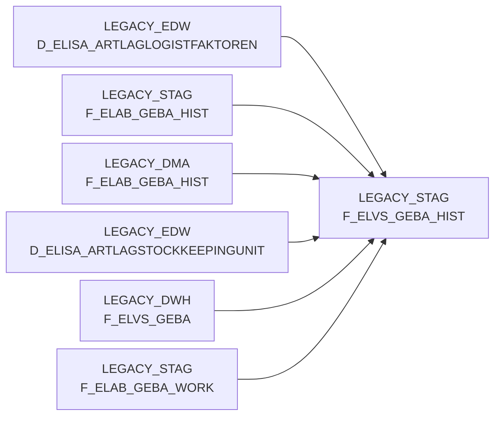

# F_ELVS_GEBA_HIST (Table)

## Table Description

**Historical staging table for ELVS GEBA container unit data** within the **BDWH_ELABGEBA** application. This table serves as part of the ELVS core replacement process, combining legacy ELVS GEBA data with new ELISA article warehouse supply data sources.

The table maintains **historical records** of container unit data (Gebindeeinheit-Daten) for goods outbound processes, preserving data lineage during the transition from original ELVS tables to new ELISA XML message-based sources. It stores comprehensive logistics information including warehouse locations, article identifiers, dimensions, weights, validity periods, and source system indicators.

Used in the **data migration workflow** (jobs DW013803-DW013805) to historicize records that may not be present in current ELVS extracts but need to be retained. The table supports the gradual replacement of legacy ELVS.F_GEBA_HIST with new consolidated data from both ELVS and ELISA sources, ensuring **data continuity** during the system transition.

Key fields include warehouse and article identifiers, physical dimensions, weights, validity dates, and a **HERKUNFT_BASIS** field indicating data origin (ELVS vs ELAB). The historization process maintains records with AKTUELL flags and validity periods to support downstream business evaluation processes.

## Lineage / Impact



## Statements

The following statements create/modify this table:

<Util>DELETE</Util> inside [BDWH_ELABGEBA/snow_elabgeba_300_stag_loeschen.sas](../../Applications/BDWH_ELABGEBA/snow_elabgeba_300_stag_loeschen.sas):
```sql:line-numbers
delete from PRODUCT_LSP_LEGACY_PROD.LEGACY_STAG.F_ELAB_GEBA_HIST
```
<Util>DELETE</Util> inside [BDWH_ELABGEBA/snow_elabgeba_100_geba_artlag_zusammenf.sas](../../Applications/BDWH_ELABGEBA/snow_elabgeba_100_geba_artlag_zusammenf.sas):
```sql:line-numbers
DELETE FROM PRODUCT_LSP_LEGACY_PROD.LEGACY_STAG.F_ELAB_GEBA_HIST
```
<Util>INSERT</Util> inside [BDWH_ELABGEBA/snow_elabgeba_200_nach_dma.sas](../../Applications/BDWH_ELABGEBA/snow_elabgeba_200_nach_dma.sas):
```sql:line-numbers
insert into PRODUCT_LSP_LEGACY_PROD.LEGACY_DMA.F_ELAB_GEBA_HIST select * from PRODUCT_LSP_LEGACY_PROD.LEGACY_STAG.F_ELAB_GEBA_HIST
```
<Util>UPDATE</Util> inside [BDWH_ELABGEBA/snow_elabgeba_100_geba_artlag_zusammenf.sas](../../Applications/BDWH_ELABGEBA/snow_elabgeba_100_geba_artlag_zusammenf.sas):
```sql:line-numbers
UPDATE PRODUCT_LSP_LEGACY_PROD.LEGACY_STAG.F_ELAB_GEBA_HIST
SET AKTUELL = 0 ,
GUELT_BIS =
CASE WHEN (GUELT_BIS = DATE '9999-12-31') THEN (CURRENT_DATE -1)
ELSE GUELT_BIS
END
```
<Util>MERGE</Util> inside [BDWH_ELABGEBA/snow_elabgeba_100_geba_artlag_zusammenf.sas](../../Applications/BDWH_ELABGEBA/snow_elabgeba_100_geba_artlag_zusammenf.sas):
```sql:line-numbers
MERGE INTO PRODUCT_LSP_LEGACY_PROD.LEGACY_STAG.F_ELAB_GEBA_HIST HIST
USING PRODUCT_LSP_LEGACY_PROD.LEGACY_STAG.F_ELAB_GEBA_WORK GEBA
ON
HIST.LAGNR = GEBA.LAGNR AND
HIST.MA_LAG_ID = GEBA.MA_LAG_ID AND
HIST.NAN_ART_ID = GEBA.NAN_ART_ID AND
HIST.AKT_KZ = GEBA.AKT_KZ AND
HIST.WAEINH = GEBA.WAEINH
WHEN MATCHED THEN
UPDATE SET
LOKAL_KZ = GEBA.LOKAL_KZ,
ZUSATZTEXT = GEBA.ZUSATZTEXT,
HKLASSE = GEBA.HKLASSE,
UPDKZ = GEBA.UPDKZ,
GUEVDAT = GEBA.GUEVDAT,
GUEBDAT = GEBA.GUEBDAT,
GEFAHRENGUT_KZ = GEBA.GEFAHRENGUT_KZ,
LAGSTRKZ = GEBA.LAGSTRKZ,
VPEINH = GEBA.VPEINH,
GEWICHT = GEBA.GEWICHT,
UPDDAT = GEBA.UPDDAT,
LAENGE = GEBA.LAENGE,
BREITE = GEBA.BREITE,
HOEHE = GEBA.HOEHE,
VOLUMEN = GEBA.VOLUMEN,
BRUTTO_GEWICHT = GEBA.BRUTTO_GEWICHT,
PAL_HOEHE = GEBA.PAL_HOEHE,
ERZ_LAND = GEBA.ERZ_LAND,
TARA_KG = GEBA.TARA_KG,
TARA_PROZ = GEBA.TARA_PROZ,
ANZ_JE_ROLLC = GEBA.ANZ_JE_ROLLC,
RAEUMDAT = GEBA.RAEUMDAT,
ZUGANGSDAT = GEBA.ZUGANGSDAT,
RESTLZ = GEBA.RESTLZ,
VERFALLDAT = GEBA.VERFALLDAT,
CHEM_BEH = GEBA.CHEM_BEH,
AENDDAT = GEBA.AENDDAT,
LAG_ID = GEBA.LAG_ID,
GUELT_BIS = GEBA.GUELT_BIS,
ACTIVE = GEBA.ACTIVE,
AKTUELL = GEBA.AKTUELL,
HERKUNFT_BASIS = GEBA.HERKUNFT_BASIS
WHEN NOT MATCHED THEN
INSERT VALUES
(
GEBA.MA_LAG_ID,
GEBA.LAGNR,
GEBA.NAN_ART_ID ,
GEBA.AKT_KZ,
GEBA.WAEINH ,
GEBA.LOKAL_KZ,
GEBA.ZUSATZTEXT ,
GEBA.HKLASSE,
GEBA.UPDKZ,
GEBA.GUEVDAT,
GEBA.GUEBDAT,
GEBA.GEFAHRENGUT_KZ,
GEBA.LAGSTRKZ,
GEBA.VPEINH,
GEBA.GEWICHT,
GEBA.UPDDAT,
GEBA.LAENGE,
GEBA.BREITE,
GEBA.HOEHE,
GEBA.VOLUMEN,
GEBA.BRUTTO_GEWICHT,
GEBA.PAL_HOEHE,
GEBA.ERZ_LAND,
GEBA.TARA_KG,
GEBA.TARA_PROZ,
GEBA.ANZ_JE_ROLLC,
GEBA.RAEUMDAT,
GEBA.ZUGANGSDAT,
GEBA.RESTLZ,
GEBA.VERFALLDAT,
GEBA.CHEM_BEH,
GEBA.AENDDAT,
GEBA.LAG_ID,
GEBA.GUELT_VON,
GEBA.GUELT_BIS,
GEBA.ACTIVE,
GEBA.AKTUELL,
GEBA.HERKUNFT_BASIS)
```
<Util>INSERT</Util> inside [BDWH_ELABGEBA/snow_elabgeba_100_geba_artlag_zusammenf.sas](../../Applications/BDWH_ELABGEBA/snow_elabgeba_100_geba_artlag_zusammenf.sas):
```sql:line-numbers
INSERT INTO PRODUCT_LSP_LEGACY_PROD.LEGACY_STAG.F_ELAB_GEBA_HIST
SELECT T1.* FROM PRODUCT_LSP_LEGACY_PROD.LEGACY_DMA.F_ELAB_GEBA_HIST T1
```

## References

The table F_ELVS_GEBA_HIST is used in the following SAS programs:

| Application | SAS Program |
|---|---|
| [BDWH_ELABGEBA](../../Applications/BDWH_ELABGEBA) | [snow_elabgeba_100_geba_artlag_zusammenf.sas](../../Applications/BDWH_ELABGEBA/snow_elabgeba_100_geba_artlag_zusammenf.sas) |
## Table Schema

| Field Name | Datatype | Precision | Scale | Is Nullable | Constraint | Description |
|---|---|---|---|---|---|---|
| MA_LAG_ID | INTEGER |  |  | FALSE | PRIMARY KEY | Material warehouse ID |
| LAGNR | VARCHAR | 3 |  | FALSE | PRIMARY KEY | Warehouse number |
| NAN_ART_ID | INTEGER |  |  | FALSE | PRIMARY KEY | Article ID |
| AKT_KZ | VARCHAR | 1 |  | FALSE | PRIMARY KEY | Activity indicator |
| WAEINH | VARCHAR | 10 |  | FALSE | PRIMARY KEY | Goods issue unit |
| LOKAL_KZ | VARCHAR | 1 |  | TRUE |   | Local indicator |
| ZUSATZTEXT | VARCHAR | 255 |  | TRUE |   | Additional text |
| HKLASSE | VARCHAR | 10 |  | TRUE |   | Hazard class |
| UPDKZ | VARCHAR | 1 |  | TRUE |   | Update indicator |
| GUEVDAT | DATE |  |  | TRUE |   | Valid from date |
| GUEBDAT | DATE |  |  | TRUE |   | Valid to date |
| GEFAHRENGUT_KZ | VARCHAR | 1 |  | TRUE |   | Dangerous goods indicator |
| LAGSTRKZ | VARCHAR | 10 |  | TRUE |   | Storage structure indicator |
| VPEINH | VARCHAR | 10 |  | TRUE |   | Packaging unit |
| GEWICHT | DECIMAL | 15 | 3 | TRUE |   | Weight |
| UPDDAT | DATE |  |  | TRUE |   | Update date |
| LAENGE | DECIMAL | 15 | 3 | TRUE |   | Length |
| BREITE | DECIMAL | 15 | 3 | TRUE |   | Width |
| HOEHE | DECIMAL | 15 | 3 | TRUE |   | Height |
| VOLUMEN | DECIMAL | 15 | 9 | TRUE |   | Volume |
| BRUTTO_GEWICHT | DECIMAL | 15 | 3 | TRUE |   | Gross weight |
| PAL_HOEHE | DECIMAL | 15 | 3 | TRUE |   | Pallet height |
| ERZ_LAND | VARCHAR | 3 |  | TRUE |   | Country of origin |
| TARA_KG | DECIMAL | 15 | 3 | TRUE |   | Tare weight in kg |
| TARA_PROZ | DECIMAL | 5 | 2 | TRUE |   | Tare percentage |
| ANZ_JE_ROLLC | INTEGER |  |  | TRUE |   | Quantity per roll container |
| RAEUMDAT | DATE |  |  | TRUE |   | Clearing date |
| ZUGANGSDAT | DATE |  |  | TRUE |   | Access date |
| RESTLZ | INTEGER |  |  | TRUE |   | Remaining shelf life |
| VERFALLDAT | DATE |  |  | TRUE |   | Expiry date |
| CHEM_BEH | VARCHAR | 10 |  | TRUE |   | Chemical treatment |
| AENDDAT | DATE |  |  | TRUE |   | Change date |
| LAG_ID | INTEGER |  |  | TRUE |   | Warehouse ID |
| GUELT_VON | DATE |  |  | TRUE |   | Valid from |
| GUELT_BIS | DATE |  |  | TRUE |   | Valid until |
| ACTIVE | INTEGER |  |  | TRUE |   | Active flag |
| AKTUELL | INTEGER |  |  | TRUE |   | Current flag |
| HERKUNFT_BASIS | VARCHAR | 10 |  | TRUE |   | Source basis |