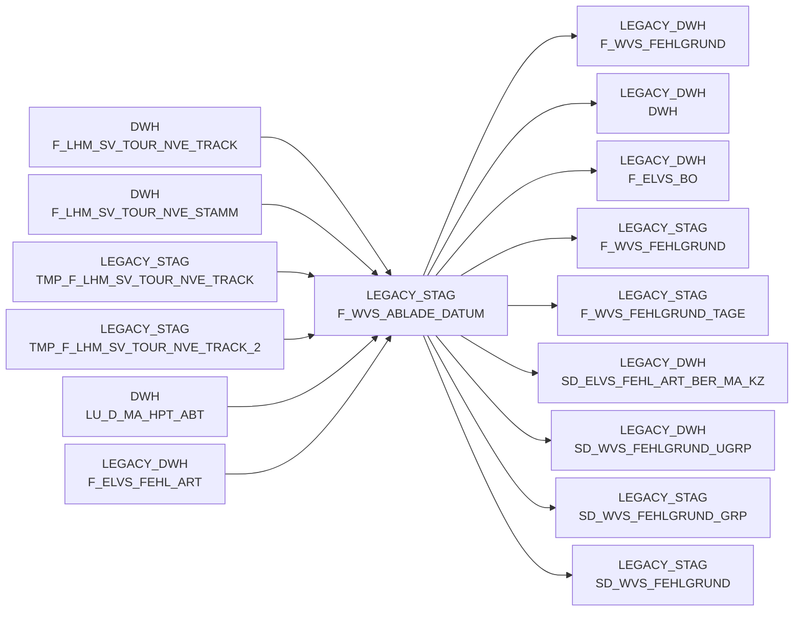

# F_WVS_ABLADE_DATUM (Table)

## Table Description

_No description available_

## Lineage / Impact

## References

The table F_WVS_ABLADE_DATUM is used in the following SAS programs:

| Application | SAS Program |
|---|---|
| [BDWH_SCCWVS](../../Applications/BDWH_SCCWVS) | [sccwvs_020_wvs_berechnen_elab.sas](../../Applications/BDWH_SCCWVS/sccwvs_020_wvs_berechnen_elab.sas) |
| [BDWH_SCCWVS](../../Applications/BDWH_SCCWVS) | [sccwvs_005_wvs_ablade_tag.sas](../../Applications/BDWH_SCCWVS/sccwvs_005_wvs_ablade_tag.sas) |
## Table Schema

| Field Name | Datatype | Precision | Scale | Is Nullable | Constraint | Description |
|---|---|---|---|---|---|---|
| MA_HPT_ABT_ID | NUMBER | 12 | 0 | TRUE |   | Market main department ID |
| MA_LAG_ID | NUMBER | 10 | 0 | TRUE |   | Market warehouse ID |
| LAGNR | VARCHAR | 3 | 0 | TRUE |   | Warehouse number |
| REFNR | NUMBER | 11 | 0 | TRUE |   | Reference number |
| POS_REFNR_LFDNR | NUMBER | 6 | 0 | TRUE |   | Position reference number sequence |
| KAL_TAG_ID | DATE |  |  | TRUE |   | Calendar day ID |
| ABLADE_TAG | DATE |  |  | TRUE |   | Unloading day (legacy field - not used anymore) |
| ABLADE_TAG_SV | DATE |  |  | TRUE |   | Unloading day from supply chain tracking |
| ABLADE_TAG_KZ | NUMBER | 2 | 0 | TRUE |   | Unloading day indicator (1=tracked 250 |