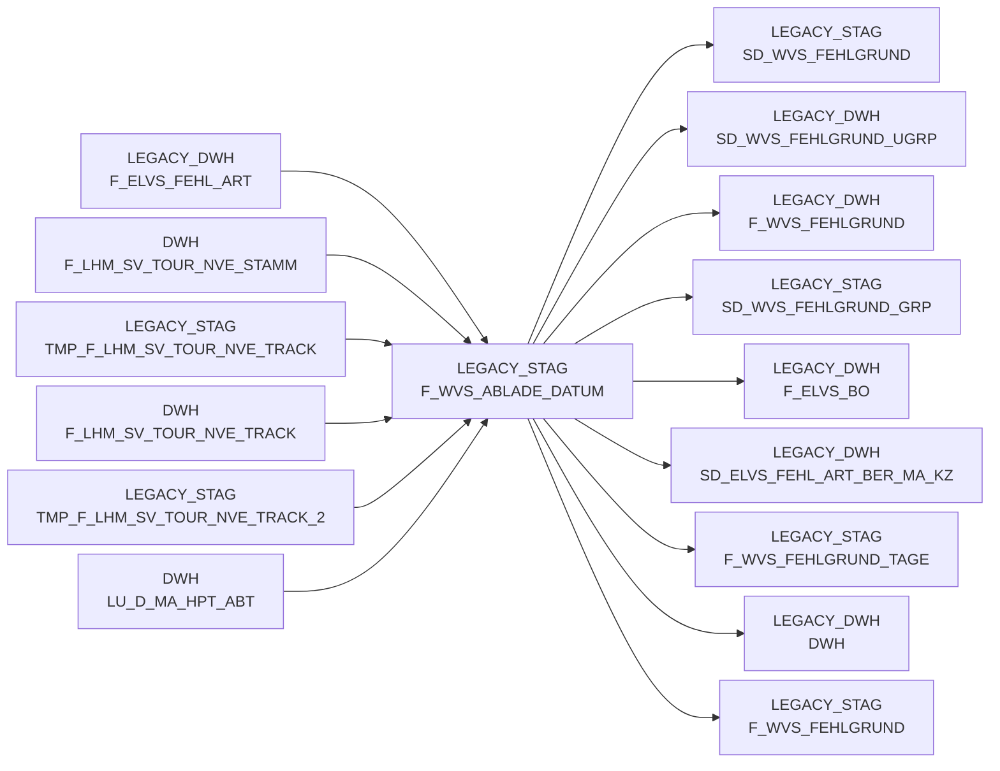

# F_WVS_ABLADE_DATUM (Table)

## Table Description

**BDWH_SCCWVS** is a **WVS (WarenVersorgungsStatistik)** application that builds a parallel environment to LEGACY_DWH in PRODUCT_SCC_PROD for system replacement purposes.

This table stores **unloading date information** for the last 28 days as part of the WVS supply chain statistics system. The table is populated by determining unloading days from commissioning data, specifically tracking NVE (Nummer der Versandeinheit) status changes through various transport stages.

The table captures delivery tracking information from **ELVS-free warehouses** (HERKUNFT_BASIS = ELAB) and processes NVE tracking data to calculate actual unloading dates versus planned delivery dates. It includes fields for unloading date indicators and quality markers that distinguish between different delivery completion scenarios.

This staging table serves as an intermediate step in the WVS calculation process, feeding into the main supply statistics workflow that analyzes delivery performance and shortage reasons across the retail network.

## Lineage / Impact



## Statements

The following statements create/modify this table:

<Util>INSERT</Util> inside [BDWH_SCCWVS/sccwvs_005_wvs_ablade_tag.sas](../../Applications/BDWH_SCCWVS/sccwvs_005_wvs_ablade_tag.sas):
```sql:line-numbers
delete from PRODUCT_SCC_PROD.LEGACY_STAG.F_WVS_ABLADE_DATUM 
 INSERT INTO PRODUCT_SCC_PROD.LEGACY_STAG.F_WVS_ABLADE_DATUM
select
a.ma_hpt_abt_id, a.ma_lag_id, a.lagnr, a.refnr, a.pos_refnr_lfdnr, a.kal_tag_id,
NULL as ablade_tag,
case when max(track.nve_status) in (250) then max(cast(track.track_ts as date))
when max(track.nve_status) in (255) and max(track.nve_status) not in (245) then max(cast(a.kal_tag_id +1 as date))
when max(track.nve_status) in (245) and max(track.nve_status) not in (250) then max(cast(a.kal_tag_id +1 as date))
when max(track.nve_status) in (246) and max(track.nve_status) not in (245) then max(cast(a.kal_tag_id +1 as date))
else max(cast(a.kal_tag_id +1 as date))
end as ablade_tag_sv,
case when max(track.nve_status) in (250) then 1
when max(track.nve_status) in (255) and max(track.nve_status) not in (245) then 2
when max(track.nve_status) in (245) and max(track.nve_status) not in (250) then 3
when max(track.nve_status) in (246) and max(track.nve_status) not in (245) then 4
else 5
end as ablade_tag_kz
from (select ma_hpt_abt_id, ma_lag_id, lagnr, refnr, pos_refnr_lfdnr, kal_tag_id, lif_nve,
pos_leergutkz, kopf_storno_kz from PRODUCT_SCC_PROD.LEGACY_DWH.F_ELVS_FEHL_ART
where herkunft_basis='ELAB'
and kal_tag_id >= dateadd(day,-21,CURRENT_DATE) )a
left join LEGACY_DWH.DWH.LU_D_MA_HPT_ABT c
on a.ma_hpt_abt_id = c.ma_hpt_abt_id
left join (
select * from LEGACY_DWH.DWH.F_LHM_SV_TOUR_NVE_STAMM
where erstell_datum >=dateadd(day,-28,CURRENT_DATE)
) d
on a.lif_nve = d.nve
and c.ma_id = d.ma_id
left join (
select nve_id, nve_status, transport_stufe, track_ts, verdichtet_auf_nve_id
from PRODUCT_SCC_PROD.LEGACY_STAG.TMP_F_LHM_SV_TOUR_NVE_TRACK_2
union all
select nve_id, nve_status, transport_stufe, track_ts, verdichtet_auf_nve_id
from LEGACY_DWH.DWH.F_LHM_SV_TOUR_NVE_TRACK
where nve_status_fail <> 'f'
and nve_status in (245,246,250,255)
and cast(track_ts as date) >= dateadd(day,-28,CURRENT_DATE)
) track
on d.nve_id = track.nve_id
where a.kal_tag_id >= dateadd(day,-21,CURRENT_DATE)
and a.lif_nve <> 0
and a.pos_leergutkz <> 'l'
and a.kopf_storno_kz not in ('s', 'x', 'y')
AND NOT EXISTS
( SELECT * FROM PRODUCT_SCC_PROD.LEGACY_STAG.F_WVS_ABLADE_DATUM t1
WHERE
a.kal_tag_id = t1.kal_tag_id
AND a.ma_hpt_abt_id = t1.ma_hpt_abt_id
AND a.ma_lag_id = t1.ma_lag_id
AND a.lagnr = t1.lagnr
AND a.refnr = t1.refnr
AND a.pos_refnr_lfdnr = t1.pos_refnr_lfdnr
)
group by a.ma_hpt_abt_id, a.ma_lag_id, a.lagnr, a.refnr, a.pos_refnr_lfdnr, a.kal_tag_id
```

## References

The table F_WVS_ABLADE_DATUM is used in the following SAS programs:

| Application | SAS Program |
|---|---|
| [BDWH_SCCWVS](../../Applications/BDWH_SCCWVS) | [sccwvs_005_wvs_ablade_tag.sas](../../Applications/BDWH_SCCWVS/sccwvs_005_wvs_ablade_tag.sas) |
| [BDWH_SCCWVS](../../Applications/BDWH_SCCWVS) | [sccwvs_020_wvs_berechnen_elab.sas](../../Applications/BDWH_SCCWVS/sccwvs_020_wvs_berechnen_elab.sas) |
## Table Schema

| Field Name | Datatype | Precision | Scale | Is Nullable | Constraint | Description |
|---|---|---|---|---|---|---|
| MA_HPT_ABT_ID | NUMBER | 12 | 0 | TRUE |   | Market main department ID |
| MA_LAG_ID | NUMBER | 10 | 0 | TRUE |   | Market warehouse ID |
| LAGNR | VARCHAR | 3 | 0 | TRUE |   | Warehouse number |
| REFNR | NUMBER | 11 | 0 | TRUE |   | Reference number |
| POS_REFNR_LFDNR | NUMBER | 6 | 0 | TRUE |   | Position reference number sequence |
| KAL_TAG_ID | DATE |  |  | TRUE |   | Calendar day ID |
| ABLADE_TAG | DATE |  |  | TRUE |   | Unloading day (legacy field - not used anymore) |
| ABLADE_TAG_SV | DATE |  |  | TRUE |   | Unloading day from supply chain tracking |
| ABLADE_TAG_KZ | NUMBER | 2 | 0 | TRUE |   | Unloading day indicator (1=tracked 250 |