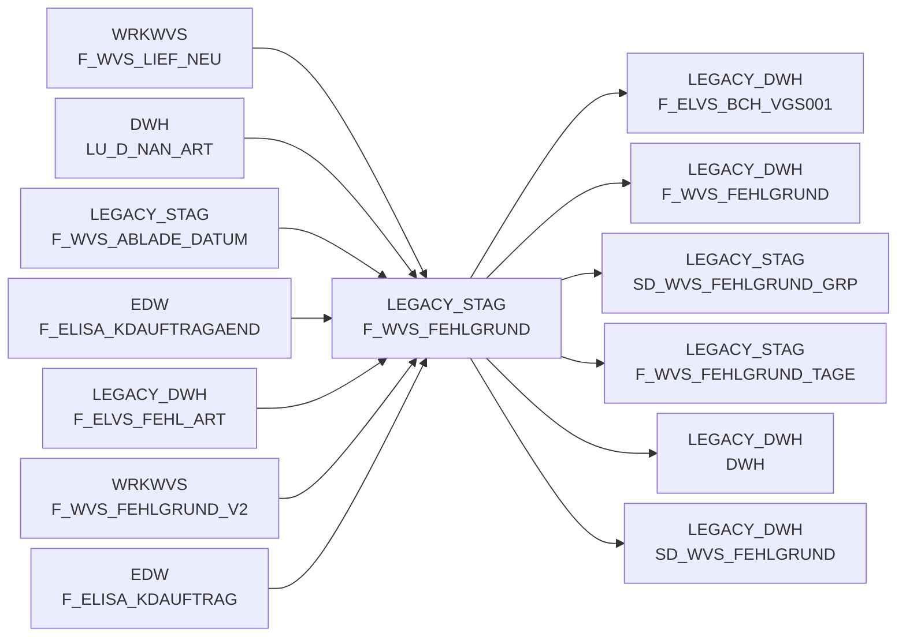

# F_WVS_FEHLGRUND (Table)

## Table Description

_No description available_

## Lineage / Impact

## References

The table F_WVS_FEHLGRUND is used in the following SAS programs:

| Application | SAS Program |
|---|---|
| [BDWH_SCCWVS](../../Applications/BDWH_SCCWVS) | [sccwvs_020_wvs_berechnen_elab.sas](../../Applications/BDWH_SCCWVS/sccwvs_020_wvs_berechnen_elab.sas) |
| [BDWH_SCCWVS](../../Applications/BDWH_SCCWVS) | [sccwvs_300_fakt_n_stag.sas](../../Applications/BDWH_SCCWVS/sccwvs_300_fakt_n_stag.sas) |
| [BDWH_SCCWVS](../../Applications/BDWH_SCCWVS) | [sccwvs_400_fakt_n_dwh.sas](../../Applications/BDWH_SCCWVS/sccwvs_400_fakt_n_dwh.sas) |
| [BDWH_SCCWVS](../../Applications/BDWH_SCCWVS) | [sccwvs_250_wvs_relevant.sas](../../Applications/BDWH_SCCWVS/sccwvs_250_wvs_relevant.sas) |
## Table Schema

| Field Name | Datatype | Precision | Scale | Is Nullable | Constraint | Description |
|---|---|---|---|---|---|---|
| NAN_ART_ID | NUMBER | 9 | 0 | TRUE |   | Article ID from NAN system |
| MA_HPT_ABT_ID | NUMBER | 12 | 0 | TRUE |   | Main department ID |
| KAL_TAG_ID | DATE |  |  | TRUE |   | Calendar day ID |
| MA_LAG_ID | NUMBER | 10 | 0 | TRUE |   | Warehouse ID |
| AKT_KZ | VARCHAR | 1 |  | TRUE |   | Action indicator |
| WAEINH | NUMBER | 6 | 0 | TRUE |   | Unit of measure |
| LAGNR | VARCHAR | 3 |  | TRUE |   | Warehouse number |
| REFNR | NUMBER | 11 | 0 | TRUE |   | Reference number |
| POS_REFNR_LFDNR | NUMBER | 6 | 0 | TRUE |   | Position reference number sequence |
| FEHL_ART_GRUND_ID | NUMBER | 7 | 0 | TRUE |   | Shortage reason ID |
| BEST_MG | NUMBER | 12 | 3 | TRUE |   | Order quantity |
| BEST_W_EK_BTO | NUMBER | 12 | 3 | TRUE |   | Order value purchase price gross |
| BEST_W_WG_BTO | NUMBER | 12 | 3 | TRUE |   | Order value goods price gross |
| BEST_W_VK_BTO | NUMBER | 12 | 3 | TRUE |   | Order value sales price gross |
| FEHL_GRUND_MG | NUMBER | 12 | 3 | TRUE |   | Shortage reason quantity |
| FEHL_GRUND_W_EK_BTO | NUMBER | 12 | 3 | TRUE |   | Shortage reason value purchase price gross |
| FEHL_GRUND_W_WG_BTO | NUMBER | 12 | 3 | TRUE |   | Shortage reason value goods price gross |
| FEHL_GRUND_W_VK_BTO | NUMBER | 12 | 3 | TRUE |   | Shortage reason value sales price gross |
| LIEF_ID | VARCHAR | 6 |  | TRUE |   | Supplier ID |
| LIEF_KZ | VARCHAR | 1 |  | TRUE |   | Supplier indicator |
| ABLADE_TAG | DATE |  |  | TRUE |   | Unloading day |
| KOPF_AUFTRAG | NUMBER | 11 | 0 | TRUE |   | Header order number |
| KOPF_KD_AUFTRAGS_NR | VARCHAR | 15 |  | TRUE |   | Header customer order number |
| KOPF_AENDDAT | DATE |  |  | TRUE |   | Header change date |
| ABLADE_TAG_SV | DATE |  |  | TRUE |   | Unloading day service |
| ABLADE_TAG_KZ | NUMBER | 2 | 0 | TRUE |   | Unloading day indicator |
| HERKUNFT_BASIS | VARCHAR | 4 |  | TRUE |   | Origin basis |
| WVS_RELEVANT | NUMBER | 2 | 0 | TRUE |   | WVS relevant indicator |
| LIEFMG_ANGEPASST | NUMBER | 2 | 0 | TRUE |   | Delivery quantity adjusted indicator |