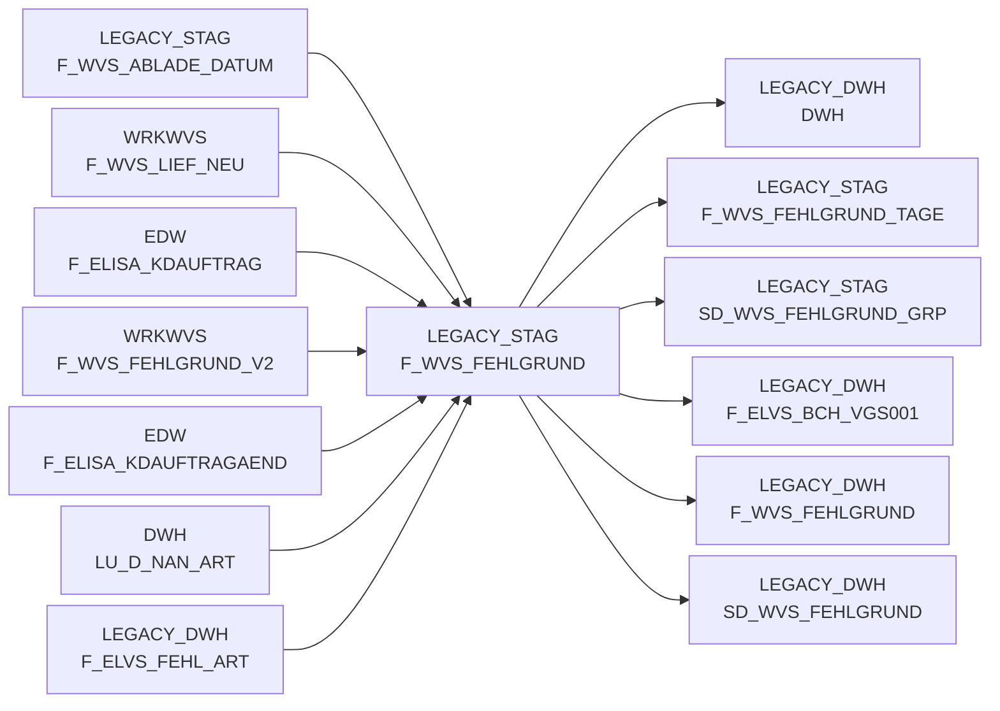

# F_WVS_FEHLGRUND (Table)

## Table Description

**BDWH_SCCWVS** is a **Waren-Versorgungs-Statistik (WVS)** application that builds a parallel environment to LEGACY_DWH in PRODUCT_SCC_PROD for system replacement purposes.

This staging table stores **detailed failure reason data** for supply chain statistics, capturing line-by-line breakdown of shortage quantities and values by specific reasons from the F_ELVS_FEHL_ART source. The table processes all positions including those without shortages, creating header records with total order quantities and additional records for over-deliveries.

The application processes data from **ELAB** (post-ELVS core replacement) sources, filtering for original records excluding empty containers and cancelled orders. Key processing includes failure reason assignment via supplier cause codes and error keys, supplier determination through multi-stage procedures, and WVS relevance identification.

The table supports **daily processing** covering the last 21 days with delta updates, feeding into aggregated views for supply chain performance analysis and reporting across different organizational levels (TREG_LBER, warehouse, supplier dimensions).

## Lineage / Impact



## Statements

The following statements create/modify this table:

<Util>INSERT</Util> inside [BDWH_SCCWVS/sccwvs_300_fakt_n_stag.sas](../../Applications/BDWH_SCCWVS/sccwvs_300_fakt_n_stag.sas):
```sql:line-numbers
CREATE TABLE wrkwvs.f_wvs_fehlgrund_v2 AS SELECT NAN_ART_ID format=9., MA_HPT_ABT_ID format=12., KAL_TAG_ID format=eurdfdd10., MA_LAG_ID format=10., AKT_KZ format=$1., POS_WAEINH as WAEINH format=6., LAGNR format=$3., REFNR format=11., POS_REFNR_LFDNR format=6., FEHL_ART_GRUND_ID format=7., BEST_MG format=12.3, BEST_W_EK_BTO format=12.3, BEST_W_WG_BTO format=12.3, BEST_W_VK_BTO format=12.3, FEHL_GRUND_MG format=12.3, FEHL_GRUND_W_EK_BTO format=12.3, FEHL_GRUND_W_WG_BTO format=12.3, FEHL_GRUND_W_VK_BTO format=12.3, LIEF_ID format=$6., LIEF_KZ format=$1., ABLADE_TAG format=eurdfdd10., KOPF_AUFTRAG format=11., KOPF_KD_AUFTRAGS_NR FORMAT=$15., KOPF_AENDDAT format=eurdfdd10., ABLADE_TAG_SV format=eurdfdd10., ABLADE_TAG_KZ format=2., HERKUNFT_BASIS length=4 format=$4., CASE WHEN KOPF_HERKUNFT = 'L' THEN 0 ELSE 1 END AS WVS_RELEVANT format=2., CASE WHEN KOPF_HERKUNFT = 'I' THEN 1 WHEN KOPF_HERKUNFT = 'P' THEN 2 ELSE 0 END AS LIEFMG_ANGEPASST format=2. FROM wrkwvs.f_wvs_lief_neu WHERE herkunft_basis='ELAB'
```

## References

The table F_WVS_FEHLGRUND is used in the following SAS programs:

| Application | SAS Program |
|---|---|
| [BDWH_SCCWVS](../../Applications/BDWH_SCCWVS) | [sccwvs_250_wvs_relevant.sas](../../Applications/BDWH_SCCWVS/sccwvs_250_wvs_relevant.sas) |
| [BDWH_SCCWVS](../../Applications/BDWH_SCCWVS) | [sccwvs_300_fakt_n_stag.sas](../../Applications/BDWH_SCCWVS/sccwvs_300_fakt_n_stag.sas) |
| [BDWH_SCCWVS](../../Applications/BDWH_SCCWVS) | [sccwvs_400_fakt_n_dwh.sas](../../Applications/BDWH_SCCWVS/sccwvs_400_fakt_n_dwh.sas) |
| [BDWH_SCCWVS](../../Applications/BDWH_SCCWVS) | [sccwvs_020_wvs_berechnen_elab.sas](../../Applications/BDWH_SCCWVS/sccwvs_020_wvs_berechnen_elab.sas) |
## Table Schema

| Field Name | Datatype | Precision | Scale | Is Nullable | Constraint | Description |
|---|---|---|---|---|---|---|
| NAN_ART_ID | NUMBER | 9 | 0 | TRUE |   | Article ID from NAN system |
| MA_HPT_ABT_ID | NUMBER | 12 | 0 | TRUE |   | Main department ID |
| KAL_TAG_ID | DATE |  |  | TRUE |   | Calendar day ID |
| MA_LAG_ID | NUMBER | 10 | 0 | TRUE |   | Warehouse ID |
| AKT_KZ | VARCHAR | 1 |  | TRUE |   | Action indicator |
| WAEINH | NUMBER | 6 | 0 | TRUE |   | Unit of measure |
| LAGNR | VARCHAR | 3 |  | TRUE |   | Warehouse number |
| REFNR | NUMBER | 11 | 0 | TRUE |   | Reference number |
| POS_REFNR_LFDNR | NUMBER | 6 | 0 | TRUE |   | Position reference number sequence |
| FEHL_ART_GRUND_ID | NUMBER | 7 | 0 | TRUE |   | Shortage reason ID |
| BEST_MG | NUMBER | 12 | 3 | TRUE |   | Order quantity |
| BEST_W_EK_BTO | NUMBER | 12 | 3 | TRUE |   | Order value purchase price gross |
| BEST_W_WG_BTO | NUMBER | 12 | 3 | TRUE |   | Order value goods price gross |
| BEST_W_VK_BTO | NUMBER | 12 | 3 | TRUE |   | Order value sales price gross |
| FEHL_GRUND_MG | NUMBER | 12 | 3 | TRUE |   | Shortage reason quantity |
| FEHL_GRUND_W_EK_BTO | NUMBER | 12 | 3 | TRUE |   | Shortage reason value purchase price gross |
| FEHL_GRUND_W_WG_BTO | NUMBER | 12 | 3 | TRUE |   | Shortage reason value goods price gross |
| FEHL_GRUND_W_VK_BTO | NUMBER | 12 | 3 | TRUE |   | Shortage reason value sales price gross |
| LIEF_ID | VARCHAR | 6 |  | TRUE |   | Supplier ID |
| LIEF_KZ | VARCHAR | 1 |  | TRUE |   | Supplier indicator |
| ABLADE_TAG | DATE |  |  | TRUE |   | Unloading day |
| KOPF_AUFTRAG | NUMBER | 11 | 0 | TRUE |   | Header order number |
| KOPF_KD_AUFTRAGS_NR | VARCHAR | 15 |  | TRUE |   | Header customer order number |
| KOPF_AENDDAT | DATE |  |  | TRUE |   | Header change date |
| ABLADE_TAG_SV | DATE |  |  | TRUE |   | Unloading day service |
| ABLADE_TAG_KZ | NUMBER | 2 | 0 | TRUE |   | Unloading day indicator |
| HERKUNFT_BASIS | VARCHAR | 4 |  | TRUE |   | Origin basis |
| WVS_RELEVANT | NUMBER | 2 | 0 | TRUE |   | WVS relevant indicator |
| LIEFMG_ANGEPASST | NUMBER | 2 | 0 | TRUE |   | Delivery quantity adjusted indicator |