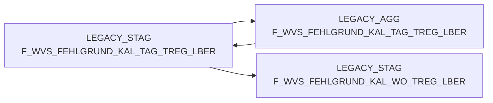

# F_WVS_FEHLGRUND_KAL_TAG_TREG_LBER (Table)

## Table Description

**BDWH_SCCWVS** is a **Waren-Versorgungs-Statistik (WVS)** application that builds a parallel environment to replace the legacy LEGACY_DWH system in PRODUCT_SCC_PROD.

This table serves as a **daily aggregated staging table** for WVS shortage reason analysis at the **regional delivery area level**. It contains aggregated data from F_WVS_FEHLGRUND grouped by calendar day (KAL_TAG_ID) and regional delivery area (MA_TREG_LBER_ID).

The table is populated through the **sccwvs_500_wvs_aggregate.sas** script as part of the WVS calculation pipeline. It aggregates order quantities, delivery shortages, and their corresponding values (purchase, goods, sales) by article, location, supplier, and shortage reason codes.

Key features include:
- **Daily granularity** with regional delivery area aggregation
- **WVS relevance indicators** for filtering relevant supply chain events
- **Adjusted delivery quantity flags** for tracking order modifications
- **Multi-dimensional analysis** supporting article, location, supplier, and shortage reason perspectives

This table supports **supply chain analytics** and **shortage analysis reporting** for retail operations, enabling identification of delivery issues and their root causes across different organizational levels.

## Lineage / Impact



## Statements

The following statements create/modify this table:

<Util>INSERT</Util> inside [BDWH_SCCWVS/sccwvs_500_wvs_aggregate.sas](../../Applications/BDWH_SCCWVS/sccwvs_500_wvs_aggregate.sas):
```sql:line-numbers
INSERT INTO PRODUCT_SCC_PROD.LEGACY_STAG.F_WVS_FEHLGRUND_KAL_TAG_TREG_LBER SELECT
NAN_ART_ID,
MA_TREG_LBER_ID,
KAL_TAG_ID,
MA_LAG_ID,
LIEF_ID,
AKT_KZ,
WAEINH,
FEHL_ART_GRUND_ID,
SUM(BEST_MG),
SUM(BEST_W_EK_BTO),
SUM(BEST_W_WG_BTO),
SUM(BEST_W_VK_BTO),
SUM(FEHL_GRUND_MG),
SUM(FEHL_GRUND_W_EK_BTO),
SUM(FEHL_GRUND_W_WG_BTO),
SUM(FEHL_GRUND_W_VK_BTO),
WVS_RELEVANT,
LIEFMG_ANGEPASST
FROM PRODUCT_SCC_PROD.LEGACY_DWH.F_WVS_FEHLGRUND F
INNER JOIN LEGACY_DWH.DWH.LU_D_MA_HPT_ABT M
ON (F.MA_HPT_ABT_ID = M.MA_HPT_ABT_ID)
WHERE
F.KAL_TAG_ID IN (SELECT DISTINCT KAL_TAG_ID
FROM PRODUCT_SCC_PROD.LEGACY_STAG.F_WVS_FEHLGRUND_TAGE)
GROUP BY
NAN_ART_ID,
MA_TREG_LBER_ID,
KAL_TAG_ID,
MA_LAG_ID,
LIEF_ID,
AKT_KZ,
WAEINH,
FEHL_ART_GRUND_ID,
WVS_RELEVANT,
LIEFMG_ANGEPASST
```

## References

The table F_WVS_FEHLGRUND_KAL_TAG_TREG_LBER is used in the following SAS programs:

| Application | SAS Program |
|---|---|
| [BDWH_SCCWVS](../../Applications/BDWH_SCCWVS) | [sccwvs_500_wvs_aggregate.sas](../../Applications/BDWH_SCCWVS/sccwvs_500_wvs_aggregate.sas) |
## Table Schema

| Field Name | Datatype | Precision | Scale | Is Nullable | Constraint | Description |
|---|---|---|---|---|---|---|
| NAN_ART_ID | NUMBER | 38 | 0 | TRUE |   | Article ID from NAN system |
| MA_TREG_LBER_ID | NUMBER | 38 | 0 | TRUE |   | Market region delivery area ID |
| KAL_TAG_ID | DATE |  |  | TRUE |   | Calendar day ID |
| MA_LAG_ID | NUMBER | 38 | 0 | TRUE |   | Market warehouse ID |
| LIEF_ID | VARCHAR | 6 |  | TRUE |   | Supplier ID |
| AKT_KZ | VARCHAR | 1 |  | TRUE |   | Action indicator |
| WAEINH | NUMBER | 38 | 0 | TRUE |   | Goods unit |
| FEHL_ART_GRUND_ID | NUMBER | 38 | 0 | TRUE |   | Shortage reason ID |
| BEST_MG | NUMBER | 38 | 3 | TRUE |   | Order quantity |
| BEST_W_EK_BTO | NUMBER | 38 | 3 | TRUE |   | Order value purchase price gross |
| BEST_W_WG_BTO | NUMBER | 38 | 3 | TRUE |   | Order value goods price gross |
| BEST_W_VK_BTO | NUMBER | 38 | 3 | TRUE |   | Order value sales price gross |
| FEHL_GRUND_MG | NUMBER | 38 | 3 | TRUE |   | Shortage reason quantity |
| FEHL_GRUND_W_EK_BTO | NUMBER | 38 | 3 | TRUE |   | Shortage reason value purchase price gross |
| FEHL_GRUND_W_WG_BTO | NUMBER | 38 | 3 | TRUE |   | Shortage reason value goods price gross |
| FEHL_GRUND_W_VK_BTO | NUMBER | 38 | 3 | TRUE |   | Shortage reason value sales price gross |
| WVS_RELEVANT | NUMBER | 38 | 0 | TRUE |   | WVS relevance indicator |
| LIEFMG_ANGEPASST | NUMBER | 38 | 0 | TRUE |   | Delivery quantity adjusted indicator |