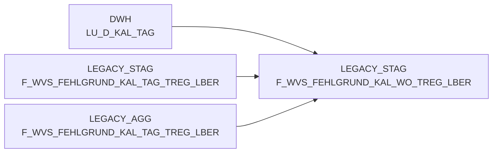

# F_WVS_FEHLGRUND_KAL_WO_TREG_LBER (Table)

## Table Description

The **BDWH_SCCWVS** application is a comprehensive **Waren-Versorgungs-Statistik (WVS)** system that processes and analyzes supply chain statistics for retail operations. This application builds a parallel environment to replace the legacy LEGACY_DWH system within PRODUCT_SCC_PROD.

This specific table serves as a **weekly aggregation staging table** that consolidates supply shortage reasons (*Fehlgrund*) data by calendar week (*KAL_WO*) and regional delivery areas (*TREG_LBER*). The table is populated through a multi-step ETL process that:

- Extracts data from F_ELVS_FEHL_ART with basis 'ELAB' (post-ELVS core replacement)
- Processes delivery tracking information and supplier identification
- Applies business rules for shortage reason classification
- Aggregates daily detail records into weekly summaries by trading region

The application processes order data, delivery shortages, supplier assignments, and various shortage classifications while maintaining data lineage through multiple staging phases. Key features include automated supplier determination, delivery date calculation from tracking systems, and comprehensive shortage reason categorization supporting both regular and promotional articles.

This staging table specifically supports the weekly reporting requirements and serves as an intermediate step before final data warehouse loading, enabling efficient weekly supply chain performance analysis across regional delivery areas.

## Lineage / Impact



## Statements

The following statements create/modify this table:

<Util>INSERT</Util> inside [BDWH_SCCWVS/sccwvs_500_wvs_aggregate.sas](../../Applications/BDWH_SCCWVS/sccwvs_500_wvs_aggregate.sas):
```sql:line-numbers
INSERT INTO PRODUCT_SCC_PROD.LEGACY_STAG.F_WVS_FEHLGRUND_KAL_WO_TREG_LBER SELECT
NAN_ART_ID,
MA_TREG_LBER_ID,
KAL_WO_ID,
MA_LAG_ID,
LIEF_ID,
AKT_KZ,
WAEINH,
FEHL_ART_GRUND_ID,
SUM(BEST_MG),
SUM(BEST_W_EK_BTO),
SUM(BEST_W_WG_BTO),
SUM(BEST_W_VK_BTO),
SUM(FEHL_GRUND_MG),
SUM(FEHL_GRUND_W_EK_BTO),
SUM(FEHL_GRUND_W_WG_BTO),
SUM(FEHL_GRUND_W_VK_BTO),
WVS_RELEVANT,
LIEFMG_ANGEPASST
FROM PRODUCT_SCC_PROD.LEGACY_AGG.F_WVS_FEHLGRUND_KAL_TAG_TREG_LBER F
INNER JOIN LEGACY_DWH.DWH.LU_D_KAL_TAG T
ON (F.KAL_TAG_ID = T.KAL_TAG_ID)
WHERE
T.KAL_WO_ID IN (SELECT DISTINCT KAL_WO_ID
FROM PRODUCT_SCC_PROD.LEGACY_STAG.F_WVS_FEHLGRUND_TAGE)
GROUP BY
NAN_ART_ID,
MA_TREG_LBER_ID,
KAL_WO_ID,
MA_LAG_ID,
LIEF_ID,
AKT_KZ,
WAEINH,
FEHL_ART_GRUND_ID,
WVS_RELEVANT,
LIEFMG_ANGEPASST
```

## References

The table F_WVS_FEHLGRUND_KAL_WO_TREG_LBER is used in the following SAS programs:

| Application | SAS Program |
|---|---|
| [BDWH_SCCWVS](../../Applications/BDWH_SCCWVS) | [sccwvs_500_wvs_aggregate.sas](../../Applications/BDWH_SCCWVS/sccwvs_500_wvs_aggregate.sas) |
## Table Schema

| Field Name | Datatype | Precision | Scale | Is Nullable | Constraint | Description |
|---|---|---|---|---|---|---|
| NAN_ART_ID | NUMBER | 38 | 0 | TRUE |   | Article ID from NAN system |
| MA_TREG_LBER_ID | NUMBER | 38 | 0 | TRUE |   | Market region delivery area ID |
| KAL_WO_ID | DATE |  |  | TRUE |   | Calendar week ID |
| MA_LAG_ID | NUMBER | 38 | 0 | TRUE |   | Market warehouse ID |
| LIEF_ID | VARCHAR | 6 |  | TRUE |   | Supplier ID |
| AKT_KZ | VARCHAR | 1 |  | TRUE |   | Action indicator |
| WAEINH | NUMBER | 38 | 0 | TRUE |   | Goods unit |
| FEHL_ART_GRUND_ID | NUMBER | 38 | 0 | TRUE |   | Shortage reason ID |
| BEST_MG | NUMBER | 38 | 3 | TRUE |   | Order quantity |
| BEST_W_EK_BTO | NUMBER | 38 | 3 | TRUE |   | Order value purchase price gross |
| BEST_W_WG_BTO | NUMBER | 38 | 3 | TRUE |   | Order value goods price gross |
| BEST_W_VK_BTO | NUMBER | 38 | 3 | TRUE |   | Order value sales price gross |
| FEHL_GRUND_MG | NUMBER | 38 | 3 | TRUE |   | Shortage reason quantity |
| FEHL_GRUND_W_EK_BTO | NUMBER | 38 | 3 | TRUE |   | Shortage reason value purchase price gross |
| FEHL_GRUND_W_WG_BTO | NUMBER | 38 | 3 | TRUE |   | Shortage reason value goods price gross |
| FEHL_GRUND_W_VK_BTO | NUMBER | 38 | 3 | TRUE |   | Shortage reason value sales price gross |
| WVS_RELEVANT | NUMBER | 38 | 0 | TRUE |   | WVS relevance indicator |
| LIEFMG_ANGEPASST | NUMBER | 38 | 0 | TRUE |   | Delivery quantity adjusted indicator |