# F_WVS_FEHLGRUND_KAL_WO_TREG_LBER_WG4_MARKE (Table)

## Table Description

**BDWH_SCCWVS** is a **Waren-Versorgungs-Statistik (WVS)** application that builds a parallel environment to LEGACY_DWH in PRODUCT_SCC_PROD for system replacement purposes.

This table stores **weekly aggregated WVS shortage reason data** grouped by **product group 4 (WG4) and brand dimensions** at the **trading region/delivery area (TREG_LBER) level**. It represents the highest level of aggregation in the WVS data hierarchy, consolidating shortage reasons and quantities from the detailed daily transaction data.

The table is populated through a **multi-stage ETL process** that:
- Extracts shortage data from ELAB-based commissioning systems
- Calculates shortage reasons using business rules and supplier determination logic
- Aggregates daily data to weekly summaries by product group and brand
- Supports **WVS relevance filtering** and **delivery quantity adjustment tracking**

Key business dimensions include calendar week, trading region/delivery area, warehouse, supplier, article characteristics, and shortage reason classifications. The aggregation enables **executive reporting** and **trend analysis** for supply chain performance monitoring across product categories and brands.

## Lineage / Impact

```mermaid
%%{init: {'flowchart': { 'nodeSpacing': 10, 'rankSpacing': 40, 'rankdir': 'TB' }}}%%

flowchart LR

  LEGACY_AGG.F_WVS_FEHLGRUND_KAL_WO_TREG_LBER_WG4_MARKE["LEGACY_AGG<br/>F_WVS_FEHLGRUND_KAL_WO_TREG_LBER_WG4_MARKE"] --> LEGACY_STAG.F_WVS_FEHLGRUND_KAL_WO_TREG_LBER_WG4_MARKE["LEGACY_STAG<br/>F_WVS_FEHLGRUND_KAL_WO_TREG_LBER_WG4_MARKE"]
  DWH.LU_D_NAN_ART["DWH<br/>LU_D_NAN_ART"] --> LEGACY_STAG.F_WVS_FEHLGRUND_KAL_WO_TREG_LBER_WG4_MARKE["LEGACY_STAG<br/>F_WVS_FEHLGRUND_KAL_WO_TREG_LBER_WG4_MARKE"]
  LEGACY_STAG.F_WVS_FEHLGRUND_KAL_WO_TREG_LBER_WG4_MARKE["LEGACY_STAG<br/>F_WVS_FEHLGRUND_KAL_WO_TREG_LBER_WG4_MARKE"] --> LEGACY_STAG.F_WVS_FEHLGRUND_KAL_WO_TREG_LBER_WG4_MARKE["LEGACY_STAG<br/>F_WVS_FEHLGRUND_KAL_WO_TREG_LBER_WG4_MARKE"]
  LEGACY_STAG.F_WVS_FEHLGRUND_KAL_WO_TREG_LBER_WG4_MARKE["LEGACY_STAG<br/>F_WVS_FEHLGRUND_KAL_WO_TREG_LBER_WG4_MARKE"] --> LEGACY_AGG.F_WVS_FEHLGRUND_KAL_WO_TREG_LBER_WG4_MARKE["LEGACY_AGG<br/>F_WVS_FEHLGRUND_KAL_WO_TREG_LBER_WG4_MARKE"]
  LEGACY_STAG.F_WVS_FEHLGRUND_TAGE["LEGACY_STAG<br/>F_WVS_FEHLGRUND_TAGE"] --> LEGACY_STAG.F_WVS_FEHLGRUND_KAL_WO_TREG_LBER_WG4_MARKE["LEGACY_STAG<br/>F_WVS_FEHLGRUND_KAL_WO_TREG_LBER_WG4_MARKE"]
  click LEGACY_AGG.F_WVS_FEHLGRUND_KAL_WO_TREG_LBER_WG4_MARKE "../../tables/LEGACY_AGG/F_WVS_FEHLGRUND_KAL_WO_TREG_LBER_WG4_MARKE"
  click DWH.LU_D_NAN_ART "../../tables/DWH/LU_D_NAN_ART"
  click LEGACY_STAG.F_WVS_FEHLGRUND_KAL_WO_TREG_LBER_WG4_MARKE "../../tables/LEGACY_STAG/F_WVS_FEHLGRUND_KAL_WO_TREG_LBER_WG4_MARKE"
  click LEGACY_STAG.F_WVS_FEHLGRUND_KAL_WO_TREG_LBER_WG4_MARKE "../../tables/LEGACY_STAG/F_WVS_FEHLGRUND_KAL_WO_TREG_LBER_WG4_MARKE"
  click LEGACY_STAG.F_WVS_FEHLGRUND_TAGE "../../tables/LEGACY_STAG/F_WVS_FEHLGRUND_TAGE"
  click LEGACY_STAG.F_WVS_FEHLGRUND_KAL_WO_TREG_LBER_WG4_MARKE "../../tables/LEGACY_STAG/F_WVS_FEHLGRUND_KAL_WO_TREG_LBER_WG4_MARKE"
  click LEGACY_STAG.F_WVS_FEHLGRUND_KAL_WO_TREG_LBER_WG4_MARKE "../../tables/LEGACY_STAG/F_WVS_FEHLGRUND_KAL_WO_TREG_LBER_WG4_MARKE"
  click LEGACY_STAG.F_WVS_FEHLGRUND_KAL_WO_TREG_LBER_WG4_MARKE "../../tables/LEGACY_STAG/F_WVS_FEHLGRUND_KAL_WO_TREG_LBER_WG4_MARKE"
  click LEGACY_AGG.F_WVS_FEHLGRUND_KAL_WO_TREG_LBER_WG4_MARKE "../../tables/LEGACY_AGG/F_WVS_FEHLGRUND_KAL_WO_TREG_LBER_WG4_MARKE"
  click LEGACY_STAG.F_WVS_FEHLGRUND_KAL_WO_TREG_LBER_WG4_MARKE "../../tables/LEGACY_STAG/F_WVS_FEHLGRUND_KAL_WO_TREG_LBER_WG4_MARKE"
```



## Statements

The following statements create/modify this table:

<Util>INSERT</Util> inside [BDWH_SCCWVS/sccwvs_500_wvs_aggregate.sas](../../Applications/BDWH_SCCWVS/sccwvs_500_wvs_aggregate.sas):
```sql:line-numbers
INSERT INTO PRODUCT_SCC_PROD.LEGACY_STAG.F_WVS_FEHLGRUND_KAL_WO_TREG_LBER_WG4_MARKE SELECT
WG4_MARKE_ID,
MA_TREG_LBER_ID,
KAL_WO_ID,
MA_LAG_ID,
LIEF_ID,
AKT_KZ,
WAEINH,
FEHL_ART_GRUND_ID,
SUM(BEST_MG),
SUM(BEST_W_EK_BTO),
SUM(BEST_W_WG_BTO),
SUM(BEST_W_VK_BTO),
SUM(FEHL_GRUND_MG),
SUM(FEHL_GRUND_W_EK_BTO),
SUM(FEHL_GRUND_W_WG_BTO),
SUM(FEHL_GRUND_W_VK_BTO),
WVS_RELEVANT,
LIEFMG_ANGEPASST
FROM PRODUCT_SCC_PROD.LEGACY_AGG.F_WVS_FEHLGRUND_KAL_WO_TREG_LBER F
INNER JOIN LEGACY_DWH.DWH.LU_D_NAN_ART M
ON (F.NAN_ART_ID = M.NAN_ART_ID)
WHERE
F.KAL_WO_ID IN (SELECT DISTINCT KAL_WO_ID
FROM PRODUCT_SCC_PROD.LEGACY_STAG.F_WVS_FEHLGRUND_TAGE)
GROUP BY
WG4_MARKE_ID,
MA_TREG_LBER_ID,
KAL_WO_ID,
MA_LAG_ID,
LIEF_ID,
AKT_KZ,
WAEINH,
FEHL_ART_GRUND_ID,
WVS_RELEVANT,
LIEFMG_ANGEPASST
```

## References

The table F_WVS_FEHLGRUND_KAL_WO_TREG_LBER_WG4_MARKE is used in the following SAS programs:

| Application | SAS Program |
|---|---|
| [BDWH_SCCWVS](../../Applications/BDWH_SCCWVS) | [sccwvs_500_wvs_aggregate.sas](../../Applications/BDWH_SCCWVS/sccwvs_500_wvs_aggregate.sas) |
## Table Schema

| Field Name | Datatype | Precision | Scale | Is Nullable | Constraint | Description |
|---|---|---|---|---|---|---|
| WG4_MARKE_ID | NUMBER | 38 | 0 | TRUE |   | Warengruppe 4 Marken ID |
| MA_TREG_LBER_ID | NUMBER | 38 | 0 | TRUE |   | Markt Teilregion Lieferbereich ID |
| KAL_WO_ID | NUMBER | 38 | 0 | TRUE |   | Kalender Woche ID |
| MA_LAG_ID | NUMBER | 38 | 0 | TRUE |   | Markt Lager ID |
| LIEF_ID | VARCHAR | 6 | 0 | TRUE |   | Lieferanten ID |
| AKT_KZ | VARCHAR | 1 | 0 | TRUE |   | Aktionskennzeichen |
| WAEINH | NUMBER | 38 | 0 | TRUE |   | Wareneinheit |
| FEHL_ART_GRUND_ID | NUMBER | 38 | 0 | TRUE |   | Fehlart Grund ID |
| BEST_MG | NUMBER | 38 | 3 | TRUE |   | Bestellmenge |
| BEST_W_EK_BTO | NUMBER | 38 | 3 | TRUE |   | Bestellwert Einkauf brutto |
| BEST_W_WG_BTO | NUMBER | 38 | 3 | TRUE |   | Bestellwert Warengruppe brutto |
| BEST_W_VK_BTO | NUMBER | 38 | 3 | TRUE |   | Bestellwert Verkauf brutto |
| FEHL_GRUND_MG | NUMBER | 38 | 3 | TRUE |   | Fehlgrund Menge |
| FEHL_GRUND_W_EK_BTO | NUMBER | 38 | 3 | TRUE |   | Fehlgrund Wert Einkauf brutto |
| FEHL_GRUND_W_WG_BTO | NUMBER | 38 | 3 | TRUE |   | Fehlgrund Wert Warengruppe brutto |
| FEHL_GRUND_W_VK_BTO | NUMBER | 38 | 3 | TRUE |   | Fehlgrund Wert Verkauf brutto |
| WVS_RELEVANT | NUMBER | 38 | 0 | TRUE |   | WVS Relevanz Kennzeichen |
| LIEFMG_ANGEPASST | NUMBER | 38 | 0 | TRUE |   | Liefermenge angepasst Kennzeichen |