# F_WVS_FEHLGRUND_KAL_WO_TREG_LBER_WG4_MARKE (Table)

## Table Description

_No description available_

## Lineage / Impact

```mermaid
%%{init: {'flowchart': { 'nodeSpacing': 10, 'rankSpacing': 40, 'rankdir': 'TB' }}}%%

flowchart LR

  DWH.LU_D_NAN_ART["DWH<br/>LU_D_NAN_ART"] --> LEGACY_STAG.F_WVS_FEHLGRUND_KAL_WO_TREG_LBER_WG4_MARKE["LEGACY_STAG<br/>F_WVS_FEHLGRUND_KAL_WO_TREG_LBER_WG4_MARKE"]
  LEGACY_STAG.F_WVS_FEHLGRUND_KAL_WO_TREG_LBER_WG4_MARKE["LEGACY_STAG<br/>F_WVS_FEHLGRUND_KAL_WO_TREG_LBER_WG4_MARKE"] --> LEGACY_STAG.F_WVS_FEHLGRUND_KAL_WO_TREG_LBER_WG4_MARKE["LEGACY_STAG<br/>F_WVS_FEHLGRUND_KAL_WO_TREG_LBER_WG4_MARKE"]
  LEGACY_AGG.F_WVS_FEHLGRUND_KAL_WO_TREG_LBER_WG4_MARKE["LEGACY_AGG<br/>F_WVS_FEHLGRUND_KAL_WO_TREG_LBER_WG4_MARKE"] --> LEGACY_STAG.F_WVS_FEHLGRUND_KAL_WO_TREG_LBER_WG4_MARKE["LEGACY_STAG<br/>F_WVS_FEHLGRUND_KAL_WO_TREG_LBER_WG4_MARKE"]
  LEGACY_STAG.F_WVS_FEHLGRUND_TAGE["LEGACY_STAG<br/>F_WVS_FEHLGRUND_TAGE"] --> LEGACY_STAG.F_WVS_FEHLGRUND_KAL_WO_TREG_LBER_WG4_MARKE["LEGACY_STAG<br/>F_WVS_FEHLGRUND_KAL_WO_TREG_LBER_WG4_MARKE"]
  LEGACY_STAG.F_WVS_FEHLGRUND_KAL_WO_TREG_LBER_WG4_MARKE["LEGACY_STAG<br/>F_WVS_FEHLGRUND_KAL_WO_TREG_LBER_WG4_MARKE"] --> LEGACY_AGG.F_WVS_FEHLGRUND_KAL_WO_TREG_LBER_WG4_MARKE["LEGACY_AGG<br/>F_WVS_FEHLGRUND_KAL_WO_TREG_LBER_WG4_MARKE"]
  click DWH.LU_D_NAN_ART "../../tables/DWH/LU_D_NAN_ART"
  click LEGACY_STAG.F_WVS_FEHLGRUND_KAL_WO_TREG_LBER_WG4_MARKE "../../tables/LEGACY_STAG/F_WVS_FEHLGRUND_KAL_WO_TREG_LBER_WG4_MARKE"
  click LEGACY_AGG.F_WVS_FEHLGRUND_KAL_WO_TREG_LBER_WG4_MARKE "../../tables/LEGACY_AGG/F_WVS_FEHLGRUND_KAL_WO_TREG_LBER_WG4_MARKE"
  click LEGACY_STAG.F_WVS_FEHLGRUND_TAGE "../../tables/LEGACY_STAG/F_WVS_FEHLGRUND_TAGE"
  click LEGACY_STAG.F_WVS_FEHLGRUND_KAL_WO_TREG_LBER_WG4_MARKE "../../tables/LEGACY_STAG/F_WVS_FEHLGRUND_KAL_WO_TREG_LBER_WG4_MARKE"
  click LEGACY_STAG.F_WVS_FEHLGRUND_KAL_WO_TREG_LBER_WG4_MARKE "../../tables/LEGACY_STAG/F_WVS_FEHLGRUND_KAL_WO_TREG_LBER_WG4_MARKE"
  click LEGACY_STAG.F_WVS_FEHLGRUND_KAL_WO_TREG_LBER_WG4_MARKE "../../tables/LEGACY_STAG/F_WVS_FEHLGRUND_KAL_WO_TREG_LBER_WG4_MARKE"
  click LEGACY_STAG.F_WVS_FEHLGRUND_KAL_WO_TREG_LBER_WG4_MARKE "../../tables/LEGACY_STAG/F_WVS_FEHLGRUND_KAL_WO_TREG_LBER_WG4_MARKE"
  click LEGACY_STAG.F_WVS_FEHLGRUND_KAL_WO_TREG_LBER_WG4_MARKE "../../tables/LEGACY_STAG/F_WVS_FEHLGRUND_KAL_WO_TREG_LBER_WG4_MARKE"
  click LEGACY_AGG.F_WVS_FEHLGRUND_KAL_WO_TREG_LBER_WG4_MARKE "../../tables/LEGACY_AGG/F_WVS_FEHLGRUND_KAL_WO_TREG_LBER_WG4_MARKE"
```

## References

The table F_WVS_FEHLGRUND_KAL_WO_TREG_LBER_WG4_MARKE is used in the following SAS programs:

| Application | SAS Program |
|---|---|
| [BDWH_SCCWVS](../../Applications/BDWH_SCCWVS) | [sccwvs_500_wvs_aggregate.sas](../../Applications/BDWH_SCCWVS/sccwvs_500_wvs_aggregate.sas) |
## Table Schema

| Field Name | Datatype | Precision | Scale | Is Nullable | Constraint | Description |
|---|---|---|---|---|---|---|
| WG4_MARKE_ID | NUMBER | 38 | 0 | TRUE |   | Warengruppe 4 Marken ID |
| MA_TREG_LBER_ID | NUMBER | 38 | 0 | TRUE |   | Markt Teilregion Lieferbereich ID |
| KAL_WO_ID | NUMBER | 38 | 0 | TRUE |   | Kalender Woche ID |
| MA_LAG_ID | NUMBER | 38 | 0 | TRUE |   | Markt Lager ID |
| LIEF_ID | VARCHAR | 6 | 0 | TRUE |   | Lieferanten ID |
| AKT_KZ | VARCHAR | 1 | 0 | TRUE |   | Aktionskennzeichen |
| WAEINH | NUMBER | 38 | 0 | TRUE |   | Wareneinheit |
| FEHL_ART_GRUND_ID | NUMBER | 38 | 0 | TRUE |   | Fehlart Grund ID |
| BEST_MG | NUMBER | 38 | 3 | TRUE |   | Bestellmenge |
| BEST_W_EK_BTO | NUMBER | 38 | 3 | TRUE |   | Bestellwert Einkauf brutto |
| BEST_W_WG_BTO | NUMBER | 38 | 3 | TRUE |   | Bestellwert Warengruppe brutto |
| BEST_W_VK_BTO | NUMBER | 38 | 3 | TRUE |   | Bestellwert Verkauf brutto |
| FEHL_GRUND_MG | NUMBER | 38 | 3 | TRUE |   | Fehlgrund Menge |
| FEHL_GRUND_W_EK_BTO | NUMBER | 38 | 3 | TRUE |   | Fehlgrund Wert Einkauf brutto |
| FEHL_GRUND_W_WG_BTO | NUMBER | 38 | 3 | TRUE |   | Fehlgrund Wert Warengruppe brutto |
| FEHL_GRUND_W_VK_BTO | NUMBER | 38 | 3 | TRUE |   | Fehlgrund Wert Verkauf brutto |
| WVS_RELEVANT | NUMBER | 38 | 0 | TRUE |   | WVS Relevanz Kennzeichen |
| LIEFMG_ANGEPASST | NUMBER | 38 | 0 | TRUE |   | Liefermenge angepasst Kennzeichen |