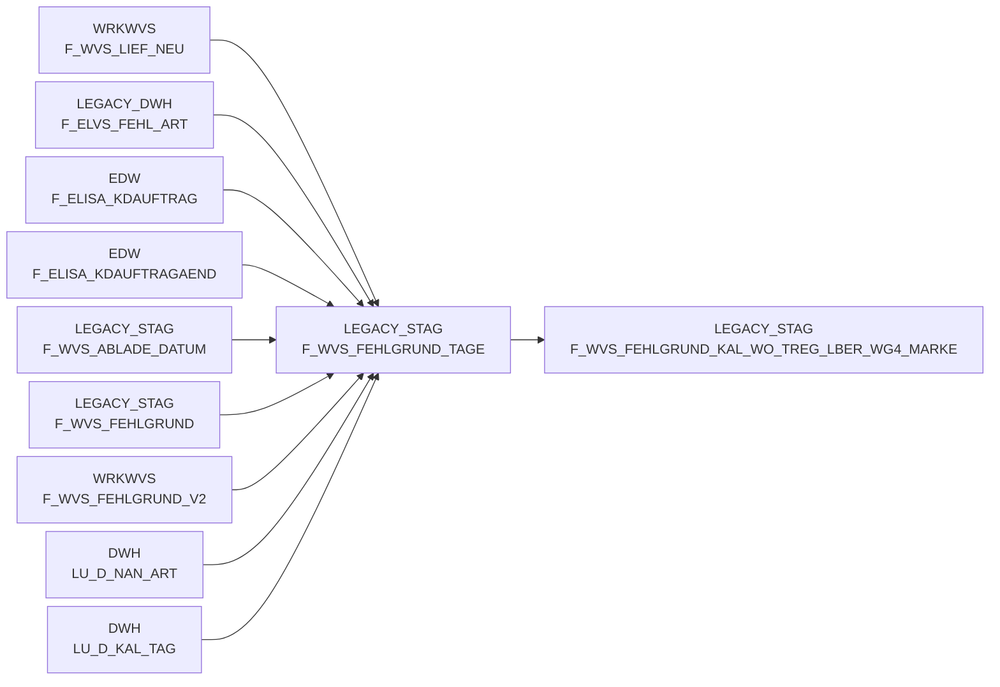

# F_WVS_FEHLGRUND_TAGE (Table)

## Table Description

The **BDWH_SCCWVS** application is a **Waren-Versorgungs-Statistik (WVS)** system that builds a parallel environment to replace the legacy LEGACY_DWH infrastructure within PRODUCT_SCC_PROD. This staging table stores calendar day information used for WVS aggregate calculations.

The table contains **KAL_TAG_ID** and **KAL_WO_ID** fields representing relevant days and weeks for WVS processing. It serves as a temporary staging area during the aggregate calculation process in job **sccwvs_500_wvs_aggregate.sas**, where it identifies the time intervals (up to 365 days in the past and future from current date) that need to be processed for various WVS aggregation levels.

This table is part of the **supply chain statistics workflow** that processes delivery shortages, supplier assignments, and inventory management data. It gets populated at the beginning of the aggregation process and cleaned up at the end, making it a **transient staging table** for time-based filtering during WVS calculations. The data flows through multiple aggregation stages including daily regional supplier levels and weekly regional supplier/brand combinations.

## Lineage / Impact



## Statements

The following statements create/modify this table:

<Util>INSERT</Util> inside [BDWH_SCCWVS/sccwvs_500_wvs_aggregate.sas](../../Applications/BDWH_SCCWVS/sccwvs_500_wvs_aggregate.sas):
```sql:line-numbers
INSERT INTO PRODUCT_SCC_PROD.LEGACY_STAG.F_WVS_FEHLGRUND_TAGE SELECT DISTINCT
T.KAL_TAG_ID,
T.KAL_WO_ID
FROM LEGACY_DWH.DWH.LU_D_KAL_TAG T
WHERE KAL_TAG_ID BETWEEN CURRENT_DATE - INTERVAL '365 DAY' AND CURRENT_DATE + 365
```

## References

The table F_WVS_FEHLGRUND_TAGE is used in the following SAS programs:

| Application | SAS Program |
|---|---|
| [BDWH_SCCWVS](../../Applications/BDWH_SCCWVS) | [sccwvs_400_fakt_n_dwh.sas](../../Applications/BDWH_SCCWVS/sccwvs_400_fakt_n_dwh.sas) |
| [BDWH_SCCWVS](../../Applications/BDWH_SCCWVS) | [sccwvs_250_wvs_relevant.sas](../../Applications/BDWH_SCCWVS/sccwvs_250_wvs_relevant.sas) |
| [BDWH_SCCWVS](../../Applications/BDWH_SCCWVS) | [sccwvs_020_wvs_berechnen_elab.sas](../../Applications/BDWH_SCCWVS/sccwvs_020_wvs_berechnen_elab.sas) |
| [BDWH_SCCWVS](../../Applications/BDWH_SCCWVS) | [sccwvs_300_fakt_n_stag.sas](../../Applications/BDWH_SCCWVS/sccwvs_300_fakt_n_stag.sas) |
| [BDWH_SCCWVS](../../Applications/BDWH_SCCWVS) | [sccwvs_500_wvs_aggregate.sas](../../Applications/BDWH_SCCWVS/sccwvs_500_wvs_aggregate.sas) |
## Table Schema

| Field Name | Datatype | Precision | Scale | Is Nullable | Constraint | Description |
|---|---|---|---|---|---|---|
| KAL_TAG_ID | DATE |  |  | FALSE | PRIMARY KEY | Calendar day identifier for WVS processing |
| KAL_WO_ID | INTEGER |  |  | FALSE | FOREIGN KEY | Calendar week identifier for aggregation purposes |