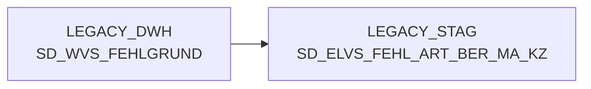

# SD_ELVS_FEHL_ART_BER_MA_KZ (Table)

## Table Description

**BDWH_SCCWVS** is a **Waren-Versorgungs-Statistik (WVS)** application that builds a parallel environment to replace the legacy LEGACY_DWH system in PRODUCT_SCC_PROD.

This staging table is part of the WVS data processing pipeline that analyzes supply chain statistics and shortage reasons. The table stores **market authorization indicators** (Berechtigt Markt Kennzeichen) for ELVS shortage article processing.

The application processes supply chain data through multiple stages:
- Determines delivery dates for the last 28 days
- Calculates WVS statistics using the main script *sccwvs_020_wvs_berechnen_elab.sas*
- Identifies suppliers and processes shortage reasons
- Aggregates data for reporting purposes

This table specifically supports the **shortage reason classification system** by providing market-specific authorization flags that determine which shortage reasons are valid for different market segments. It's used in conjunction with other WVS tables to ensure proper shortage categorization and reporting accuracy across the supply chain network.

## Lineage / Impact



## Statements

The following statements create/modify this table:

<Util>DELETE</Util> inside [BDWH_SCCWVS/sccwvs_600_cleandb.sas](../../Applications/BDWH_SCCWVS/sccwvs_600_cleandb.sas):
```sql:line-numbers
DELETE FROM PRODUCT_SCC_PROD.LEGACY_STAG.SD_ELVS_FEHL_ART_BER_MA_KZ
```

## References

The table SD_ELVS_FEHL_ART_BER_MA_KZ is used in the following SAS programs:

| Application | SAS Program |
|---|---|
| [BDWH_SCCWVS](../../Applications/BDWH_SCCWVS) | [sccwvs_400_fakt_n_dwh.sas](../../Applications/BDWH_SCCWVS/sccwvs_400_fakt_n_dwh.sas) |
## Table Schema

| Field Name | Datatype | Precision | Scale | Is Nullable | Constraint | Description |
|---|---|---|---|---|---|---|
| BERECHTIGT_MARKT_KZ | VARCHAR | 10 | 0 | TRUE |   | Market authorization indicator for ELVS error article |
| BERECHTIGT_MARKT_TXT | VARCHAR | 255 | 0 | TRUE |   | Market authorization text description for ELVS error article |
| ERSTELL_DATUM | DATE | 0 | 0 | TRUE |   | Creation date of the record |
| AENDER_DATUM | DATE | 0 | 0 | TRUE |   | Last modification date of the record |
| SATZ_STATUS | VARCHAR | 1 | 0 | TRUE |   | Record status indicator |