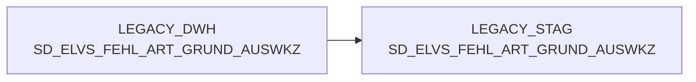

# SD_ELVS_FEHL_ART_GRUND_AUSWKZ (Table)

## Table Description

**BDWH_SCCWVS** is a **WarenVersorgungsStatistik (WVS)** application that builds a parallel environment to LEGACY_DWH in PRODUCT_SCC_PROD for system replacement purposes.

This staging table is part of the WVS data processing pipeline that analyzes supply chain statistics and shortage reasons. The table stores **shortage reason selection indicators** (*FEHL_ART_GRUND_AUSWKZ*) used in the WVS calculation process.

The application processes data from ELAB-based warehouses (post-ELVS core replacement) and performs multi-stage supplier determination, shortage reason analysis, and relevance identification. Key processing includes:
- Daily unloading date determination for the last 28 days
- Line-by-line resolution of shortage quantities and values by reasons
- WVS relevance marking and supplier identification
- Aggregation calculations for reporting

The table is populated during the WVS calculation workflow and cleaned up at the end of each processing cycle. It supports the transition from the legacy ELVS system to the new ELAB-based data sources while maintaining backward compatibility for reporting and analysis.

## Lineage / Impact



## Statements

The following statements create/modify this table:

<Util>DELETE</Util> inside [BDWH_SCCWVS/sccwvs_600_cleandb.sas](../../Applications/BDWH_SCCWVS/sccwvs_600_cleandb.sas):
```sql:line-numbers
DELETE FROM PRODUCT_SCC_PROD.LEGACY_STAG.SD_ELVS_FEHL_ART_GRUND_AUSWKZ
```

## References

The table SD_ELVS_FEHL_ART_GRUND_AUSWKZ is used in the following SAS programs:

| Application | SAS Program |
|---|---|
| [BDWH_SCCWVS](../../Applications/BDWH_SCCWVS) | [sccwvs_600_cleandb.sas](../../Applications/BDWH_SCCWVS/sccwvs_600_cleandb.sas) |
## Table Schema

| Field Name | Datatype | Precision | Scale | Is Nullable | Constraint | Description |
|---|---|---|---|---|---|---|
| FEHL_ART_GRUND_ID | NUMBER | 7 | 0 | TRUE |   | Fehlart Grund ID - Identifier for failure reason |
| FEHL_ART_GRUND_AUSWKZ | VARCHAR | 1 | 0 | TRUE |   | Fehlart Grund Auswertungskennzeichen - Evaluation indicator for failure reason |
| FEHL_ART_GRUND_TXT | VARCHAR | 100 | 0 | TRUE |   | Fehlart Grund Text - Description text for failure reason |
| FEHL_ART_GRUND_UGRP_ID | NUMBER | 7 | 0 | TRUE |   | Fehlart Grund Untergruppe ID - Failure reason subgroup identifier |
| BERECHTIGT_MARKT_KZ | VARCHAR | 2 | 0 | TRUE |   | Berechtigt Markt Kennzeichen - Authorized market indicator |
| ERSTELL_DATUM | DATE |  |  | TRUE |   | Erstellungsdatum - Creation date |
| AEND_DATUM | DATE |  |  | TRUE |   | Änderungsdatum - Modification date |
| SATZ_STATUS | VARCHAR | 1 | 0 | TRUE |   | Satzstatus - Record status indicator |