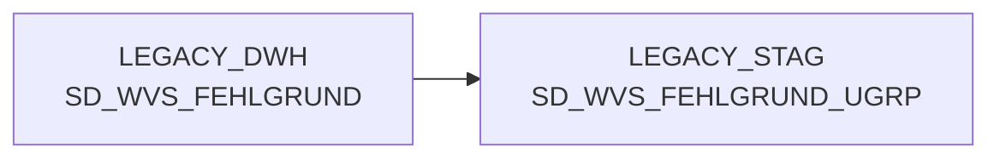

# SD_WVS_FEHLGRUND_UGRP (Table)

## Table Description

The **BDWH_SCCWVS** application is a **Waren-Versorgungs-Statistik (WVS)** system that builds a parallel environment to replace the legacy LEGACY_DWH infrastructure within PRODUCT_SCC_PROD. This table serves as part of the **staging layer** for WVS error reason sub-groups.

The application processes supply chain statistics by analyzing delivery shortages and their underlying causes. It operates through a sequential job pipeline where **sccwvs_020_wvs_berechnen_elab.sas** is the core calculation script. The system handles data from ELAB sources (post-ELVS core replacement) and processes order positions, delivery quantities, and shortage reasons.

This specific table stores **sub-group classifications** for WVS error reasons, supporting the hierarchical structure: *Klasse* (Class) ¿ *Gruppe* (Group) ¿ *Untergruppe* (Sub-group) ¿ *Individual Error Reasons*. It's populated during the staging process and used for categorizing delivery shortage causes in the supply statistics workflow.

The table supports the daily recalculation of supply statistics covering the last 21 days, enabling correction mechanisms and ensuring data consistency across the supply chain analysis system.

## Lineage / Impact



## Statements

The following statements create/modify this table:

<Util>DELETE</Util> inside [BDWH_SCCWVS/sccwvs_600_cleandb.sas](../../Applications/BDWH_SCCWVS/sccwvs_600_cleandb.sas):
```sql:line-numbers
DELETE FROM PRODUCT_SCC_PROD.LEGACY_STAG.SD_WVS_FEHLGRUND_UGRP
```

## References

The table SD_WVS_FEHLGRUND_UGRP is used in the following SAS programs:

| Application | SAS Program |
|---|---|
| [BDWH_SCCWVS](../../Applications/BDWH_SCCWVS) | [sccwvs_250_wvs_relevant.sas](../../Applications/BDWH_SCCWVS/sccwvs_250_wvs_relevant.sas) |
## Table Schema

| Field Name | Datatype | Precision | Scale | Is Nullable | Constraint | Description |
|---|---|---|---|---|---|---|
| FEHL_ART_GRUND_UGRP_ID | NUMBER | 7 | 0 | FALSE | PRIMARY KEY | Unique identifier for the failure reason subgroup |
| FEHL_ART_GRUND_UGRP_TXT | VARCHAR | 100 | 0 | TRUE |   | Description text for the failure reason subgroup |
| FEHL_ART_GRUND_GRP_ID | NUMBER | 7 | 0 | FALSE | FOREIGN KEY | Foreign key reference to failure reason group |
| ERSTELL_DATUM | DATE | 0 | 0 | TRUE |   | Creation date of the record |
| AENDER_DATUM | DATE | 0 | 0 | TRUE |   | Last modification date of the record |
| AKTIV_KZ | VARCHAR | 1 | 0 | TRUE |   | Active indicator flag |