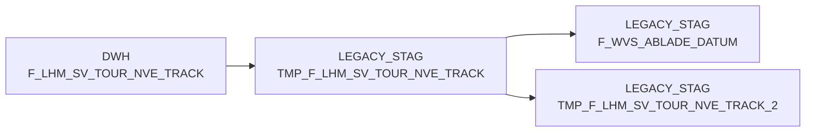

# TMP_F_LHM_SV_TOUR_NVE_TRACK (Table)

## Table Description

_No description available_

## Lineage / Impact

## References

The table TMP_F_LHM_SV_TOUR_NVE_TRACK is used in the following SAS programs:

| Application | SAS Program |
|---|---|
| [BDWH_SCCWVS](../../Applications/BDWH_SCCWVS) | [sccwvs_005_wvs_ablade_tag.sas](../../Applications/BDWH_SCCWVS/sccwvs_005_wvs_ablade_tag.sas) |
## Table Schema

| Field Name | Datatype | Precision | Scale | Is Nullable | Constraint | Description |
|---|---|---|---|---|---|---|
| NVE_ID | BIGINT | 19 | 0 | TRUE |   | NVE identifier for tracking |
| VERDICHTET_AUF_NVE_ID | BIGINT | 19 | 0 | TRUE |   | Consolidated NVE identifier |
| NVE_ID_ORG | BIGINT | 19 | 0 | TRUE |   | Original NVE identifier |
| NVE_STATUS | INTEGER | 10 | 0 | TRUE |   | NVE status code |
| NVE_STATUS_FAIL | VARCHAR | 1 | 0 | TRUE |   | NVE status failure indicator |
| TRANSPORT_STUFE | INTEGER | 10 | 0 | TRUE |   | Transport stage level |
| TRACK_TS | TIMESTAMP_NTZ | 29 | 9 | TRUE |   | Tracking timestamp |