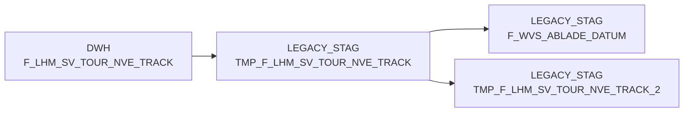

# TMP_F_LHM_SV_TOUR_NVE_TRACK (Table)

## Table Description

**BDWH_SCCWVS** is a **WarenVersorgungsStatistik (WVS)** application that builds a parallel environment to LEGACY_DWH in PRODUCT_SCC_PROD for system replacement purposes.

This temporary staging table stores **NVE (Nummer der Versandeinheit) tracking data** from the last 28 days for supply chain logistics processing. The table contains shipment tracking information with specific NVE status codes (210, 245, 246, 250, 255) excluding failed records.

The table is populated during the **discharge day determination process** (sccwvs_005_wvs_ablade_tag.sas) where it serves as an intermediate storage for commissioning tracking data. It supports the calculation of delivery dates and supply chain visibility by tracking package movement through various transport stages.

This table is part of the **WVS calculation pipeline** that processes supply statistics and shortage reasons, ultimately feeding into the main F_WVS_FEHLGRUND fact table. The data flows through multiple processing steps including supplier determination, relevance marking, and aggregation before final storage in the data warehouse.

The table is regularly cleaned up as part of the automated workflow and contains time-sensitive logistics data essential for **retail supply chain analytics**.

## Lineage / Impact



## Statements

The following statements create/modify this table:

<Util>INSERT</Util> inside [BDWH_SCCWVS/sccwvs_005_wvs_ablade_tag.sas](../../Applications/BDWH_SCCWVS/sccwvs_005_wvs_ablade_tag.sas):
```sql:line-numbers
INSERT INTO PRODUCT_SCC_PROD.LEGACY_STAG.TMP_F_LHM_SV_TOUR_NVE_TRACK
SELECT *
FROM LEGACY_DWH.DWH.F_LHM_SV_TOUR_NVE_TRACK a
WHERE
NVE_STATUS_FAIL <> 'F'
AND a.NVE_STATUS IN (210, 245, 246, 250, 255)
AND CAST(a.TRACK_TS AS DATE) >= dateadd(day,-28,CURRENT_DATE)
```

## References

The table TMP_F_LHM_SV_TOUR_NVE_TRACK is used in the following SAS programs:

| Application | SAS Program |
|---|---|
| [BDWH_SCCWVS](../../Applications/BDWH_SCCWVS) | [sccwvs_005_wvs_ablade_tag.sas](../../Applications/BDWH_SCCWVS/sccwvs_005_wvs_ablade_tag.sas) |
## Table Schema

| Field Name | Datatype | Precision | Scale | Is Nullable | Constraint | Description |
|---|---|---|---|---|---|---|
| NVE_ID | BIGINT | 19 | 0 | TRUE |   | NVE identifier for tracking |
| VERDICHTET_AUF_NVE_ID | BIGINT | 19 | 0 | TRUE |   | Consolidated NVE identifier |
| NVE_ID_ORG | BIGINT | 19 | 0 | TRUE |   | Original NVE identifier |
| NVE_STATUS | INTEGER | 10 | 0 | TRUE |   | NVE status code |
| NVE_STATUS_FAIL | VARCHAR | 1 | 0 | TRUE |   | NVE status failure indicator |
| TRANSPORT_STUFE | INTEGER | 10 | 0 | TRUE |   | Transport stage level |
| TRACK_TS | TIMESTAMP_NTZ | 29 | 9 | TRUE |   | Tracking timestamp |