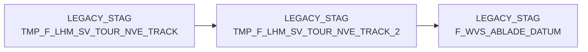

# TMP_F_LHM_SV_TOUR_NVE_TRACK_2 (Table)

## Table Description

**BDWH_SCCWVS** is a **WarenVersorgungsStatistik (WVS)** application that builds a parallel environment to LEGACY_DWH in PRODUCT_SCC_PROD for system replacement purposes.

This temporary staging table is part of the **supply chain tracking system** that processes NVE (Nummer der Versandeinheit - shipping unit number) tracking data for the last 28 days. The table serves as an **intermediate storage** for hierarchical NVE tracking information using **recursive SQL queries** to trace shipping unit relationships through multiple transport levels.

The table is populated during the **delivery date determination process** (sccwvs_005_wvs_ablade_tag.sas) where it stores tracking data with various NVE statuses (210, 245, 246, 250, 255) to calculate accurate delivery dates for supply statistics. It uses a **recursive CTE approach** to follow the chain of shipping unit consolidations up to 10 levels deep.

This table is **temporary** and gets **deleted and recreated** during each processing cycle, making it a crucial component for determining accurate delivery timing in the WVS calculation pipeline. The data flows from F_LHM_SV_TOUR_NVE_TRACK through this staging table to ultimately support the F_WVS_ABLADE_DATUM fact table creation.

## Lineage / Impact



## Statements

The following statements create/modify this table:

<Util>INSERT</Util> inside [BDWH_SCCWVS/sccwvs_005_wvs_ablade_tag.sas](../../Applications/BDWH_SCCWVS/sccwvs_005_wvs_ablade_tag.sas):
```sql:line-numbers
INSERT INTO PRODUCT_SCC_PROD.LEGACY_STAG.TMP_F_LHM_SV_TOUR_NVE_TRACK_2
WITH RECURSIVE SEED ( NVE_ID , VERDICHTET_AUF_NVE_ID , NVE_ID_ORG, NVE_STATUS, TRANSPORT_STUFE, TRACK_TS, LVL , NVE_ID_PATH ) AS
(
SELECT a.NVE_ID, a.VERDICHTET_AUF_NVE_ID , NVE_ID_ORG, NVE_STATUS, TRANSPORT_STUFE, TRACK_TS ,1 AS LVL , CAST (NVE_ID AS VARCHAR(1000) )|| '|' NVE_ID_PATH
FROM PRODUCT_SCC_PROD.LEGACY_STAG.TMP_F_LHM_SV_TOUR_NVE_TRACK a
WHERE a.NVE_STATUS_FAIL <> 'F'
AND a.NVE_STATUS IN (210)
AND CAST(a.TRACK_TS AS DATE) >= dateadd(day,-28,CURRENT_DATE)
UNION ALL
SELECT b.NVE_ID, b.VERDICHTET_AUF_NVE_ID , b.NVE_ID_ORG, b.NVE_STATUS, b.TRANSPORT_STUFE, b.TRACK_TS , TRK.LVL + 1 , TRK.NVE_ID_PATH || b.NVE_ID AS NVE_ID_PATH
FROM PRODUCT_SCC_PROD.LEGACY_STAG.TMP_F_LHM_SV_TOUR_NVE_TRACK b
INNER JOIN SEED AS TRK
ON TRK.VERDICHTET_AUF_NVE_ID = b.NVE_ID_ORG
WHERE b.NVE_STATUS IN (210, 245, 246, 250, 255)
AND TRK.LVL <= 10
AND b.NVE_ID <> 10000000000
AND CAST(b.TRACK_TS AS DATE) >= dateadd(day,-28,CURRENT_DATE)
)
SELECT CAST ( SUBSTR (NVE_ID_PATH, 1, POSITION ('|' IN NVE_ID_PATH ) -1 ) AS BIGINT ) AS NVE_ID , NVE_STATUS , TRANSPORT_STUFE, TRACK_TS, VERDICHTET_AUF_NVE_ID
FROM SEED
```

## References

The table TMP_F_LHM_SV_TOUR_NVE_TRACK_2 is used in the following SAS programs:

| Application | SAS Program |
|---|---|
| [BDWH_SCCWVS](../../Applications/BDWH_SCCWVS) | [sccwvs_005_wvs_ablade_tag.sas](../../Applications/BDWH_SCCWVS/sccwvs_005_wvs_ablade_tag.sas) |
## Table Schema

| Field Name | Datatype | Precision | Scale | Is Nullable | Constraint | Description |
|---|---|---|---|---|---|---|
| NVE_ID | BIGINT | 19 | 0 | TRUE |   | NVE identifier from recursive tracking query |
| NVE_STATUS | INTEGER | 10 | 0 | TRUE |   | Status of the NVE in tracking system |
| TRANSPORT_STUFE | INTEGER | 10 | 0 | TRUE |   | Transport stage level |
| TRACK_TS | TIMESTAMP_NTZ | 29 | 9 | TRUE |   | Tracking timestamp |
| VERDICHTET_AUF_NVE_ID | BIGINT | 19 | 0 | TRUE |   | Consolidated NVE identifier |