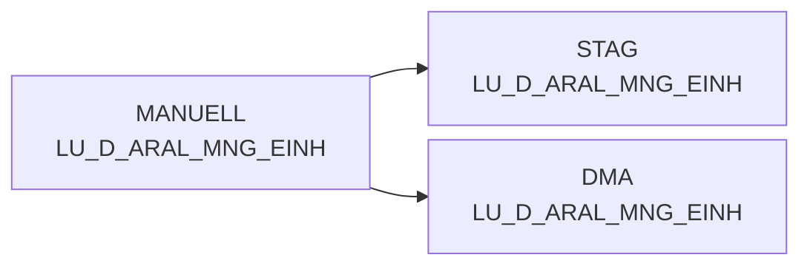

# LU_D_ARAL_MNG_EINH (Table)

## Table Description

**DWABVARAL** is a data warehouse application that processes **Aral sales data** (Abverkaufsdaten) from gas stations. The application handles the complete ETL pipeline for Aral point-of-sale transactions.

The table **LU_D_ARAL_MNG_EINH** serves as a **lookup table for Aral quantity units** (Mengeneinheiten). It contains reference data that maps different unit identifiers used in Aral sales transactions to standardized unit descriptions.

This lookup table is essential for **data normalization** during the sales data processing workflow. It ensures consistent interpretation of quantity measurements across different Aral gas station locations and transaction types. The table is populated through the application's data loading processes and synchronized with the staging environment before being deployed to the data mart layer.

The table supports the broader DWABVARAL application which includes data movement, decompression, validation, enrichment with master data (MA_ID, NAN_ART_ID), purchase price evaluation, and creation of various aggregated views for reporting and analytics purposes.

## Lineage / Impact



## Statements

The following statements create/modify this table:

<Util>INSERT</Util> inside [DWABVARAL/dw010992.sas](../../Applications/DWABVARAL/dw010992.sas):
```sql:line-numbers
CREATE TABLE MANUELL.LU_D_ARAL_MNG_EINH AS
SELECT CAST((100 + ARAL_VK_MNG_EINH) AS SMALLINT) AS ARAL_MNG_ID,
       ARAL_MNG_EINH
FROM (
    SELECT DISTINCT ARAL_VK_MNG_EINH, ARAL_MNG_EINH
    FROM BEREIT_F.F_SC_ABV_ARAL
    WHERE ARAL_VK_MNG_EINH IS NOT NULL
      AND ARAL_MNG_EINH IS NOT NULL
)
ORDER BY ARAL_MNG_ID
```

## References

The table LU_D_ARAL_MNG_EINH is used in the following SAS programs:

| Application | SAS Program |
|---|---|
| [DWABVARAL](../../Applications/DWABVARAL) | [dw010992.sas](../../Applications/DWABVARAL/dw010992.sas) |
| [DWABVARAL](../../Applications/DWABVARAL) | [snow_abv_aral_verdichtungen.sas](../../Applications/DWABVARAL/snow_abv_aral_verdichtungen.sas) |
## Table Schema

| Field Name | Datatype | Precision | Scale | Is Nullable | Constraint | Description |
|---|---|---|---|---|---|---|
| ARAL_VK_MNG_EINH | VARCHAR | 1 | 0 | TRUE |   | Verkaufsmengeneinheit als 1 |
| ARAL_MNG_EINH | VARCHAR | 3 | 0 | TRUE |   | Basismengeneinheit |