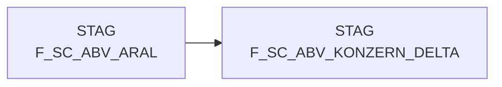

# F_SC_ABV_KONZERN_DELTA (Table)

## Table Description

**DWABVARAL** is a comprehensive data warehouse application that processes **Aral fuel station sales data** for integration into the corporate sales data warehouse.

The application handles the complete **ETL pipeline** for Aral point-of-sale transactions, including:

• **Data ingestion** from raw Aral sales files delivered via DFUE interface
• **File processing** with validation, decompression and sequential file handling
• **Data transformation** including article mapping (EAN to NAN conversion), market ID assignment, and purchase price evaluation
• **Quality assurance** through control record validation and data consistency checks
• **Staging operations** for loading processed data into STAG.F_SC_ABV_KONZERN_DELTA table

The table serves as a **staging area** for consolidated Aral sales data before final integration into the enterprise data warehouse. It contains aggregated transaction data with standardized formats for amounts, quantities, article identifiers, and market references.

Key features include **error handling** with automatic validation of file sequences, **metadata tracking** for audit trails, and **purchase price evaluation** using corporate pricing models. The application supports **restart capability** and includes comprehensive logging for operational monitoring.

This system enables **centralized reporting** and analysis of Aral fuel station performance within the broader corporate retail analytics framework.

## Lineage / Impact



## Statements

The following statements create/modify this table:

<Util>INSERT</Util> inside [DWABVARAL/snow_abv_aral_insert_sca_delta.sas](../../Applications/DWABVARAL/snow_abv_aral_insert_sca_delta.sas):
```sql:line-numbers
INSERT INTO STAG.F_SC_ABV_KONZERN_DELTA
select pos.ma_id,nan_art_id,akt_kz,kal_tag_id,vlt_id,ums_art_id,kopf_art_id,stat_kz_id,abt_nr,abv_ean,
fremd_artikel_typ_id,fremd_artikel_nr,fremd_markt_typ_id,fremd_markt_nr,konz_nr,sum(abv_w_nn_ek) as abv_w_nn_ek,
sum(abv_w_bew_ek) as abv_w_bew_ek,sum(abv_w_wgp_ek) as abv_w_wgp_ek,sum(abv_w_markt_ek) as abv_w_markt_ek,
sum(abv_w_nto) as abv_w_nto,sum(abv_w_bto) as abv_w_bto,sum(abv_w_bto_vr) as abv_w_bto_vr,sum(abv_w_bto_fw) as abv_w_bto_fw,
sum(ARAL_MENGE) as abv_mg,COUNT(DISTINCT ARAL_BELEG) as anz_bon,COUNT(DISTINCT ARAL_BELEG) as anz_kunden,quelle_id,abv_bewert_id,
mf_flag, LFD_NR_LOAD AS lfd_nr_rohdat,&mlfd_nr_load. as lfd_nr_load,sum(abv_w_rkp_ek) as abv_w_rkp_ek,
hist_fokus_grp,hist_fokus_sort,hist_abt_grp,hist_abt_nr, 0 AS AKTION_NR, CAST (ARAL_MWST_TYP AS CHAR) AS T4734_MWST_KZ ,
HIST_MWST_ID,SUM(ABV_W_NN_DEK) AS ABV_W_NN_DEK,
SUM(ABV_W_WGP_DEK) AS ABV_W_WGP_DEK, SUM(ABV_W_NN_DEK_KORR) AS ABV_W_NN_DEK_KORR, SUM(ABV_W_WGP_DEK_KORR) AS ABV_W_WGP_DEK_KORR,
'000' AS MABU_LIEF_ART_ID, 0 AS T4360_BESTAND_NAN, 0 AS BESTAND_NAN_ART_ID, 0 As T4360_MABU_BESTAND_NAN,
0 AS MABU_BESTAND_NAN_ART_ID, 0 as T4734_MULTIPLIKATOR
from STAG.F_SC_ABV_ARAL pos
group by pos.ma_id,nan_art_id,akt_kz,kal_tag_id,vlt_id,ums_art_id,kopf_art_id,stat_kz_id,abt_nr,abv_ean,
fremd_artikel_typ_id,fremd_artikel_nr,fremd_markt_typ_id,fremd_markt_nr,konz_nr,quelle_id,abv_bewert_id,
mf_flag,lfd_nr_load,hist_fokus_grp,hist_fokus_sort,hist_abt_grp,hist_abt_nr,ARAL_MWST_TYP,HIST_MWST_ID
```

## References

The table F_SC_ABV_KONZERN_DELTA is used in the following SAS programs:

| Application | SAS Program |
|---|---|
| [DWABVARAL](../../Applications/DWABVARAL) | [snow_abv_aral_insert_sca_delta.sas](../../Applications/DWABVARAL/snow_abv_aral_insert_sca_delta.sas) |
## Table Schema

| Field Name | Datatype | Precision | Scale | Is Nullable | Constraint | Description |
|---|---|---|---|---|---|---|
| MA_ID | NUMBER | 10 | 0 | TRUE |   | Market ID |
| NAN_ART_ID | NUMBER | 9 | 0 | TRUE |   | Article ID |
| AKT_KZ | VARCHAR | 1 |  | TRUE |   | Active indicator |
| KAL_TAG_ID | DATE |  |  | TRUE |   | Calendar day ID |
| VLT_ID | VARCHAR | 3 |  | TRUE |   | Currency ID |
| UMS_ART_ID | NUMBER | 5 | 0 | TRUE |   | Sales type ID |
| KOPF_ART_ID | NUMBER | 9 | 0 | TRUE |   | Header type ID |
| STAT_KZ_ID | NUMBER | 5 | 0 | TRUE |   | Status indicator ID |
| ABT_NR | NUMBER | 5 | 0 | TRUE |   | Department number |
| ABV_EAN | VARCHAR | 14 |  | TRUE |   | Sales EAN |
| FREMD_ARTIKEL_TYP_ID | NUMBER | 5 | 0 | TRUE |   | External article type ID |
| FREMD_ARTIKEL_NR | VARCHAR | 20 |  | TRUE |   | External article number |
| FREMD_MARKT_TYP_ID | NUMBER | 5 | 0 | TRUE |   | External market type ID |
| FREMD_MARKT_NR | VARCHAR | 14 |  | TRUE |   | External market number |
| KONZ_NR | NUMBER | 9 | 0 | TRUE |   | Concept number |
| ABV_W_NN_EK | NUMBER | 13 | 2 | TRUE |   | Sales value net purchase price |
| ABV_W_BEW_EK | NUMBER | 13 | 2 | TRUE |   | Sales value evaluated purchase price |
| ABV_W_WGP_EK | NUMBER | 13 | 2 | TRUE |   | Sales value wholesale purchase price |
| ABV_W_MARKT_EK | NUMBER | 13 | 2 | TRUE |   | Sales value market purchase price |
| ABV_W_NTO | NUMBER | 13 | 2 | TRUE |   | Sales value net |
| ABV_W_BTO | NUMBER | 13 | 2 | TRUE |   | Sales value gross |
| ABV_W_BTO_VR | NUMBER | 13 | 2 | TRUE |   | Sales value gross previous year |
| ABV_W_BTO_FW | NUMBER | 13 | 2 | TRUE |   | Sales value gross foreign currency |
| ABV_MG | NUMBER | 16 | 4 | TRUE |   | Sales quantity |
| ANZ_BON | NUMBER | 9 | 0 | TRUE |   | Number of receipts |
| ANZ_KUNDEN | NUMBER | 9 | 0 | TRUE |   | Number of customers |
| QUELLE_ID | NUMBER | 5 | 0 | TRUE |   | Source ID |
| ABV_BEWERT_ID | NUMBER | 5 | 0 | TRUE |   | Sales evaluation ID |
| MF_FLAG | VARCHAR | 3 |  | TRUE |   | Multi-format flag |
| LFD_NR_ROHDAT | NUMBER | 10 | 0 | TRUE |   | Sequential number raw data |
| LFD_NR_LOAD | NUMBER | 10 | 0 | TRUE |   | Sequential number load |
| ABV_W_RKP_EK | NUMBER | 13 | 2 | TRUE |   | Sales value retail purchase price |
| HIST_FOKUS_GRP | NUMBER | 5 | 0 | TRUE |   | Historical focus group |
| HIST_FOKUS_SORT | NUMBER | 5 | 0 | TRUE |   | Historical focus sort |
| HIST_ABT_GRP | NUMBER | 5 | 0 | TRUE |   | Historical department group |
| HIST_ABT_NR | NUMBER | 5 | 0 | TRUE |   | Historical department number |
| AKTION_NR | NUMBER | 11 | 0 | TRUE |   | Action number |
| T4734_MWST_KZ | VARCHAR | 1 |  | TRUE |   | VAT indicator |
| HIST_MWST_ID | NUMBER | 5 | 0 | TRUE |   | Historical VAT ID |
| ABV_W_NN_DEK | NUMBER | 13 | 2 | TRUE |   | Sales value net contribution margin |
| ABV_W_WGP_DEK | NUMBER | 13 | 2 | TRUE |   | Sales value wholesale contribution margin |
| ABV_W_NN_DEK_KORR | NUMBER | 13 | 2 | TRUE |   | Sales value net contribution margin corrected |
| ABV_W_WGP_DEK_KORR | NUMBER | 13 | 2 | TRUE |   | Sales value wholesale contribution margin corrected |
| MABU_LIEF_ART_ID | VARCHAR | 3 |  | TRUE |   | Material movement delivery type ID |
| T4360_BESTAND_NAN | NUMBER | 10 | 0 | TRUE |   | Stock NAN |
| BESTAND_NAN_ART_ID | NUMBER | 9 | 0 | TRUE |   | Stock NAN article ID |
| T4360_MABU_BESTAND_NAN | NUMBER | 10 | 0 | TRUE |   | Material movement stock NAN |
| MABU_BESTAND_NAN_ART_ID | NUMBER | 9 | 0 | TRUE |   | Material movement stock NAN article ID |
| T4734_MULTIPLIKATOR | NUMBER | 10 | 0 | TRUE |   | Multiplier |