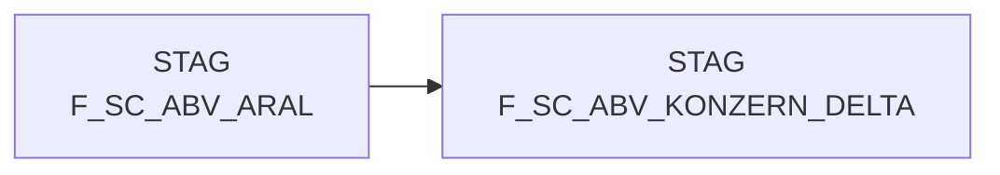

# F_SC_ABV_KONZERN_DELTA (Table)

## Table Description

_No description available_

## Lineage / Impact

## References

The table F_SC_ABV_KONZERN_DELTA is used in the following SAS programs:

| Application | SAS Program |
|---|---|
| [DWABVARAL](../../Applications/DWABVARAL) | [snow_abv_aral_insert_sca_delta.sas](../../Applications/DWABVARAL/snow_abv_aral_insert_sca_delta.sas) |
## Table Schema

| Field Name | Datatype | Precision | Scale | Is Nullable | Constraint | Description |
|---|---|---|---|---|---|---|
| MA_ID | NUMBER | 10 | 0 | TRUE |   | Market ID |
| NAN_ART_ID | NUMBER | 9 | 0 | TRUE |   | Article ID |
| AKT_KZ | VARCHAR | 1 |  | TRUE |   | Active indicator |
| KAL_TAG_ID | DATE |  |  | TRUE |   | Calendar day ID |
| VLT_ID | VARCHAR | 3 |  | TRUE |   | Currency ID |
| UMS_ART_ID | NUMBER | 5 | 0 | TRUE |   | Sales type ID |
| KOPF_ART_ID | NUMBER | 9 | 0 | TRUE |   | Header type ID |
| STAT_KZ_ID | NUMBER | 5 | 0 | TRUE |   | Status indicator ID |
| ABT_NR | NUMBER | 5 | 0 | TRUE |   | Department number |
| ABV_EAN | VARCHAR | 14 |  | TRUE |   | Sales EAN |
| FREMD_ARTIKEL_TYP_ID | NUMBER | 5 | 0 | TRUE |   | External article type ID |
| FREMD_ARTIKEL_NR | VARCHAR | 20 |  | TRUE |   | External article number |
| FREMD_MARKT_TYP_ID | NUMBER | 5 | 0 | TRUE |   | External market type ID |
| FREMD_MARKT_NR | VARCHAR | 14 |  | TRUE |   | External market number |
| KONZ_NR | NUMBER | 9 | 0 | TRUE |   | Concept number |
| ABV_W_NN_EK | NUMBER | 13 | 2 | TRUE |   | Sales value net purchase price |
| ABV_W_BEW_EK | NUMBER | 13 | 2 | TRUE |   | Sales value evaluated purchase price |
| ABV_W_WGP_EK | NUMBER | 13 | 2 | TRUE |   | Sales value wholesale purchase price |
| ABV_W_MARKT_EK | NUMBER | 13 | 2 | TRUE |   | Sales value market purchase price |
| ABV_W_NTO | NUMBER | 13 | 2 | TRUE |   | Sales value net |
| ABV_W_BTO | NUMBER | 13 | 2 | TRUE |   | Sales value gross |
| ABV_W_BTO_VR | NUMBER | 13 | 2 | TRUE |   | Sales value gross previous year |
| ABV_W_BTO_FW | NUMBER | 13 | 2 | TRUE |   | Sales value gross foreign currency |
| ABV_MG | NUMBER | 16 | 4 | TRUE |   | Sales quantity |
| ANZ_BON | NUMBER | 9 | 0 | TRUE |   | Number of receipts |
| ANZ_KUNDEN | NUMBER | 9 | 0 | TRUE |   | Number of customers |
| QUELLE_ID | NUMBER | 5 | 0 | TRUE |   | Source ID |
| ABV_BEWERT_ID | NUMBER | 5 | 0 | TRUE |   | Sales evaluation ID |
| MF_FLAG | VARCHAR | 3 |  | TRUE |   | Multi-format flag |
| LFD_NR_ROHDAT | NUMBER | 10 | 0 | TRUE |   | Sequential number raw data |
| LFD_NR_LOAD | NUMBER | 10 | 0 | TRUE |   | Sequential number load |
| ABV_W_RKP_EK | NUMBER | 13 | 2 | TRUE |   | Sales value retail purchase price |
| HIST_FOKUS_GRP | NUMBER | 5 | 0 | TRUE |   | Historical focus group |
| HIST_FOKUS_SORT | NUMBER | 5 | 0 | TRUE |   | Historical focus sort |
| HIST_ABT_GRP | NUMBER | 5 | 0 | TRUE |   | Historical department group |
| HIST_ABT_NR | NUMBER | 5 | 0 | TRUE |   | Historical department number |
| AKTION_NR | NUMBER | 11 | 0 | TRUE |   | Action number |
| T4734_MWST_KZ | VARCHAR | 1 |  | TRUE |   | VAT indicator |
| HIST_MWST_ID | NUMBER | 5 | 0 | TRUE |   | Historical VAT ID |
| ABV_W_NN_DEK | NUMBER | 13 | 2 | TRUE |   | Sales value net contribution margin |
| ABV_W_WGP_DEK | NUMBER | 13 | 2 | TRUE |   | Sales value wholesale contribution margin |
| ABV_W_NN_DEK_KORR | NUMBER | 13 | 2 | TRUE |   | Sales value net contribution margin corrected |
| ABV_W_WGP_DEK_KORR | NUMBER | 13 | 2 | TRUE |   | Sales value wholesale contribution margin corrected |
| MABU_LIEF_ART_ID | VARCHAR | 3 |  | TRUE |   | Material movement delivery type ID |
| T4360_BESTAND_NAN | NUMBER | 10 | 0 | TRUE |   | Stock NAN |
| BESTAND_NAN_ART_ID | NUMBER | 9 | 0 | TRUE |   | Stock NAN article ID |
| T4360_MABU_BESTAND_NAN | NUMBER | 10 | 0 | TRUE |   | Material movement stock NAN |
| MABU_BESTAND_NAN_ART_ID | NUMBER | 9 | 0 | TRUE |   | Material movement stock NAN article ID |
| T4734_MULTIPLIKATOR | NUMBER | 10 | 0 | TRUE |   | Multiplier |