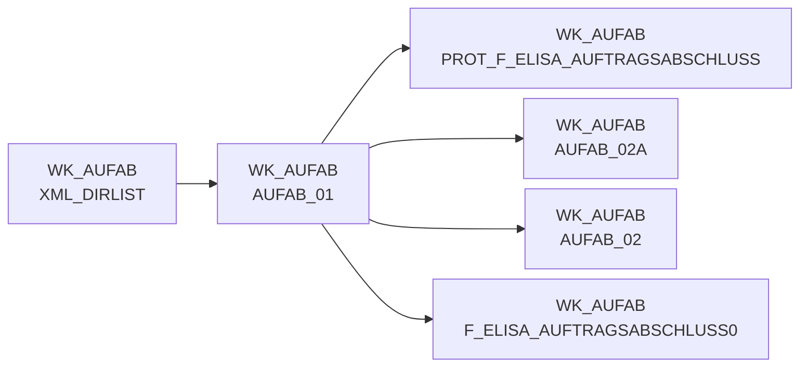

# AUFAB_01 (Table)

## Table Description

**DWELISAAUFTRAB** is a data warehouse application that processes **order completion messages** (Auftragsabschlussmeldung) from the ELISA system. This application handles XML-based order completion notifications from pL-Store to ELISA, containing commissioned quantities for all order positions.

The table **wk_aufab.aufab_01** serves as the **primary staging table** for raw order completion data after XML parsing. It contains comprehensive order information including warehouse numbers, document numbers, article identifiers (NAN), quantities (ordered, commissioned, target), NVE details for both goods receipt and goods issue, supplier information, and pricing data.

The application processes data through a **sequential job chain** (DWDW6449 through DW013912) that moves files from DFUE directories, reads XML messages using specialized maps, transforms data with master data lookups, enriches with purchase and sales prices, loads to staging and EDW tables, and maps to ELVS-compatible structures. The system handles **multiple XML message versions** and includes comprehensive error handling, duplicate detection, and replacement article logic for supply chain operations.

## Lineage / Impact



## Statements

The following statements create/modify this table:

<Util>CREATE TABLE</Util> inside [DWELISAAUFTRAB/auftragsabschlussmeldung_einlesen.sas](../../Applications/DWELISAAUFTRAB/auftragsabschlussmeldung_einlesen.sas):
```sql:line-numbers
proc sql;
create table wk_aufab.aufab_tmp_wanves as
select *
, &xml_dname. as dateiname length=100 format=$100.
, &meta_lfd_nummer. as lfd_nr_rohdat
from xmllib.aufab_tmp_wanves
;
quit;
```

## References

The table AUFAB_01 is used in the following SAS programs:

| Application | SAS Program |
|---|---|
| [DWELISAAUFTRAB](../../Applications/DWELISAAUFTRAB) | [auftragsabschlussmeldung_transfrm.sas](../../Applications/DWELISAAUFTRAB/auftragsabschlussmeldung_transfrm.sas) |
| [DWELISAAUFTRAB](../../Applications/DWELISAAUFTRAB) | [auftragsabschlussmeldung_einlesen.sas](../../Applications/DWELISAAUFTRAB/auftragsabschlussmeldung_einlesen.sas) |
## Table Schema

| Field Name | Datatype | Precision | Scale | Is Nullable | Constraint | Description |
|---|---|---|---|---|---|---|
| AuftragsabschlussmeldungV2_fullC | VARCHAR | 79 | 0 | TRUE |   | Full content identifier for order completion message V2 |
| lagerNummer | INTEGER | 8 | 0 | TRUE |   | Warehouse number identifier |
| belegnummer | INTEGER | 8 | 0 | TRUE |   | Document number for the order |
| vorgangsSchluessel | INTEGER | 8 | 0 | TRUE |   | Process key identifier |
| wwIdent_bilanzstelle | INTEGER | 8 | 0 | TRUE |   | Balance sheet location identifier |
| wwIdent_filialnummer | INTEGER | 8 | 0 | TRUE |   | Branch number identifier |
| wwIdent_pruefziffer | INTEGER | 8 | 0 | TRUE |   | Check digit for identification |
| wwIdent_vertriebsbereich | INTEGER | 8 | 0 | TRUE |   | Sales area identifier |
| marktNummer_bereich | INTEGER | 8 | 0 | TRUE |   | Market number area |
| marktNummer_region | INTEGER | 8 | 0 | TRUE |   | Market number region |
| marktNummer_zaehlNummer | INTEGER | 8 | 0 | TRUE |   | Market counting number |
| plStoreAuftragsNummer | INTEGER | 8 | 0 | TRUE |   | pL-Store order number |
| lieferart | INTEGER | 8 | 0 | TRUE |   | Delivery type |
| buchungsDatum_day | INTEGER | 8 | 0 | TRUE |   | Booking date day |
| buchungsDatum_month | INTEGER | 8 | 0 | TRUE |   | Booking date month |
| buchungsDatum_year | INTEGER | 8 | 0 | TRUE |   | Booking date year |
| belegdatum_day | INTEGER | 8 | 0 | TRUE |   | Document date day |
| belegdatum_month | INTEGER | 8 | 0 | TRUE |   | Document date month |
| belegdatum_year | INTEGER | 8 | 0 | TRUE |   | Document date year |
| waNves_ORDINAL | INTEGER | 8 | 0 | TRUE |   | Goods issue NVE ordinal number |
| waNve_erweiterungsZiffer | INTEGER | 8 | 0 | TRUE |   | Goods issue NVE extension digit |
| waNve_fortlaufendeNummer | INTEGER | 8 | 0 | TRUE |   | Goods issue NVE sequential number |
| waNve_globalCompanyPrefix | INTEGER | 8 | 0 | TRUE |   | Goods issue NVE global company prefix |
| waNve_pruefZiffer | INTEGER | 8 | 0 | TRUE |   | Goods issue NVE check digit |
| lhmKuerzel | VARCHAR | 20 | 0 | TRUE |   | LHM abbreviation |
| lhmArtikelNummer | VARCHAR | 20 | 0 | TRUE |   | LHM article number |
| positionen_ORDINAL | INTEGER | 8 | 0 | TRUE |   | Position ordinal number |
| AuftragsabschlussmeldungsPositio | INTEGER | 8 | 0 | TRUE |   | Order completion message position |
| nan | INTEGER | 8 | 0 | TRUE |   | National article number |
| waEinheit | INTEGER | 8 | 0 | TRUE |   | Goods issue unit |
| auftragsMengeInStueck | INTEGER | 8 | 0 | TRUE |   | Order quantity in pieces |
| sollKommMengeInStueck | INTEGER | 8 | 0 | TRUE |   | Target picking quantity in pieces |
| kvGrund | VARCHAR | 20 | 0 | TRUE |   | Short delivery reason |
| ursprungsland | VARCHAR | 30 | 0 | TRUE |   | Country of origin |
| referenzen | VARCHAR | 32 | 0 | TRUE |   | References |
| referenz_nan | INTEGER | 8 | 0 | TRUE |   | Reference national article number |
| referenz_waeinheit | INTEGER | 8 | 0 | TRUE |   | Reference goods issue unit |
| betriebe | VARCHAR | 32 | 0 | TRUE |   | Operations/facilities |
| mhd_type | VARCHAR | 8 | 0 | TRUE |   | Best before date type |
| land_typ | VARCHAR | 24 | 0 | TRUE |   | Country type |
| zusatzposition | VARCHAR | 20 | 0 | TRUE |   | Additional position |
| grai | VARCHAR | 32 | 0 | TRUE |   | Global Returnable Asset Identifier |
| fehlerschluessel | VARCHAR | 4 | 0 | TRUE |   | Error key |
| rueckmeldungId | INTEGER | 8 | 0 | TRUE |   | Feedback ID |
| chargeId | VARCHAR | 30 | 0 | TRUE |   | Batch ID |
| dateiname | VARCHAR | 100 | 0 | TRUE |   | File name |
| lfd_nr_rohdat | INTEGER | 8 | 0 | TRUE |   | Sequential number raw data |
| kommissionierlaufNummer | INTEGER | 8 | 0 | TRUE |   | Picking run number |
| kst8AuftragNummer | INTEGER | 8 | 0 | TRUE |   | Cost center 8 order number |
| weNve_erweiterungsZiffer | INTEGER | 8 | 0 | TRUE |   | Goods receipt NVE extension digit |
| weNve_fortlaufendeNummer | INTEGER | 8 | 0 | TRUE |   | Goods receipt NVE sequential number |
| weNve_GlobalCompanyPrefix | INTEGER | 8 | 0 | TRUE |   | Goods receipt NVE global company prefix |
| weNve_PruefZiffer | INTEGER | 8 | 0 | TRUE |   | Goods receipt NVE check digit |
| mhd_day | INTEGER | 8 | 0 | TRUE |   | Best before date day |
| mhd_month | INTEGER | 8 | 0 | TRUE |   | Best before date month |
| mhd_year | INTEGER | 8 | 0 | TRUE |   | Best before date year |
| istKommMengeInStueck | INTEGER | 8 | 0 | TRUE |   | Actual picking quantity in pieces |
| mengeInGramm | VARCHAR | 20 | 0 | TRUE |   | Quantity in grams |
| lieferantenNr | VARCHAR | 5 | 0 | TRUE |   | Supplier number |
| schnittGewichtInGramm | VARCHAR | 20 | 0 | TRUE |   | Average weight in grams |
| einkaufspreis | VARCHAR | 10 | 0 | TRUE |   | Purchase price |
| gangNummer | VARCHAR | 20 | 0 | TRUE |   | Aisle number |
| platz | VARCHAR | 20 | 0 | TRUE |   | Storage location |
| pickNan | INTEGER | 8 | 0 | TRUE |   | Pick national article number |
| pickEinheit | INTEGER | 8 | 0 | TRUE |   | Pick unit |
| storno_kennz | INTEGER | 8 | 0 | TRUE |   | Cancellation indicator |