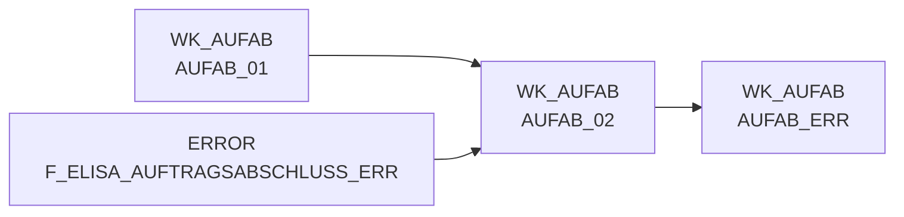

# AUFAB_02 (Table)

## Table Description

**DWELISAAUFTRAB** is a data warehouse application that processes **order completion messages** (Auftragsabschlussmeldung) from the ELISA system. This application handles XML-based order completion notifications from pL-Store to ELISA, containing detailed information about commissioned quantities for all positions of completed orders.

The table **wk_aufab.aufab_02** serves as a **transformed staging table** in the order completion message processing pipeline. It contains processed order data after initial XML parsing and transformation, including order headers, position details, and warehouse-specific information. The table structure includes order identification fields, article numbers (NAN), quantities (ordered, commissioned, target), warehouse codes (WA-NVE, WE-NVE), supplier information, and pricing data.

This table is part of a **sequential job chain** (DWDW6449 through DW013912) that moves data from raw XML files through various transformation stages, ultimately feeding into the **Supply Chain Cockpit** for logistics and inventory management. The application runs **four times daily** and processes order completion data with **2-level position hierarchy** (orders containing 1-n WaNVE, each containing 1-n articles), supporting both regular orders and cancellation positions (storno).

## Lineage / Impact



## Statements

The following statements create/modify this table:

<Util>CREATE TABLE</Util> inside [DWELISAAUFTRAB/auftragsabschlussmeldung_transfrm.sas](../../Applications/DWELISAAUFTRAB/auftragsabschlussmeldung_transfrm.sas):
```sql:line-numbers
data wk_aufab.aufab_02;
set wk_aufab.aufab_02a;
by lagernummer belegnummer belegDatum_month belegDatum_day belegDatum_year
wwident_bilanzstelle wwident_vertriebsbereich wwident_filialnummer
WANVE_ERWEITERUNGSZIFFER WANVE_FORTLAUFENDENUMMER WANVE_GLOBALCOMPANYPREFIX WANVE_PRUEFZIFFER
WENVE_ERWEITERUNGSZIFFER WENVE_FORTLAUFENDENUMMER WENVE_GLOBALCOMPANYPREFIX WENVE_PRUEFZIFFER
nan WAEINHEIT LFD_NR_ROHDAT;
if last.waeinheit;
run;
```

## References

The table AUFAB_02 is used in the following SAS programs:

| Application | SAS Program |
|---|---|
| [DWELISAAUFTRAB](../../Applications/DWELISAAUFTRAB) | [auftragsabschlussmeldung_transfrm.sas](../../Applications/DWELISAAUFTRAB/auftragsabschlussmeldung_transfrm.sas) |
## Table Schema

| Field Name | Datatype | Precision | Scale | Is Nullable | Constraint | Description |
|---|---|---|---|---|---|---|
| AuftragsabschlussmeldungV2_fullC | VARCHAR | 79 | 0 | TRUE |   | Full content identifier for order completion message V2 |
| lagerNummer | INTEGER | 8 | 0 | TRUE |   | Warehouse number identifier |
| belegNummer | INTEGER | 8 | 0 | TRUE |   | Document number identifier |
| vorgangsSchluessel | INTEGER | 8 | 0 | TRUE |   | Process key identifier |
| wwIdent_bilanzstelle | INTEGER | 8 | 0 | TRUE |   | Business identifier balance point |
| wwIdent_vertriebsbereich | INTEGER | 8 | 0 | TRUE |   | Business identifier sales area |
| wwIdent_filialnummer | INTEGER | 8 | 0 | TRUE |   | Business identifier branch number |
| marktNummer_bereich | INTEGER | 8 | 0 | TRUE |   | Market number area identifier |
| marktNummer_region | INTEGER | 8 | 0 | TRUE |   | Market number region identifier |
| marktNummer_zaehlNummer | INTEGER | 8 | 0 | TRUE |   | Market number counting identifier |
| kommissionierlaufNummer | INTEGER | 8 | 0 | TRUE |   | Commissioning run number |
| kst8AuftragNummer | INTEGER | 8 | 0 | TRUE |   | Cost center 8 order number |
| plStoreAuftragsNummer | INTEGER | 8 | 0 | TRUE |   | PL Store order number |
| lieferart | INTEGER | 8 | 0 | TRUE |   | Delivery type identifier |
| buchungsDatum_day | INTEGER | 8 | 0 | TRUE |   | Booking date day component |
| buchungsDatum_month | INTEGER | 8 | 0 | TRUE |   | Booking date month component |
| buchungsDatum_year | INTEGER | 8 | 0 | TRUE |   | Booking date year component |
| belegDatum_day | INTEGER | 8 | 0 | TRUE |   | Document date day component |
| belegDatum_month | INTEGER | 8 | 0 | TRUE |   | Document date month component |
| belegDatum_year | INTEGER | 8 | 0 | TRUE |   | Document date year component |
| waNve_erweiterungsZiffer | INTEGER | 8 | 0 | TRUE |   | WA NVE extension digit |
| waNve_fortlaufendeNummer | INTEGER | 8 | 0 | TRUE |   | WA NVE sequential number |
| waNve_globalCompanyPrefix | INTEGER | 8 | 0 | TRUE |   | WA NVE global company prefix |
| waNve_pruefZiffer | INTEGER | 8 | 0 | TRUE |   | WA NVE check digit |
| lhmKuerzel | VARCHAR | 20 | 0 | TRUE |   | LHM abbreviation identifier |
| lhmArtikelnummer | VARCHAR | 20 | 0 | TRUE |   | LHM article number |
| nan | INTEGER | 8 | 0 | TRUE |   | National article number |
| waEinheit | INTEGER | 8 | 0 | TRUE |   | Goods receipt unit |
| weNve_erweiterungsZiffer | INTEGER | 8 | 0 | TRUE |   | WE NVE extension digit |
| weNve_fortlaufendeNummer | INTEGER | 8 | 0 | TRUE |   | WE NVE sequential number |
| weNve_globalCompanyPrefix | INTEGER | 8 | 0 | TRUE |   | WE NVE global company prefix |
| weNve_pruefZiffer | INTEGER | 8 | 0 | TRUE |   | WE NVE check digit |
| auftragsMengeInStueck | INTEGER | 8 | 0 | TRUE |   | Order quantity in pieces |
| istKommMengeInStueck | INTEGER | 8 | 0 | TRUE |   | Actual commissioning quantity in pieces |
| sollKommMengeInStueck | INTEGER | 8 | 0 | TRUE |   | Target commissioning quantity in pieces |
| mengeInGramm | INTEGER | 8 | 0 | TRUE |   | Quantity in grams |
| kvGrund | VARCHAR | 20 | 0 | TRUE |   | Short delivery reason code |
| mhd_day | INTEGER | 8 | 0 | TRUE |   | Best before date day component |
| mhd_month | INTEGER | 8 | 0 | TRUE |   | Best before date month component |
| mhd_year | INTEGER | 8 | 0 | TRUE |   | Best before date year component |
| ursprungsland | VARCHAR | 30 | 0 | TRUE |   | Country of origin |
| charge | VARCHAR | 40 | 0 | TRUE |   | Batch identifier |
| lieferantenNr | VARCHAR | 5 | 0 | TRUE |   | Supplier number |
| zusatzPosition | VARCHAR | 20 | 0 | TRUE |   | Additional position identifier |
| schnittGewichtInGramm | INTEGER | 8 | 0 | TRUE |   | Average weight in grams |
| einkaufspreis | DECIMAL | 10 | 2 | TRUE |   | Purchase price |
| dateiname | VARCHAR | 100 | 0 | TRUE |   | Source file name |
| lfd_nr_rohdat | INTEGER | 8 | 0 | TRUE |   | Sequential number raw data |
| gebindeKz | VARCHAR | 20 | 0 | TRUE |   | Container indicator |
| fortlaufendeNummer | INTEGER | 8 | 0 | TRUE |   | Sequential number |
| gangNummer | VARCHAR | 20 | 0 | TRUE |   | Aisle number |
| platz | VARCHAR | 20 | 0 | TRUE |   | Storage location |
| faktnr | INTEGER | 8 | 0 | TRUE |   | Invoice number |
| teilKommId | INTEGER | 8 | 0 | TRUE |   | Partial commissioning ID |
| referenzen | VARCHAR | 32 | 0 | TRUE |   | Reference identifiers |
| betriebe | VARCHAR | 32 | 0 | TRUE |   | Operating facilities |
| mhd_type | VARCHAR | 8 | 0 | TRUE |   | Best before date type |
| land_typ | VARCHAR | 24 | 0 | TRUE |   | Country type |
| grai | VARCHAR | 32 | 0 | TRUE |   | Global Returnable Asset Identifier |
| fehlerschluessel | VARCHAR | 4 | 0 | TRUE |   | Error code |
| rueckmeldungId | INTEGER | 8 | 0 | TRUE |   | Feedback ID |
| chargeid | VARCHAR | 30 | 0 | TRUE |   | Batch ID |
| storno_kennz | INTEGER | 8 | 0 | TRUE |   | Cancellation indicator |
| referenz_nan | INTEGER | 8 | 0 | TRUE |   | Reference national article number |
| referenz_waeinheit | INTEGER | 8 | 0 | TRUE |   | Reference goods receipt unit |
| fmgrund_storno | VARCHAR | 20 | 0 | TRUE |   | Shortage reason for cancellation |
| pickNan | INTEGER | 8 | 0 | TRUE |   | Pick national article number |
| pickEinheit | INTEGER | 8 | 0 | TRUE |   | Pick unit |