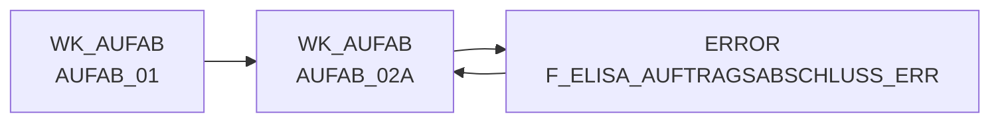

# AUFAB_02A (Table)

## Table Description

The **DWELISAAUFTRAB** application processes XML order completion messages from the ELISA system. This table serves as an intermediate staging table containing transformed order completion data from pL-Store warehouse management system.

The table stores **order completion notifications** that are generated when the last NVE (shipping unit) of an order is commissioned. These messages contain all commissioned quantities for all order positions and are transmitted to ELISA for further processing.

Key data includes order headers, position details, and a **2-level position structure**: orders can contain 1-n WaNVEs (outbound shipping units), and each WaNVE can contain 1-n articles. The table handles both regular order completions and **cancellation positions** (storno), with appropriate flags and processing logic.

This table is part of a **sequential job chain** (DWDW6449 through DW013912) that processes XML files, applies transformations including price enrichment (purchase and sales prices), and loads data into staging and EDW tables. The application runs **four times daily** and includes comprehensive error handling and metadata tracking for data quality assurance.

## Lineage / Impact



## Statements

The following statements create/modify this table:

<Util>CREATE TABLE</Util> inside [DWELISAAUFTRAB/auftragsabschlussmeldung_transfrm.sas](../../Applications/DWELISAAUFTRAB/auftragsabschlussmeldung_transfrm.sas):
```sql:line-numbers
data wk_aufab.aufab_02a;
set wk_aufab.aufab_01 (rename=(mengeInGramm=mengeInGrammc schnittGewichtInGramm=schnittGewichtInGrammc
einkaufspreis=einkaufspreisC))
error.f_elisa_auftragsabschluss_err;
run;
```

## References

The table AUFAB_02A is used in the following SAS programs:

| Application | SAS Program |
|---|---|
| [DWELISAAUFTRAB](../../Applications/DWELISAAUFTRAB) | [auftragsabschlussmeldung_transfrm.sas](../../Applications/DWELISAAUFTRAB/auftragsabschlussmeldung_transfrm.sas) |
## Table Schema

| Field Name | Datatype | Precision | Scale | Is Nullable | Constraint | Description |
|---|---|---|---|---|---|---|
| AuftragsabschlussmeldungV2_fullC | VARCHAR | 79 | 0 | TRUE |   | Full content identifier for order completion message V2 |
| lagerNummer | INTEGER | 8 | 0 | TRUE |   | Warehouse number |
| belegNummer | INTEGER | 8 | 0 | TRUE |   | Document number |
| vorgangsSchluessel | INTEGER | 8 | 0 | TRUE |   | Process key |
| wwIdent_bilanzstelle | INTEGER | 8 | 0 | TRUE |   | Business identifier balance point |
| wwIdent_vertriebsbereich | INTEGER | 8 | 0 | TRUE |   | Business identifier sales area |
| wwIdent_filialnummer | INTEGER | 8 | 0 | TRUE |   | Business identifier branch number |
| marktNummer_bereich | INTEGER | 8 | 0 | TRUE |   | Market number area |
| marktNummer_region | INTEGER | 8 | 0 | TRUE |   | Market number region |
| marktNummer_zaehlNummer | INTEGER | 8 | 0 | TRUE |   | Market number counting number |
| kommissionierlaufNummer | INTEGER | 8 | 0 | TRUE |   | Picking run number |
| kst8AuftragNummer | INTEGER | 8 | 0 | TRUE |   | Cost center 8 order number |
| plStoreAuftragsNummer | INTEGER | 8 | 0 | TRUE |   | PL Store order number |
| lieferart | INTEGER | 8 | 0 | TRUE |   | Delivery type |
| buchungsDatum_day | INTEGER | 8 | 0 | TRUE |   | Booking date day |
| buchungsDatum_month | INTEGER | 8 | 0 | TRUE |   | Booking date month |
| buchungsDatum_year | INTEGER | 8 | 0 | TRUE |   | Booking date year |
| belegDatum_day | INTEGER | 8 | 0 | TRUE |   | Document date day |
| belegDatum_month | INTEGER | 8 | 0 | TRUE |   | Document date month |
| belegDatum_year | INTEGER | 8 | 0 | TRUE |   | Document date year |
| waNve_erweiterungsZiffer | INTEGER | 8 | 0 | TRUE |   | Goods issue NVE extension digit |
| waNve_fortlaufendeNummer | INTEGER | 8 | 0 | TRUE |   | Goods issue NVE sequential number |
| waNve_globalCompanyPrefix | INTEGER | 8 | 0 | TRUE |   | Goods issue NVE global company prefix |
| waNve_pruefZiffer | INTEGER | 8 | 0 | TRUE |   | Goods issue NVE check digit |
| lhmKuerzel | VARCHAR | 20 | 0 | TRUE |   | LHM abbreviation |
| lhmArtikelnummer | VARCHAR | 20 | 0 | TRUE |   | LHM article number |
| nan | INTEGER | 8 | 0 | TRUE |   | National article number |
| waEinheit | INTEGER | 8 | 0 | TRUE |   | Goods issue unit |
| weNve_erweiterungsZiffer | INTEGER | 8 | 0 | TRUE |   | Goods receipt NVE extension digit |
| weNve_fortlaufendeNummer | INTEGER | 8 | 0 | TRUE |   | Goods receipt NVE sequential number |
| weNve_globalCompanyPrefix | INTEGER | 8 | 0 | TRUE |   | Goods receipt NVE global company prefix |
| weNve_pruefZiffer | INTEGER | 8 | 0 | TRUE |   | Goods receipt NVE check digit |
| auftragsMengeInStueck | INTEGER | 8 | 0 | TRUE |   | Order quantity in pieces |
| istKommMengeInStueck | INTEGER | 8 | 0 | TRUE |   | Actual picking quantity in pieces |
| sollKommMengeInStueck | INTEGER | 8 | 0 | TRUE |   | Target picking quantity in pieces |
| mengeInGramm | INTEGER | 8 | 0 | TRUE |   | Quantity in grams |
| kvGrund | VARCHAR | 20 | 0 | TRUE |   | Short delivery reason |
| mhd_day | INTEGER | 8 | 0 | TRUE |   | Best before date day |
| mhd_month | INTEGER | 8 | 0 | TRUE |   | Best before date month |
| mhd_year | INTEGER | 8 | 0 | TRUE |   | Best before date year |
| ursprungsland | VARCHAR | 30 | 0 | TRUE |   | Country of origin |
| charge | VARCHAR | 40 | 0 | TRUE |   | Batch number |
| lieferantenNr | VARCHAR | 5 | 0 | TRUE |   | Supplier number |
| zusatzPosition | VARCHAR | 20 | 0 | TRUE |   | Additional position |
| schnittGewichtInGramm | FLOAT | 8 | 0 | TRUE |   | Average weight in grams |
| einkaufspreis | FLOAT | 8 | 2 | TRUE |   | Purchase price |
| dateiname | VARCHAR | 100 | 0 | TRUE |   | File name |
| lfd_nr_rohdat | INTEGER | 8 | 0 | TRUE |   | Sequential number raw data |
| gebindeKz | VARCHAR | 20 | 0 | TRUE |   | Container indicator |
| fortlaufendeNummer | INTEGER | 8 | 0 | TRUE |   | Sequential number |
| gangNummer | VARCHAR | 20 | 0 | TRUE |   | Aisle number |
| platz | VARCHAR | 20 | 0 | TRUE |   | Storage location |
| faktnr | INTEGER | 8 | 0 | TRUE |   | Invoice number |
| teilKommId | INTEGER | 8 | 0 | TRUE |   | Partial picking ID |
| referenzen | VARCHAR | 32 | 0 | TRUE |   | References |
| betriebe | VARCHAR | 32 | 0 | TRUE |   | Operations |
| mhd_type | VARCHAR | 8 | 0 | TRUE |   | Best before date type |
| land_typ | VARCHAR | 24 | 0 | TRUE |   | Country type |
| grai | VARCHAR | 32 | 0 | TRUE |   | Global Returnable Asset Identifier |
| fehlerschluessel | VARCHAR | 4 | 0 | TRUE |   | Error key |
| rueckmeldungId | INTEGER | 8 | 0 | TRUE |   | Feedback ID |
| chargeid | VARCHAR | 30 | 0 | TRUE |   | Batch ID |
| storno_kennz | INTEGER | 8 | 0 | TRUE |   | Cancellation indicator |
| referenz_nan | INTEGER | 8 | 0 | TRUE |   | Reference national article number |
| referenz_waeinheit | INTEGER | 8 | 0 | TRUE |   | Reference goods issue unit |
| fmgrund_storno | VARCHAR | 20 | 0 | TRUE |   | Shortage reason cancellation |
| pickNan | INTEGER | 8 | 0 | TRUE |   | Pick national article number |
| pickEinheit | INTEGER | 8 | 0 | TRUE |   | Pick unit |