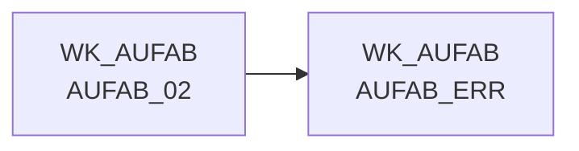

# AUFAB_ERR (Table)

## Table Description

The **wk_aufab.aufab_err** table serves as an error repository within the **DWELISAAUFTRAB** application, which processes order completion messages from the ELISA system. This application handles XML-based order completion notifications (AuftragsabschlussmeldungV2) from pL-Store to ELISA.

The table captures records that fail validation during the transformation process, specifically when master data lookups fail for critical identifiers like warehouse-market combinations (ma_lag_id), warehouse identifiers (lag_id), article numbers (nan_art_id), or market identifiers (ma_id). When these lookups return default error values (such as 1000000000 for ma_lag_id/ma_id, 9999 for lag_id, or 100000000 for nan_art_id), the records are automatically routed to this error table.

The application processes order completion data through a comprehensive pipeline including XML parsing, data transformation, price enrichment (both purchase and sales prices), and loading to staging and production databases. The error table ensures data quality by segregating problematic records that require manual review and correction, while allowing the main processing flow to continue with valid data.

This error handling mechanism is crucial for maintaining data integrity in the supply chain cockpit system, as the order completion messages contain critical information about commissioned quantities, delivery details, and article-specific data used for downstream analytics and reporting.

## Lineage / Impact



## Statements

The following statements create/modify this table:

<Util>Data Quality Check</Util> inside [DWELISAAUFTRAB/auftragsabschlussmeldung_transfrm.sas](../../Applications/DWELISAAUFTRAB/auftragsabschlussmeldung_transfrm.sas):
```sql:line-numbers
data wk_aufab.f_elisa_auftragsabschluss0
(keep= MA_LAG_ID LAG_ID NAN_ART_ID AKT_KZ LIEF_ID MA_ID KAL_TAG_ID BUCHUNGSDATUM
MHDATUM AuftragsabschlussmeldungV2_fullC lagerNummer belegNummer vorgangsSchluessel
wwIdent_bilanzstelle wwIdent_vertriebsbereich wwIdent_filialnummer
marktNummer_bereich marktNummer_region marktNummer_zaehlNummer kommissionierlaufNummer kst8AuftragNummer
plStoreAuftragsNummer lieferart buchungsDatum_day buchungsDatum_month buchungsDatum_year belegDatum_day
belegDatum_month belegDatum_year waNve_erweiterungsZiffer waNve_fortlaufendeNummer
waNve_globalCompanyPrefix waNve_pruefZiffer lhmKuerzel lhmArtikelnummer lhm_nan_art_id
nan waEinheit weNve_erweiterungsZiffer weNve_fortlaufendeNummer
weNve_globalCompanyPrefix weNve_pruefZiffer auftragsMengeInStueck istKommMengeInStueck sollKommMengeInStueck mengeInGramm kvGrund
mhd_day mhd_month mhd_year ursprungsland charge lieferantenNr zusatzPosition schnittGewichtInGramm
einkaufspreis
dateiname lfd_nr_rohdat
gebindeKz fortlaufendeNummer gangNummer platz
faktnr
teilKommId referenzen betriebe mhd_type
land_typ grai fehlerschluessel
rueckmeldungId
chargeid
storno_kennz
referenz_nan
referenz_waeinheit
referenz_nan_art_id
fmgrund_storno
pickNan
pickEinheit
)
wk_aufab.aufab_err
(keep= MA_LAG_ID LAG_ID NAN_ART_ID AKT_KZ LIEF_ID MA_ID KAL_TAG_ID BUCHUNGSDATUM
MHDATUM AuftragsabschlussmeldungV2_fullC lagerNummer belegNummer vorgangsSchluessel
wwIdent_bilanzstelle wwIdent_vertriebsbereich wwIdent_filialnummer
marktNummer_bereich marktNummer_region marktNummer_zaehlNummer kommissionierlaufNummer kst8AuftragNummer
plStoreAuftragsNummer lieferart buchungsDatum_day buchungsDatum_month buchungsDatum_year belegDatum_day
belegDatum_month belegDatum_year waNve_erweiterungsZiffer waNve_fortlaufendeNummer
waNve_globalCompanyPrefix waNve_pruefZiffer lhmKuerzel lhmArtikelnummer lhm_nan_art_id
nan waEinheit weNve_erweiterungsZiffer weNve_fortlaufendeNummer
weNve_globalCompanyPrefix weNve_pruefZiffer auftragsMengeInStueck istKommMengeInStueck sollKommMengeInStueck mengeInGramm kvGrund
mhd_day mhd_month mhd_year ursprungsland charge lieferantenNr zusatzPosition schnittGewichtInGramm
einkaufspreis
dateiname lfd_nr_rohdat mengeInGrammC schnittGewichtInGrammC einkaufspreisC
gebindeKz fortlaufendeNummer gangNummer platz
faktnr
teilKommId referenzen betriebe mhd_type
land_typ grai fehlerschluessel
rueckmeldungId
chargeid
storno_kennz
referenz_nan
referenz_waeinheit
referenz_nan_art_id
fmgrund_storno
pickNan
pickEinheit
) 
if ma_lag_id=1000000000 or lag_id=9999 or nan_art_id=100000000 or ma_id=1000000000
then output wk_aufab.aufab_err 
else output wk_aufab.f_elisa_auftragsabschluss0
```

## References

The table AUFAB_ERR is used in the following SAS programs:

| Application | SAS Program |
|---|---|
| [DWELISAAUFTRAB](../../Applications/DWELISAAUFTRAB) | [auftragsabschlussmeldung_transfrm.sas](../../Applications/DWELISAAUFTRAB/auftragsabschlussmeldung_transfrm.sas) |
## Table Schema

| Field Name | Datatype | Precision | Scale | Is Nullable | Constraint | Description |
|---|---|---|---|---|---|---|
| MA_LAG_ID | INTEGER | 8 | 0 | TRUE |   | Market-Warehouse ID for identification |
| LAG_ID | INTEGER | 4 | 0 | TRUE |   | Warehouse ID for identification |
| NAN_ART_ID | INTEGER | 9 | 0 | TRUE |   | Article ID based on NAN (National Article Number) |
| AKT_KZ | VARCHAR | 1 | 0 | TRUE |   | Action indicator flag |
| LIEF_ID | VARCHAR | 6 | 0 | TRUE |   | Supplier ID for vendor identification |
| MA_ID | INTEGER | 10 | 0 | TRUE |   | Market ID for store identification |
| KAL_TAG_ID | DATE | 8 | 0 | TRUE |   | Calendar day ID for date reference |
| BUCHUNGSDATUM | DATE | 8 | 0 | TRUE |   | Booking date for transaction |
| MHDATUM | DATE | 8 | 0 | TRUE |   | Best before date for product expiry |
| AuftragsabschlussmeldungV2_fullC | VARCHAR | 79 | 0 | TRUE |   | Full order completion message version 2 |
| lagerNummer | INTEGER | 8 | 0 | TRUE |   | Warehouse number from source system |
| belegNummer | INTEGER | 8 | 0 | TRUE |   | Document number for order reference |
| vorgangsSchluessel | INTEGER | 8 | 0 | TRUE |   | Process key for transaction identification |
| wwIdent_bilanzstelle | INTEGER | 8 | 0 | TRUE |   | Balance center identification |
| wwIdent_vertriebsbereich | INTEGER | 8 | 0 | TRUE |   | Sales area identification |
| wwIdent_filialnummer | INTEGER | 8 | 0 | TRUE |   | Branch number identification |
| marktNummer_bereich | INTEGER | 8 | 0 | TRUE |   | Market number area designation |
| marktNummer_region | INTEGER | 8 | 0 | TRUE |   | Market number region designation |
| marktNummer_zaehlNummer | INTEGER | 8 | 0 | TRUE |   | Market number counting designation |
| kommissionierlaufNummer | INTEGER | 8 | 0 | TRUE |   | Picking run number for warehouse operations |
| kst8AuftragNummer | INTEGER | 8 | 0 | TRUE |   | Cost center 8 order number |
| plStoreAuftragsNummer | INTEGER | 8 | 0 | TRUE |   | PL Store order number reference |
| lieferart | INTEGER | 8 | 0 | TRUE |   | Delivery type specification |
| buchungsDatum_day | INTEGER | 8 | 0 | TRUE |   | Booking date day component |
| buchungsDatum_month | INTEGER | 8 | 0 | TRUE |   | Booking date month component |
| buchungsDatum_year | INTEGER | 8 | 0 | TRUE |   | Booking date year component |
| belegDatum_day | INTEGER | 8 | 0 | TRUE |   | Document date day component |
| belegDatum_month | INTEGER | 8 | 0 | TRUE |   | Document date month component |
| belegDatum_year | INTEGER | 8 | 0 | TRUE |   | Document date year component |
| waNve_erweiterungsZiffer | INTEGER | 8 | 0 | TRUE |   | Goods issue NVE extension digit |
| waNve_fortlaufendeNummer | INTEGER | 8 | 0 | TRUE |   | Goods issue NVE sequential number |
| waNve_globalCompanyPrefix | INTEGER | 8 | 0 | TRUE |   | Goods issue NVE global company prefix |
| waNve_pruefZiffer | INTEGER | 8 | 0 | TRUE |   | Goods issue NVE check digit |
| lhmKuerzel | VARCHAR | 20 | 0 | TRUE |   | LHM abbreviation for identification |
| lhmArtikelnummer | VARCHAR | 20 | 0 | TRUE |   | LHM article number reference |
| lhm_nan_art_id | INTEGER | 9 | 0 | TRUE |   | LHM NAN article ID reference |
| nan | INTEGER | 8 | 0 | TRUE |   | National Article Number |
| waEinheit | INTEGER | 8 | 0 | TRUE |   | Goods issue unit specification |
| weNve_erweiterungsZiffer | INTEGER | 8 | 0 | TRUE |   | Goods receipt NVE extension digit |
| weNve_fortlaufendeNummer | INTEGER | 8 | 0 | TRUE |   | Goods receipt NVE sequential number |
| weNve_globalCompanyPrefix | INTEGER | 8 | 0 | TRUE |   | Goods receipt NVE global company prefix |
| weNve_pruefZiffer | INTEGER | 8 | 0 | TRUE |   | Goods receipt NVE check digit |
| auftragsMengeInStueck | INTEGER | 8 | 0 | TRUE |   | Order quantity in pieces |
| istKommMengeInStueck | INTEGER | 8 | 0 | TRUE |   | Actual picked quantity in pieces |
| sollKommMengeInStueck | INTEGER | 8 | 0 | TRUE |   | Target picked quantity in pieces |
| mengeInGramm | INTEGER | 8 | 0 | TRUE |   | Quantity in grams for weight measurement |
| kvGrund | VARCHAR | 20 | 0 | TRUE |   | Short delivery reason code |
| mhd_day | INTEGER | 8 | 0 | TRUE |   | Best before date day component |
| mhd_month | INTEGER | 8 | 0 | TRUE |   | Best before date month component |
| mhd_year | INTEGER | 8 | 0 | TRUE |   | Best before date year component |
| ursprungsland | VARCHAR | 30 | 0 | TRUE |   | Country of origin designation |
| charge | VARCHAR | 40 | 0 | TRUE |   | Batch number for traceability |
| lieferantenNr | VARCHAR | 5 | 0 | TRUE |   | Supplier number identification |
| zusatzPosition | VARCHAR | 20 | 0 | TRUE |   | Additional position information |
| schnittGewichtInGramm | INTEGER | 8 | 0 | TRUE |   | Average weight in grams per unit |
| einkaufspreis | DECIMAL | 10 | 2 | TRUE |   | Purchase price for cost calculation |
| dateiname | VARCHAR | 100 | 0 | TRUE |   | Source file name for data lineage |
| lfd_nr_rohdat | INTEGER | 8 | 0 | TRUE |   | Sequential number for raw data processing |
| mengeInGrammC | VARCHAR | 32 | 0 | TRUE |   | Quantity in grams as character field |
| schnittGewichtInGrammC | VARCHAR | 32 | 0 | TRUE |   | Average weight in grams as character field |
| einkaufspreisC | VARCHAR | 10 | 0 | TRUE |   | Purchase price as character field |
| gebindeKz | VARCHAR | 20 | 0 | TRUE |   | Container indicator for packaging |
| fortlaufendeNummer | INTEGER | 8 | 0 | TRUE |   | Sequential number for ordering |
| gangNummer | VARCHAR | 20 | 0 | TRUE |   | Aisle number for warehouse location |
| platz | VARCHAR | 20 | 0 | TRUE |   | Storage location designation |
| faktnr | INTEGER | 8 | 0 | TRUE |   | Invoice number reference |
| teilKommId | INTEGER | 8 | 0 | TRUE |   | Partial picking ID for split orders |
| referenzen | VARCHAR | 32 | 0 | TRUE |   | Reference information for cross-reference |
| betriebe | VARCHAR | 32 | 0 | TRUE |   | Operating facilities information |
| mhd_type | VARCHAR | 8 | 0 | TRUE |   | Best before date type specification |
| land_typ | VARCHAR | 24 | 0 | TRUE |   | Country type classification |
| grai | VARCHAR | 32 | 0 | TRUE |   | Global Returnable Asset Identifier |
| fehlerschluessel | VARCHAR | 4 | 0 | TRUE |   | Error key for problem identification |
| rueckmeldungId | INTEGER | 8 | 0 | TRUE |   | Feedback ID for response tracking |
| chargeid | VARCHAR | 30 | 0 | TRUE |   | Batch ID for lot tracking |
| storno_kennz | INTEGER | 8 | 0 | TRUE |   | Cancellation indicator flag |
| referenz_nan | INTEGER | 8 | 0 | TRUE |   | Reference NAN for article substitution |
| referenz_waeinheit | INTEGER | 8 | 0 | TRUE |   | Reference goods issue unit |
| referenz_nan_art_id | INTEGER | 8 | 0 | TRUE |   | Reference NAN article ID |
| fmgrund_storno | VARCHAR | 20 | 0 | TRUE |   | Cancellation reason for short delivery |
| pickNan | INTEGER | 8 | 0 | TRUE |   | Picking NAN for warehouse operations |
| pickEinheit | INTEGER | 8 | 0 | TRUE |   | Picking unit for warehouse operations |