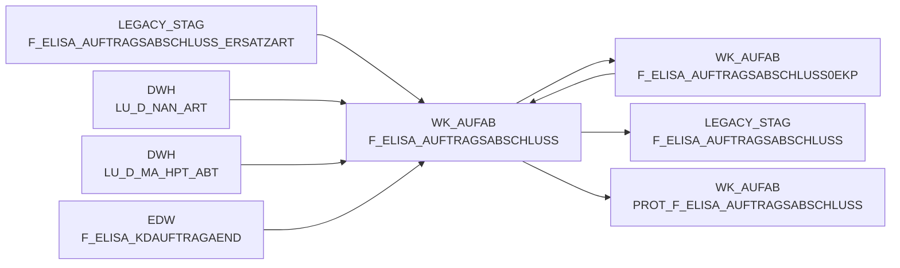

# F_ELISA_AUFTRAGSABSCHLUSS (Table)

## Table Description

_No description available_

## Lineage / Impact

## References

The table F_ELISA_AUFTRAGSABSCHLUSS is used in the following SAS programs:

| Application | SAS Program |
|---|---|
| [DWELISAAUFTRAB](../../Applications/DWELISAAUFTRAB) | [snow_auftragsabschlussmeldung_fa_mapping.sas](../../Applications/DWELISAAUFTRAB/snow_auftragsabschlussmeldung_fa_mapping.sas) |
| [DWELISAAUFTRAB](../../Applications/DWELISAAUFTRAB) | [auftragsabschlussmeldung_vkp.sas](../../Applications/DWELISAAUFTRAB/auftragsabschlussmeldung_vkp.sas) |
| [DWELISAAUFTRAB](../../Applications/DWELISAAUFTRAB) | [snow_auftragsabschlussmeldung_laden.sas](../../Applications/DWELISAAUFTRAB/snow_auftragsabschlussmeldung_laden.sas) |
| [DWELISAAUFTRAB](../../Applications/DWELISAAUFTRAB) | [auftragsabschlussmeldung_ekp.sas](../../Applications/DWELISAAUFTRAB/auftragsabschlussmeldung_ekp.sas) |
## Table Schema

| Field Name | Datatype | Precision | Scale | Is Nullable | Constraint | Description |
|---|---|---|---|---|---|---|
| MA_LAG_ID | INTEGER | 8 | 0 | FALSE | PRIMARY KEY | Market-Warehouse ID derived from warehouse number and calendar date |
| LAG_ID | INTEGER | 4 | 0 | FALSE | PRIMARY KEY | Warehouse ID derived from warehouse number and calendar date |
| NAN_ART_ID | INTEGER | 9 | 0 | FALSE | PRIMARY KEY | Article ID derived from NAN and calendar date |
| AKT_KZ | VARCHAR | 1 | 0 | FALSE | PRIMARY KEY | Action indicator for promotional articles |
| LIEF_ID | VARCHAR | 6 | 0 | FALSE | PRIMARY KEY | Supplier ID derived from supplier number and calendar date |
| MA_ID | INTEGER | 10 | 0 | FALSE | PRIMARY KEY | Market ID derived from market identification and calendar date |
| KAL_TAG_ID | DATE | 0 | 0 | FALSE | PRIMARY KEY | Calendar date ID representing the planned delivery date from order document |
| BUCHUNGSDATUM | DATE | 0 | 0 | TRUE |   | Booking date when order was processed |
| MHDATUM | DATE | 0 | 0 | TRUE |   | Best before date or expiration date of the product |
| AUFTRAGSABSCHLUSSMELDUNGV2_FULLC | VARCHAR | 79 | 0 | TRUE |   | Full content identifier for order completion message version 2 |
| LAGERNUMMER | INTEGER | 0 | 0 | FALSE |   | Warehouse number from source system |
| BELEGNUMMER | INTEGER | 0 | 0 | FALSE |   | Document number identifying the order |
| VORGANGSSCHLUESSEL | INTEGER | 0 | 0 | TRUE |   | Process key for transaction identification |
| WWIDENT_BILANZSTELLE | INTEGER | 0 | 0 | FALSE |   | Balance center identification from market identifier |
| WWIDENT_VERTRIEBSBEREICH | INTEGER | 0 | 0 | FALSE |   | Sales area identification from market identifier |
| WWIDENT_FILIALNUMMER | INTEGER | 0 | 0 | FALSE |   | Branch number from market identifier |
| MARKTNUMMER_BEREICH | INTEGER | 0 | 0 | TRUE |   | Market number area component |
| MARKTNUMMER_REGION | INTEGER | 0 | 0 | TRUE |   | Market number region component |
| MARKTNUMMER_ZAEHLNUMMER | INTEGER | 0 | 0 | TRUE |   | Market number counting component |
| KOMMISSIONIERLAUFNUMMER | INTEGER | 0 | 0 | TRUE |   | Picking run number for order processing |
| KST8AUFTRAGNUMMER | INTEGER | 0 | 0 | TRUE |   | Cost center 8 order number |
| PLSTOREAUFTRAGSNUMMER | INTEGER | 0 | 0 | TRUE |   | pL-Store order number from warehouse management system |
| LIEFERART | INTEGER | 0 | 0 | TRUE |   | Delivery type code |
| BUCHUNGSDATUM_DAY | INTEGER | 0 | 0 | TRUE |   | Day component of booking date |
| BUCHUNGSDATUM_MONTH | INTEGER | 0 | 0 | TRUE |   | Month component of booking date |
| BUCHUNGSDATUM_YEAR | INTEGER | 0 | 0 | TRUE |   | Year component of booking date |
| BELEGDATUM_DAY | INTEGER | 0 | 0 | FALSE |   | Day component of document date |
| BELEGDATUM_MONTH | INTEGER | 0 | 0 | FALSE |   | Month component of document date |
| BELEGDATUM_YEAR | INTEGER | 0 | 0 | FALSE |   | Year component of document date |
| WANVE_ERWEITERUNGSZIFFER | INTEGER | 0 | 0 | TRUE |   | Goods issue NVE extension digit |
| WANVE_FORTLAUFENDENUMMER | INTEGER | 0 | 0 | TRUE |   | Goods issue NVE sequential number |
| WANVE_GLOBALCOMPANYPREFIX | INTEGER | 0 | 0 | TRUE |   | Goods issue NVE global company prefix |
| WANVE_PRUEFZIFFER | INTEGER | 0 | 0 | TRUE |   | Goods issue NVE check digit |
| LHMKUERZEL | VARCHAR | 20 | 0 | TRUE |   | LHM abbreviation for logistics handling unit |
| LHMARTIKELNUMMER | VARCHAR | 20 | 0 | TRUE |   | LHM article number for logistics handling unit |
| LHM_NAN_ART_ID | INTEGER | 9 | 0 | TRUE |   | LHM article ID derived from LHM article number |
| NAN | INTEGER | 0 | 0 | FALSE |   | National article number from source system |
| WAEINHEIT | INTEGER | 0 | 0 | FALSE |   | Goods issue unit for quantity calculation |
| WENVE_ERWEITERUNGSZIFFER | INTEGER | 0 | 0 | TRUE |   | Goods receipt NVE extension digit |
| WENVE_FORTLAUFENDENUMMER | INTEGER | 0 | 0 | TRUE |   | Goods receipt NVE sequential number |
| WENVE_GLOBALCOMPANYPREFIX | INTEGER | 0 | 0 | TRUE |   | Goods receipt NVE global company prefix |
| WENVE_PRUEFZIFFER | INTEGER | 0 | 0 | TRUE |   | Goods receipt NVE check digit |
| AUFTRAGSMENGEINSTUECK | INTEGER | 0 | 0 | FALSE |   | Ordered quantity in pieces |
| ISTKOMMMENGEINSTUECK | INTEGER | 0 | 0 | FALSE |   | Actually picked quantity in pieces |
| SOLLKOMMMENGEINSTUECK | INTEGER | 0 | 0 | FALSE |   | Target picking quantity in pieces after modifications |
| MENGEINGRAMM | DECIMAL | 32 | 0 | TRUE |   | Quantity in grams for weight-based articles |
| KVGRUND | VARCHAR | 20 | 0 | TRUE |   | Reason code for quantity variance or shortage |
| MHD_DAY | INTEGER | 0 | 0 | TRUE |   | Day component of best before date |
| MHD_MONTH | INTEGER | 0 | 0 | TRUE |   | Month component of best before date |
| MHD_YEAR | INTEGER | 0 | 0 | TRUE |   | Year component of best before date |
| URSPRUNGSLAND | VARCHAR | 30 | 0 | TRUE |   | Country of origin for the product |
| CHARGE | VARCHAR | 40 | 0 | TRUE |   | Batch or lot number for product traceability |
| LIEFERANTENNR | VARCHAR | 5 | 0 | TRUE |   | Supplier number from source system |
| ZUSATZPOSITION | VARCHAR | 20 | 0 | TRUE |   | Additional position indicator or code |
| SCHNITTGEWICHTINGRAMM | DECIMAL | 32 | 0 | TRUE |   | Average weight per piece in grams |
| EINKAUFSPREIS | DECIMAL | 10 | 2 | TRUE |   | Purchase price per unit |
| DATEINAME | VARCHAR | 100 | 0 | FALSE |   | Source XML filename for data lineage |
| LFD_NR_ROHDAT | INTEGER | 0 | 0 | FALSE |   | Sequential number for raw data processing |
| GEBINDEKZ | VARCHAR | 20 | 0 | TRUE |   | Package or container indicator |
| FORTLAUFENDENUMMER | INTEGER | 0 | 0 | TRUE |   | Sequential number for processing order |
| GANGNUMMER | VARCHAR | 20 | 0 | TRUE |   | Aisle number in warehouse for picking location |
| PLATZ | VARCHAR | 20 | 0 | TRUE |   | Storage location or bin in warehouse |
| FAKTNR | INTEGER | 0 | 0 | TRUE |   | Invoice number reference |
| TEILKOMMID | INTEGER | 0 | 0 | TRUE |   | Partial picking ID for split orders |
| REFERENZEN | VARCHAR | 32 | 0 | TRUE |   | Reference information for order processing |
| BETRIEBE | VARCHAR | 32 | 0 | TRUE |   | Operating unit or facility information |
| MHD_TYPE | VARCHAR | 8 | 0 | TRUE |   | Best before date type indicator |
| LAND_TYP | VARCHAR | 24 | 0 | TRUE |   | Country type classification |
| GRAI | VARCHAR | 32 | 0 | TRUE |   | Global Returnable Asset Identifier |
| FEHLERSCHLUESSEL | VARCHAR | 4 | 0 | TRUE |   | Error code for processing issues |
| RUECKMELDUNGID | INTEGER | 0 | 0 | TRUE |   | Feedback message ID for order status |
| CHARGEID | VARCHAR | 30 | 0 | TRUE |   | Batch ID for product lot tracking |
| STORNO_KENNZ | INTEGER | 0 | 0 | TRUE |   | Cancellation indicator for reversed orders |
| REFERENZ_NAN | INTEGER | 0 | 0 | TRUE |   | Reference NAN for substitute articles |
| REFERENZ_WAEINHEIT | INTEGER | 0 | 0 | TRUE |   | Reference goods issue unit for substitutes |
| REFERENZ_NAN_ART_ID | INTEGER | 0 | 0 | TRUE |   | Reference article ID for substitute articles |
| VK_BTO | DECIMAL | 10 | 2 | TRUE |   | Gross sales price including tax |
| VK_NTO | DECIMAL | 10 | 2 | TRUE |   | Net sales price excluding tax |
| VK_BEWERT_KZ | INTEGER | 0 | 0 | TRUE |   | Sales price evaluation indicator |
| FMGRUND_STORNO | VARCHAR | 20 | 0 | TRUE |   | Reason code for cancellation from FM system |
| PICKNAN | INTEGER | 0 | 0 | TRUE |   | Picking NAN for warehouse operations |
| PICKEINHEIT | INTEGER | 0 | 0 | TRUE |   | Picking unit for warehouse operations |