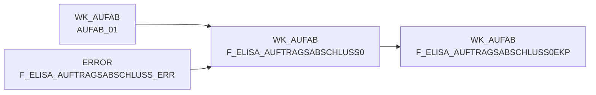

# F_ELISA_AUFTRAGSABSCHLUSS0 (Table)

## Table Description

_No description available_

## Lineage / Impact

## References

The table F_ELISA_AUFTRAGSABSCHLUSS0 is used in the following SAS programs:

| Application | SAS Program |
|---|---|
| [DWELISAAUFTRAB](../../Applications/DWELISAAUFTRAB) | [auftragsabschlussmeldung_ekp.sas](../../Applications/DWELISAAUFTRAB/auftragsabschlussmeldung_ekp.sas) |
| [DWELISAAUFTRAB](../../Applications/DWELISAAUFTRAB) | [auftragsabschlussmeldung_transfrm.sas](../../Applications/DWELISAAUFTRAB/auftragsabschlussmeldung_transfrm.sas) |
## Table Schema

| Field Name | Datatype | Precision | Scale | Is Nullable | Constraint | Description |
|---|---|---|---|---|---|---|
| MA_LAG_ID | INTEGER | 8 | 0 | TRUE |   | Market-Warehouse ID derived from warehouse number and calendar date |
| LAG_ID | INTEGER | 4 | 0 | TRUE |   | Warehouse ID derived from warehouse number and calendar date |
| NAN_ART_ID | INTEGER | 9 | 0 | TRUE |   | Article ID derived from NAN and calendar date |
| AKT_KZ | VARCHAR | 1 | 0 | TRUE |   | Action indicator flag |
| LIEF_ID | VARCHAR | 6 | 0 | TRUE |   | Supplier ID derived from supplier number and calendar date |
| MA_ID | INTEGER | 10 | 0 | TRUE |   | Market ID derived from store identification and calendar date |
| KAL_TAG_ID | DATE | 8 | 0 | TRUE |   | Calendar date ID from document date |
| BUCHUNGSDATUM | DATE | 8 | 0 | TRUE |   | Booking date from XML message |
| MHDATUM | DATE | 8 | 0 | TRUE |   | Best before date from XML message |
| AuftragsabschlussmeldungV2_fullC | VARCHAR | 79 | 0 | TRUE |   | Order completion message version 2 full content |
| lagerNummer | INTEGER | 8 | 0 | TRUE |   | Warehouse number from XML message |
| belegNummer | INTEGER | 8 | 0 | TRUE |   | Document number from XML message |
| vorgangsSchluessel | INTEGER | 8 | 0 | TRUE |   | Process key from XML message |
| wwIdent_bilanzstelle | INTEGER | 8 | 0 | TRUE |   | Store identification balance center |
| wwIdent_vertriebsbereich | INTEGER | 8 | 0 | TRUE |   | Store identification sales area |
| wwIdent_filialnummer | INTEGER | 8 | 0 | TRUE |   | Store identification branch number |
| marktNummer_bereich | INTEGER | 8 | 0 | TRUE |   | Market number area |
| marktNummer_region | INTEGER | 8 | 0 | TRUE |   | Market number region |
| marktNummer_zaehlNummer | INTEGER | 8 | 0 | TRUE |   | Market number counting number |
| kommissionierlaufNummer | INTEGER | 8 | 0 | TRUE |   | Picking run number |
| kst8AuftragNummer | INTEGER | 8 | 0 | TRUE |   | Cost center 8 order number |
| plStoreAuftragsNummer | INTEGER | 8 | 0 | TRUE |   | pL-Store order number |
| lieferart | INTEGER | 8 | 0 | TRUE |   | Delivery type |
| buchungsDatum_day | INTEGER | 8 | 0 | TRUE |   | Booking date day component |
| buchungsDatum_month | INTEGER | 8 | 0 | TRUE |   | Booking date month component |
| buchungsDatum_year | INTEGER | 8 | 0 | TRUE |   | Booking date year component |
| belegDatum_day | INTEGER | 8 | 0 | TRUE |   | Document date day component |
| belegDatum_month | INTEGER | 8 | 0 | TRUE |   | Document date month component |
| belegDatum_year | INTEGER | 8 | 0 | TRUE |   | Document date year component |
| waNve_erweiterungsZiffer | INTEGER | 8 | 0 | TRUE |   | Goods issue NVE extension digit |
| waNve_fortlaufendeNummer | INTEGER | 8 | 0 | TRUE |   | Goods issue NVE sequential number |
| waNve_globalCompanyPrefix | INTEGER | 8 | 0 | TRUE |   | Goods issue NVE global company prefix |
| waNve_pruefZiffer | INTEGER | 8 | 0 | TRUE |   | Goods issue NVE check digit |
| lhmKuerzel | VARCHAR | 20 | 0 | TRUE |   | LHM abbreviation |
| lhmArtikelnummer | VARCHAR | 20 | 0 | TRUE |   | LHM article number |
| lhm_nan_art_id | INTEGER | 9 | 0 | TRUE |   | LHM NAN article ID |
| nan | INTEGER | 8 | 0 | TRUE |   | National article number |
| waEinheit | INTEGER | 8 | 0 | TRUE |   | Goods issue unit |
| weNve_erweiterungsZiffer | INTEGER | 8 | 0 | TRUE |   | Goods receipt NVE extension digit |
| weNve_fortlaufendeNummer | INTEGER | 8 | 0 | TRUE |   | Goods receipt NVE sequential number |
| weNve_globalCompanyPrefix | INTEGER | 8 | 0 | TRUE |   | Goods receipt NVE global company prefix |
| weNve_pruefZiffer | INTEGER | 8 | 0 | TRUE |   | Goods receipt NVE check digit |
| auftragsMengeInStueck | INTEGER | 8 | 0 | TRUE |   | Order quantity in pieces |
| istKommMengeInStueck | INTEGER | 8 | 0 | TRUE |   | Actual picked quantity in pieces |
| sollKommMengeInStueck | INTEGER | 8 | 0 | TRUE |   | Target picked quantity in pieces |
| mengeInGramm | INTEGER | 8 | 0 | TRUE |   | Quantity in grams |
| kvGrund | VARCHAR | 20 | 0 | TRUE |   | Short delivery reason code |
| mhd_day | INTEGER | 8 | 0 | TRUE |   | Best before date day component |
| mhd_month | INTEGER | 8 | 0 | TRUE |   | Best before date month component |
| mhd_year | INTEGER | 8 | 0 | TRUE |   | Best before date year component |
| ursprungsland | VARCHAR | 30 | 0 | TRUE |   | Country of origin |
| charge | VARCHAR | 40 | 0 | TRUE |   | Batch number |
| lieferantenNr | VARCHAR | 5 | 0 | TRUE |   | Supplier number |
| zusatzPosition | VARCHAR | 20 | 0 | TRUE |   | Additional position indicator |
| schnittGewichtInGramm | INTEGER | 8 | 0 | TRUE |   | Average weight in grams |
| einkaufspreis | DECIMAL | 8 | 2 | TRUE |   | Purchase price |
| dateiname | VARCHAR | 100 | 0 | TRUE |   | Source XML filename |
| lfd_nr_rohdat | INTEGER | 8 | 0 | TRUE |   | Sequential number for raw data processing |
| gebindeKz | VARCHAR | 20 | 0 | TRUE |   | Container indicator |
| fortlaufendeNummer | INTEGER | 8 | 0 | TRUE |   | Sequential number |
| gangNummer | VARCHAR | 20 | 0 | TRUE |   | Aisle number |
| platz | VARCHAR | 20 | 0 | TRUE |   | Storage location |
| faktnr | INTEGER | 8 | 0 | TRUE |   | Invoice number |
| teilKommId | INTEGER | 8 | 0 | TRUE |   | Partial picking ID |
| referenzen | VARCHAR | 32 | 0 | TRUE |   | References |
| betriebe | VARCHAR | 32 | 0 | TRUE |   | Operations |
| mhd_type | VARCHAR | 8 | 0 | TRUE |   | Best before date type |
| land_typ | VARCHAR | 24 | 0 | TRUE |   | Country type |
| grai | VARCHAR | 32 | 0 | TRUE |   | Global Returnable Asset Identifier |
| fehlerschluessel | VARCHAR | 4 | 0 | TRUE |   | Error code |
| rueckmeldungId | INTEGER | 8 | 0 | TRUE |   | Feedback ID |
| chargeid | VARCHAR | 30 | 0 | TRUE |   | Batch ID |
| storno_kennz | INTEGER | 8 | 0 | TRUE |   | Cancellation indicator |
| referenz_nan | INTEGER | 8 | 0 | TRUE |   | Reference national article number |
| referenz_waeinheit | INTEGER | 8 | 0 | TRUE |   | Reference goods issue unit |
| referenz_nan_art_id | INTEGER | 8 | 0 | TRUE |   | Reference NAN article ID |
| fmgrund_storno | VARCHAR | 20 | 0 | TRUE |   | Cancellation reason code |
| pickNan | INTEGER | 8 | 0 | TRUE |   | Pick national article number |
| pickEinheit | INTEGER | 8 | 0 | TRUE |   | Pick unit |