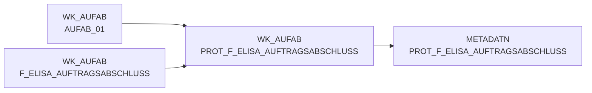

# PROT_F_ELISA_AUFTRAGSABSCHLUSS (Table)

## Table Description

**DWELISAAUFTRAB** is a comprehensive data warehouse application that processes **order completion messages** from the ELISA system. This application handles XML-based order completion notifications (AuftragsabschlussmeldungV2) from pL-Store to ELISA, containing detailed information about commissioned quantities for all order positions.

The application operates through a **sequential job chain** (DWDW6449 through DW013912) that performs data movement, XML parsing, transformation, pricing integration, and database loading. It processes order completion data including warehouse numbers, document numbers, article identifiers, commissioned quantities, and various logistics metadata.

Key functionalities include **XML file processing** with custom mapping configurations, **master data reconciliation** for warehouses and articles, **pricing integration** (both purchase and sales prices), and **replacement article handling**. The system supports multiple data versions and includes comprehensive error handling with email notifications.

The application transforms raw XML data into structured formats compatible with existing ELVS systems, aggregating data to the F_ELVS_FEHL_ART level for supply chain analytics. It handles **multi-level position structures** (orders containing 1-n WaNVE, each containing 1-n articles) and manages **cancellation positions** separately.

Data flows from raw XML files through staging tables to final EDW tables in Snowflake, with comprehensive metadata tracking, data archiving, and cleanup processes. The system runs **four times daily** and includes safeguards for missing data scenarios and structural changes in XML formats.

## Lineage / Impact



## Statements

The following statements create/modify this table:

<Util>CREATE TABLE</Util> inside [DWELISAAUFTRAB/auftragsabschlussmeldung_einlesen.sas](../../Applications/DWELISAAUFTRAB/auftragsabschlussmeldung_einlesen.sas):
```sql:line-numbers
data wk_aufab.prot_f_elisa_auftragsabschluss;
if 0 then set metadatn.prot_f_elisa_auftragsabschluss;
datum = today();
zeit = time();
anzahl_rohdateien = &anz_xml_dateien.;
gelesene_saetze = &entladene_saetze.;
lfd_nr_rohdat = &meta_lfd_nummer.;
output;
stop;
run;
```

## References

The table PROT_F_ELISA_AUFTRAGSABSCHLUSS is used in the following SAS programs:

| Application | SAS Program |
|---|---|
| [DWELISAAUFTRAB](../../Applications/DWELISAAUFTRAB) | [auftragsabschlussmeldung_einlesen.sas](../../Applications/DWELISAAUFTRAB/auftragsabschlussmeldung_einlesen.sas) |
| [DWELISAAUFTRAB](../../Applications/DWELISAAUFTRAB) | [snow_auftragsabschlussmeldung_fa_mapping.sas](../../Applications/DWELISAAUFTRAB/snow_auftragsabschlussmeldung_fa_mapping.sas) |
| [DWELISAAUFTRAB](../../Applications/DWELISAAUFTRAB) | [auftragsabschlussmeldung_metadaten.sas](../../Applications/DWELISAAUFTRAB/auftragsabschlussmeldung_metadaten.sas) |
## Table Schema

| Field Name | Datatype | Precision | Scale | Is Nullable | Constraint | Description |
|---|---|---|---|---|---|---|
| datum | DATE |  |  | FALSE | PRIMARY KEY | Date when the protocol record was created |
| zeit | TIME |  |  | FALSE | PRIMARY KEY | Time when the protocol record was created |
| anzahl_rohdateien | INTEGER |  |  | TRUE |   | Number of raw data files processed |
| gelesene_saetze | INTEGER |  |  | TRUE |   | Number of records read from raw data files |
| lfd_nr_rohdat | INTEGER |  |  | TRUE |   | Sequential number for raw data processing |
| anz_err_in | INTEGER |  |  | TRUE |   | Number of error records input |
| anz_err_out | INTEGER |  |  | TRUE |   | Number of error records output |
| geladene_saetze | INTEGER |  |  | TRUE |   | Number of records loaded to target system |
| sicherungsdatei | VARCHAR | 100 |  | TRUE |   | Name of the backup file containing archived raw data |