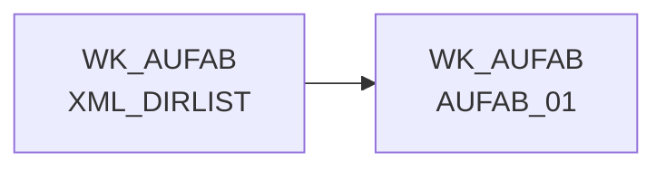

# XML_DIRLIST (Table)

## Table Description

The **xml_dirlist** table is a core component of the **DWELISAAUFTRAB** application, which processes order completion messages from the ELISA system. This table serves as a **directory listing** that contains metadata about XML files to be processed during the data ingestion workflow.

The table is populated by the `%dirlist` macro and stores information about XML files located in the raw data directory. It acts as a **control mechanism** for the entire processing chain - when no files are present in this table, the `%complete_aufab` macro automatically terminates subsequent jobs in the workflow to prevent unnecessary processing.

This table is essential for the **file-based ETL process** that reads order completion messages (AuftragsabschlussmeldungV2) from pL-Store systems. The application processes these XML messages through multiple stages including data movement, parsing, transformation, price enrichment, and loading into staging and production databases.

The xml_dirlist table enables **restartability** and **error handling** by providing a clear inventory of files to be processed, supporting the application's four-times-daily execution schedule for supply chain data processing.

## Lineage / Impact



## Statements

The following statements create/modify this table:

<Util>CREATE TABLE</Util> inside [DWELISAAUFTRAB/auftragsabschlussmeldung_einlesen.sas](../../Applications/DWELISAAUFTRAB/auftragsabschlussmeldung_einlesen.sas):
```sql:line-numbers
%dirlist(path=&raw_data., data=wk_aufab.xml_dirlist, regex_fname="/^.*.xml/ i", keep_fname=1 )
```

## References

The table XML_DIRLIST is used in the following SAS programs:

| Application | SAS Program |
|---|---|
| [DWELISAAUFTRAB](../../Applications/DWELISAAUFTRAB) | [auftragsabschlussmeldung_einlesen.sas](../../Applications/DWELISAAUFTRAB/auftragsabschlussmeldung_einlesen.sas) |
## Table Schema

| Field Name | Datatype | Precision | Scale | Is Nullable | Constraint | Description |
|---|---|---|---|---|---|---|
| fpath | VARCHAR | NULL | NULL | TRUE |   | File path of the XML file |
| fname | VARCHAR | NULL | NULL | TRUE |   | File name of the XML file |