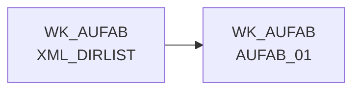

# XML_DIRLIST (Table)

## Table Description

_No description available_

## Lineage / Impact

## References

The table XML_DIRLIST is used in the following SAS programs:

| Application | SAS Program |
|---|---|
| [DWELISAAUFTRAB](../../Applications/DWELISAAUFTRAB) | [auftragsabschlussmeldung_einlesen.sas](../../Applications/DWELISAAUFTRAB/auftragsabschlussmeldung_einlesen.sas) |
## Table Schema

| Field Name | Datatype | Precision | Scale | Is Nullable | Constraint | Description |
|---|---|---|---|---|---|---|
| fpath | VARCHAR | NULL | NULL | TRUE |   | File path of the XML file |
| fname | VARCHAR | NULL | NULL | TRUE |   | File name of the XML file |