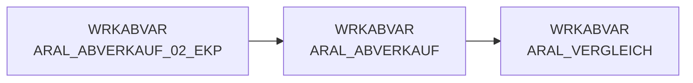

# ARAL_ABVERKAUF (Table)

## Table Description

**DWABVARAL** is a comprehensive data warehouse application that processes **Aral fuel station sales data** (Abverkaufsdaten) within the REWE Group's data warehouse infrastructure.

The application handles the complete **ETL pipeline** for Aral point-of-sale transactions, including:

• **Data ingestion** from raw files delivered via DFUE interface
• **File processing** with validation, decompression, and format conversion
• **Data transformation** including article mapping (EAN to NAN conversion), market ID assignment, and purchase price evaluation
• **Quality assurance** through control record validation and sequence number verification
• **Data loading** to staging and production environments in Snowflake DWH

The table **WRKABVAR.ARAL_ABVERKAUF** serves as the primary working dataset containing processed Aral sales transactions with enriched attributes like market IDs (MA_ID), article numbers (NAN_ART_ID), and various pricing fields. Each record represents an individual sales position with detailed transaction information including timestamps, quantities, prices, and payment methods.

The application supports **automated daily processing** with comprehensive error handling, metadata tracking, and data archiving capabilities. It integrates with the broader REWE data ecosystem through standardized interfaces and maintains full audit trails for regulatory compliance.

## Lineage / Impact



## Statements

The following statements create/modify this table:

<Util>CREATE TABLE</Util> inside [DWABVARAL/snow_abv_aral_einlesen.sas](../../Applications/DWABVARAL/snow_abv_aral_einlesen.sas):
```sql:line-numbers
data WRKABVAR.ARAL_ABVERKAUF (drop=physname kennsatz)
WRKABVAR.ARAL_ABVERKAUF_KONTROLL_SATZ (KEEP = ARAL_SATZANZ ARAL_VORGAENGER ROHDATEI)
WRKABVAR.ARAL_ABVERKAUF_FEHLER;
set WRKABVAR.PHYSDAT;
ATTRIB ARAL_SATZ_ART FORMAT=$1. LABEL='ARAL_SATZ_ART'
ARAL_PART_NR FORMAT=$13. LABEL='ARAL_PART_NR'
ARAL_WAEHRUNG FORMAT=$5. LABEL='ARAL_WAEHRUNG'
ARAL_VERKAUF_DATUM FORMAT=eurdfdd10. LABEL='ARAL_VERKAUF_DATUM'
ARAL_VERKAUF_ZEIT FORMAT=time8. LABEL='ARAL_VERKAUF_ZEIT'
ARAL_VERKAUF_ORT FORMAT=2. LABEL='ARAL_VERKAUF_ORT'
ARAL_BELEG FORMAT=6. LABEL='ARAL_BELEG'
ARAL_MWST_TYP FORMAT=1. LABEL='ARAL_MWST_TYP'
ARAL_EAN FORMAT=$18. LABEL='ARAL_EAN'
ARAL_MENGE FORMAT=9.2 LABEL='ARAL_MENGE'
ARAL_VK_MNG_EINH FORMAT=$1. LABEL='ARAL_VK_MNG_EINH'
ARAL_BMENGE FORMAT=9.2 LABEL='ARAL_BMENGE'
ARAL_MNG_EINH FORMAT=$3. LABEL='ARAL_MNG_EINH'
ARAL_MATNR FORMAT=$18. LABEL='ARAL_MATNR'
ARAL_NAN FORMAT=$7. LABEL='ARAL_NAN'
ARAL_BETRAG FORMAT=11.2 LABEL='ARAL_BETRAG'
ARAL_EK_PREIS FORMAT=11.3 LABEL='ARAL_EK_PREIS'
ARAL_VK_PREIS FORMAT=11.3 LABEL='ARAL_VK_PREIS'
ARAL_GES_BETRAG FORMAT=11.2 LABEL='ARAL_GES_BETRAG'
ARAL_KRED_KL FORMAT=$4. LABEL='ARAL_KRED_KL'
ARAL_VK_BETRAG_NTO FORMAT=11.2 LABEL='ARAL_VK_BETRAG_NTO'
ARAL_GES_BETRAG_NTO FORMAT=11.2 LABEL='ARAL_GES_BETRAG_NTO'
LFD_NR_ROHDATEI FORMAT=10. LABEL='LFD_NR_ROHDATEI'
LFD_NR_LOAD FORMAT=10. LABEL='LFD_NR_LOAD'
KAL_TAG_ID FORMAT=EURDFDD10. LABEL='KAL_TAG_ID';
LENGTH ARAL_SATZ_ART $1. ARAL_PART_NR $13. ARAL_WAEHRUNG $5. ARAL_VERKAUF_DATUM_CHAR $8. ARAL_VERKAUF_ZEIT_CHAR $6. ARAL_VERKAUF_ORT 8. ARAL_BELEG 8. ARAL_MWST_TYP 8. ARAL_EAN $18. ARAL_MENGE_CHAR $11. ARAL_VK_MNG_EINH $1. ARAL_BMENGE_CHAR $11. ARAL_MNG_EINH $3. ARAL_MATNR $18. ARAL_NAN $7. ARAL_BETRAG_CHAR $12. ARAL_EK_PREIS 8. ARAL_VK_PREIS 8. ARAL_GES_BETRAG_CHAR $12. ARAL_KRED_KL $4. ARAL_VK_BETRAG_NTO_CHAR $12. ARAL_GES_BETRAG_NTO_CHAR $12. ARAL_SATZANZ 8. ARAL_VORGAENGER 8. ROHDATEI $19. LFD_NR_ROHDATEI 8. LFD_NR_LOAD 8.;
RETAIN LFD_NR_LOAD &LFD.;
name = &rohdaten/abverkauf_aral/||physname;
infile _temp_ filevar=name end=done DELIMITER = ';' missover LRECL=300 dsd pad &SAS_FILENAME_DISK_OPTIONS.;
do until(done);
input @1 ARAL_SATZ_ART $1 @;
select (ARAL_SATZ_ART);
when ('I') link position;
when ('T') link kontrolle;
otherwise link rest;
end;
END;
return;
position:
INPUT @1 ARAL_SATZ_ART ARAL_PART_NR ARAL_WAEHRUNG ARAL_VERKAUF_DATUM_CHAR ARAL_VERKAUF_ZEIT_CHAR ARAL_VERKAUF_ORT ARAL_BELEG ARAL_MWST_TYP ARAL_EAN ARAL_MENGE_CHAR ARAL_VK_MNG_EINH ARAL_BMENGE_CHAR ARAL_MNG_EINH ARAL_MATNR ARAL_NAN ARAL_BETRAG_CHAR ARAL_EK_PREIS ARAL_VK_PREIS ARAL_GES_BETRAG_CHAR ARAL_KRED_KL ARAL_VK_BETRAG_NTO_CHAR ARAL_GES_BETRAG_NTO_CHAR;
ARAL_VERKAUF_DATUM = input(ARAL_VERKAUF_DATUM_CHAR,yymmdd10.);
KAL_TAG_ID = ARAL_VERKAUF_DATUM;
ARAL_VERKAUF_ZEIT = input(ARAL_VERKAUF_ZEIT_CHAR,hhmmss8.);
ARAL_MENGE = input(ARAL_MENGE_CHAR,commax9.2);
ARAL_BMENGE = input(ARAL_BMENGE_CHAR,commax9.2);
ARAL_BETRAG = input(ARAL_BETRAG_CHAR,commax9.2);
ARAL_GES_BETRAG = input(ARAL_GES_BETRAG_CHAR,commax9.2);
ARAL_VK_BETRAG_NTO = input(ARAL_VK_BETRAG_NTO_CHAR,commax9.2);
ARAL_GES_BETRAG_NTO = input(ARAL_GES_BETRAG_NTO_CHAR,commax9.2);
ROHDATEI = physname;
LFD_NR_ROHDATEI = input(SUBSTR(PHYSNAME,10,10),10.);
OUTPUT WRKABVAR.ARAL_ABVERKAUF;
RETURN;
kontrolle:
INPUT ARAL_SATZANZ 3 - 15 ARAL_VORGAENGER 17 - 29;
ROHDATEI = physname;
OUTPUT WRKABVAR.ARAL_ABVERKAUF_KONTROLL_SATZ;
RETURN;
rest:
input REST $ 1-300;
output WRKABVAR.ARAL_ABVERKAUF_FEHLER;
return;
run;
```

## References

The table ARAL_ABVERKAUF is used in the following SAS programs:

| Application | SAS Program |
|---|---|
| [DWABVARAL](../../Applications/DWABVARAL) | [snow_abv_aral_einlesen.sas](../../Applications/DWABVARAL/snow_abv_aral_einlesen.sas) |
| [DWABVARAL](../../Applications/DWABVARAL) | [abv_aral_bereit.sas](../../Applications/DWABVARAL/abv_aral_bereit.sas) |
## Table Schema

| Field Name | Datatype | Precision | Scale | Is Nullable | Constraint | Description |
|---|---|---|---|---|---|---|
| ARAL_SATZ_ART | VARCHAR | 1 | 0 | TRUE |   | Satzart I = bewegungssatz T = Kontrollsatz |
| ARAL_PART_NR | VARCHAR | 13 | 0 | TRUE |   | Tankstellen GLN mit zwei führenden Nummern |
| ARAL_WAEHRUNG | VARCHAR | 5 | 0 | TRUE |   | Währungskennzeichen |
| ARAL_VERKAUF_DATUM | DATE | 0 | 0 | TRUE |   | Verkaufsdatum JJJJMMTT |
| ARAL_VERKAUF_ZEIT | TIME | 0 | 0 | TRUE |   | Verkaufszeit |
| ARAL_VERKAUF_ORT | INTEGER | 2 | 0 | TRUE |   | Verkaufsort |
| ARAL_BELEG | INTEGER | 6 | 0 | TRUE |   | Kassen-Belegnummer |
| ARAL_MWST_TYP | INTEGER | 1 | 0 | TRUE |   | MWST_TYP 1=Normal 2=Ermäßigt |
| ARAL_EAN | VARCHAR | 18 | 0 | TRUE |   | EAN |
| ARAL_MENGE | DECIMAL | 9 | 2 | TRUE |   | Menge |
| ARAL_VK_MNG_EINH | VARCHAR | 1 | 0 | TRUE |   | Verkaufsmengeneinheit als 1 |
| ARAL_BMENGE | DECIMAL | 9 | 2 | TRUE |   | Menge in SAP-Basismengeneinheit |
| ARAL_MNG_EINH | VARCHAR | 3 | 0 | TRUE |   | Basismengeneinheit |
| ARAL_MATNR | VARCHAR | 18 | 0 | TRUE |   | Artikelnummer in SAP |
| ARAL_NAN | VARCHAR | 7 | 0 | TRUE |   | REWE-Artikelnummer |
| ARAL_BETRAG | DECIMAL | 11 | 2 | TRUE |   | Verkaufsbetrag |
| ARAL_EK_PREIS | DECIMAL | 11 | 3 | TRUE |   | Einkaufspreis |
| ARAL_VK_PREIS | DECIMAL | 11 | 3 | TRUE |   | Verkaufspreis |
| ARAL_GES_BETRAG | DECIMAL | 11 | 2 | TRUE |   | Gesamtbetrag |
| ARAL_KRED_KL | VARCHAR | 4 | 0 | TRUE |   | Kreditklasse - Tabelle Kartenart |
| ARAL_VK_BETRAG_NTO | DECIMAL | 11 | 2 | TRUE |   | Verkaufsbetrag ohne MWST |
| ARAL_GES_BETRAG_NTO | DECIMAL | 11 | 2 | TRUE |   | Gesamtbetrag ohne Steuern |
| LFD_NR_ROHDATEI | INTEGER | 10 | 0 | TRUE |   | Lfd-Nr. der Rohdatei |
| LFD_NR_LOAD | INTEGER | 10 | 0 | TRUE |   | Lfd-Nr. der Ladedatei |
| KAL_TAG_ID | DATE | 0 | 0 | TRUE |   | Kalendertag ID |
| MA_ID | INTEGER | 10 | 0 | TRUE |   | Markt ID |
| NAN_ART_ID | INTEGER | 9 | 0 | TRUE |   | NAN Artikel ID |
| AKT_KZ | VARCHAR | 1 | 0 | TRUE |   | Aktualitätskennzeichen |
| STAT_KZ_ID | INTEGER | 5 | 0 | TRUE |   | Status Kennzeichen ID |
| UMS_ART_ID | INTEGER | 5 | 0 | TRUE |   | Umsatzart ID |
| FREMD_ARTIKEL_TYP_ID | INTEGER | 5 | 0 | TRUE |   | Fremd Artikel Typ ID |
| FREMD_ARTIKEL_NR | VARCHAR | 20 | 0 | TRUE |   | Fremd Artikel Nummer |
| FREMD_MARKT_TYP_ID | INTEGER | 5 | 0 | TRUE |   | Fremd Markt Typ ID |
| FREMD_MARKT_NR | VARCHAR | 14 | 0 | TRUE |   | Fremd Markt Nummer |
| KONZ_NR | INTEGER | 9 | 0 | TRUE |   | Konzern Nummer |
| VLT_ID | VARCHAR | 3 | 0 | TRUE |   | Valuta ID |
| ABV_EAN | VARCHAR | 14 | 0 | TRUE |   | Abverkauf EAN |
| ANZ_BON | INTEGER | 9 | 0 | TRUE |   | Anzahl Bon |
| ANZ_KUNDEN | INTEGER | 9 | 0 | TRUE |   | Anzahl Kunden |
| QUELLE_ID | INTEGER | 5 | 0 | TRUE |   | Quelle ID |
| ABV_BEWERT_ID | INTEGER | 5 | 0 | TRUE |   | Abverkauf Bewertung ID |
| ABT_NR | INTEGER | 5 | 0 | TRUE |   | Abteilung Nummer |
| HIST_FOKUS_GRP | INTEGER | 5 | 0 | TRUE |   | Historische Fokus Gruppe |
| HIST_FOKUS_SORT | INTEGER | 5 | 0 | TRUE |   | Historische Fokus Sortierung |
| HIST_ABT_GRP | INTEGER | 5 | 0 | TRUE |   | Historische Abteilung Gruppe |
| HIST_ABT_NR | INTEGER | 5 | 0 | TRUE |   | Historische Abteilung Nummer |
| AKTION_NR | INTEGER | 11 | 0 | TRUE |   | Aktion Nummer |
| HIST_MWST_ID | INTEGER | 5 | 0 | TRUE |   | Historische MWST ID |
| ABV_W_NN_DEK | DECIMAL | 13 | 2 | TRUE |   | Abverkauf Wert NN Deckung |
| ABV_W_WGP_DEK | DECIMAL | 13 | 2 | TRUE |   | Abverkauf Wert WGP Deckung |
| ABV_W_NN_DEK_KORR | DECIMAL | 13 | 2 | TRUE |   | Abverkauf Wert NN Deckung Korrektur |
| ABV_W_WGP_DEK_KORR | DECIMAL | 13 | 2 | TRUE |   | Abverkauf Wert WGP Deckung Korrektur |
| ABV_W_BTO_VR | DECIMAL | 13 | 2 | TRUE |   | Abverkauf Wert Brutto Vorjahr |
| ABV_W_BTO_FW | DECIMAL | 13 | 2 | TRUE |   | Abverkauf Wert Brutto Fremdwährung |
| ABV_MG | DECIMAL | 16 | 4 | TRUE |   | Abverkauf Menge |
| MF_FLAG | VARCHAR | 3 | 0 | TRUE |   | MF Flag |
| ABV_W_RKP_EK | DECIMAL | 13 | 2 | TRUE |   | Abverkauf Wert RKP Einkauf |