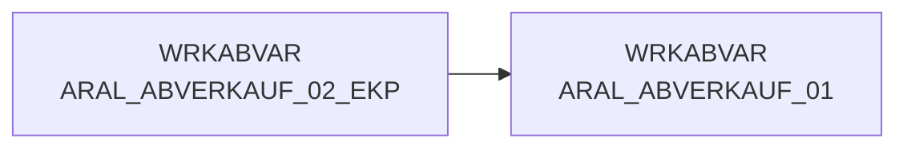

# ARAL_ABVERKAUF_01 (Table)

## Table Description

_No description available_

## Lineage / Impact

## References

The table ARAL_ABVERKAUF_01 is used in the following SAS programs:

| Application | SAS Program |
|---|---|
| [DWABVARAL](../../Applications/DWABVARAL) | [abv_aral_bereit.sas](../../Applications/DWABVARAL/abv_aral_bereit.sas) |
## Table Schema

| Field Name | Datatype | Precision | Scale | Is Nullable | Constraint | Description |
|---|---|---|---|---|---|---|
| ARAL_SATZ_ART | VARCHAR | 1 | 0 | TRUE |   | Satzart I = bewegungssatz T = Kontrollsatz |
| ARAL_PART_NR | VARCHAR | 13 | 0 | TRUE |   | Tankstellen GLN mit zwei führenden Nummern |
| ARAL_WAEHRUNG | VARCHAR | 5 | 0 | TRUE |   | Währungskennzeichen |
| ARAL_VERKAUF_DATUM | DATE | 0 | 0 | TRUE |   | Verkaufsdatum JJJJMMTT |
| ARAL_VERKAUF_ZEIT | TIME | 0 | 0 | TRUE |   | Verkaufszeit |
| ARAL_VERKAUF_ORT | INTEGER | 2 | 0 | TRUE |   | Verkaufsort |
| ARAL_BELEG | INTEGER | 6 | 0 | TRUE |   | Kassen-Belegnummer |
| ARAL_MWST_TYP | INTEGER | 1 | 0 | TRUE |   | MWST_TYP 1=Normal 2=Ermäßigt |
| ARAL_EAN | VARCHAR | 18 | 0 | TRUE |   | EAN |
| ARAL_MENGE | DECIMAL | 9 | 2 | TRUE |   | Menge |
| ARAL_VK_MNG_EINH | VARCHAR | 1 | 0 | TRUE |   | Verkaufsmengeneinheit als 1 2 3 |
| ARAL_BMENGE | DECIMAL | 9 | 2 | TRUE |   | Menge in SAP-Basismengeneinheit |
| ARAL_MNG_EINH | VARCHAR | 3 | 0 | TRUE |   | Basismengeneinheit |
| ARAL_MATNR | VARCHAR | 18 | 0 | TRUE |   | Artikelnummer in SAP |
| ARAL_NAN | VARCHAR | 7 | 0 | TRUE |   | REWE-Artikelnummer |
| ARAL_BETRAG | DECIMAL | 11 | 2 | TRUE |   | Verkaufsbetrag |
| ARAL_EK_PREIS | DECIMAL | 11 | 3 | TRUE |   | Einkaufspreis |
| ARAL_VK_PREIS | DECIMAL | 11 | 3 | TRUE |   | Verkaufspreis |
| ARAL_GES_BETRAG | DECIMAL | 11 | 2 | TRUE |   | Gesamtbetrag |
| ARAL_KRED_KL | VARCHAR | 4 | 0 | TRUE |   | Kreditklasse - Tabelle Kartenart |
| ARAL_VK_BETRAG_NTO | DECIMAL | 11 | 2 | TRUE |   | Verkaufsbetrag ohne MWST |
| ARAL_GES_BETRAG_NTO | DECIMAL | 11 | 2 | TRUE |   | Gesamtbetrag ohne Steuern |
| LFD_NR_ROHDATEI | INTEGER | 10 | 0 | TRUE |   | Lfd-Nr. der Rohdatei |
| MA_ID | INTEGER | 10 | 0 | TRUE |   | Markt-ID |
| KAL_TAG_ID | DATE | 0 | 0 | TRUE |   | Kalender Tag ID |
| LFD_NR_LOAD | INTEGER | 10 | 0 | TRUE |   | Lfd-Nr. der Ladedatei |