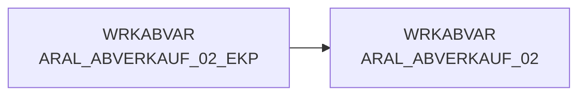

# ARAL_ABVERKAUF_02 (Table)

## Table Description

**DWABVARAL** is a data warehouse application that processes **Aral fuel station sales data** (Abverkaufsdaten) within a comprehensive ETL pipeline.

This table represents the **second processing stage** of Aral sales transactions after initial data ingestion and validation. It contains enriched sales records with additional business identifiers and standardized fields for downstream processing.

The application handles the complete lifecycle of Aral sales data: **file movement** from DFUE directories, **decompression** of raw data files, **sequential validation** of file numbering, **parsing** of semicolon-delimited transaction records, and **enrichment** with market IDs (MA_ID) and article identifiers (NAN_ART_ID).

Key processing includes **EAN-to-NAN mapping** using lookup tables, **purchase price evaluation** through specialized macros, and **data quality checks** with comprehensive error handling. The system validates record counts against control records and maintains detailed processing protocols.

This table serves as input for **final data preparation** before loading to staging tables and subsequent transfer to the **Snowflake data warehouse**. It supports retail analytics, sales reporting, and business intelligence requirements for Aral fuel station operations within the REWE Group ecosystem.

## Lineage / Impact



## Statements

The following statements create/modify this table:

<Util>CREATE TABLE</Util> inside [DWABVARAL/snow_abv_aral_einlesen.sas](../../Applications/DWABVARAL/snow_abv_aral_einlesen.sas):
```sql:line-numbers
DATA WRKABVAR.ARAL_ABVERKAUF_02;
SET WRKABVAR.ARAL_ABVERKAUF_01;
ATTRIB EAN_ART_ID FORMAT=14.0
NAN_ART_ID format=9. informat=9. label='NAN_ART_ID'
AKT_KZ format=$1. informat=$1. label='AKT_KZ'
STAT_KZ_ID format=5. label='STAT_KZ_ID'
UMS_ART_ID format=5. label='UMS_ART_ID'
FREMD_ARTIKEL_TYP_ID format=5. label='FREMD_ARTIKEL_TYP_ID'
FREMD_ARTIKEL_NR format=$20. label='FREMD_ARTIKEL_NR'
FREMD_MARKT_TYP_ID format=5. label='FREMD_MARKT_TYP_ID'
FREMD_MARKT_NR format=$14. label='FREMD_MARKT_NR'
KONZ_NR format=9. label='KONZ_NR'
VLT_ID format=$3. label='VLT_ID'
ABV_EAN format=$14. label='ABV_EAN'
ANZ_BON format=9. label='ANZ_BON'
ANZ_KUNDEN format=9. label='ANZ_KUNDEN'
QUELLE_ID format=5. label='QUELLE_ID'
ABV_BEWERT_ID format=5. label='ABV_BEWERT_ID'
ABT_NR format=5. label='ABT_NR'
HIST_FOKUS_GRP format=5. label='HIST_FOKUS_GRP'
HIST_FOKUS_SORT format=5. label='HIST_FOKUS_SORT'
HIST_ABT_GRP format=5. label='HIST_ABT_GRP'
HIST_ABT_NR format=5. label='HIST_ABT_NR'
AKTION_NR format=11. label='Aktion_NR'
ARAL_MWST_KZ format=$1. label='ARAL_MWST_KZ'
HIST_MWST_ID format=5. label='HIST_MWST_ID'
ABV_W_NN_DEK format=13.2 label='ABV_W_NN_DEK'
ABV_W_WGP_DEK format=13.2 label='ABV_W_WGP_DEK'
ABV_W_NN_DEK_KORR format=13.2 label='ABV_W_NN_DEK_KORR'
ABV_W_WGP_DEK_KORR format=13.2 label='ABV_W_WGP_DEK_KORR'
ABV_W_BTO_VR format=13.2 label='ABV_W_BTO_VR'
ABV_W_BTO_FW format=13.2 label='ABV_W_BTO_FW'
ABV_MG format=16.4 label='ABV_MG'
MF_FLAG format=$3. label='MF_FLAG'
ABV_W_RKP_EK format=13.2 label='ABV_W_RKP_EK';
AKT_KZ = '';
UMS_ART_ID = 1;
STAT_KZ_ID = 10002;
fremd_artikel_typ_id = 101;
fremd_artikel_nr = put(input(substr(ARAL_NAN,1,7),20.),z20.);
fremd_markt_typ_id = 103;
fremd_markt_nr = put(input(substr(ARAL_PART_NR,1,13),14.),z14.);
ABV_EAN = put(input(substr(ARAL_EAN,1,13),13.),z13.);
vlt_id = 'EUR';
anz_bon = 0;
anz_kunden = 0;
quelle_id =107;
abv_bewert_id =1002;
konz_nr = 0;
ABT_NR = 0;
HIST_FOKUS_GRP = 0;
HIST_FOKUS_SORT = 0;
HIST_ABT_GRP = 0;
HIST_ABT_NR = 0;
AKTION_NR = 0;
hist_mwst_id = input(compress(put(aral_mwst_typ, 1.)||put(tag_id,z8.)), taxid.);
ABV_W_NN_DEK = 0;
ABV_W_WGP_DEK = 0;
ABV_W_NN_DEK_KORR = 0;
ABV_W_WGP_DEK_KORR = 0;
ABV_W_BTO_VR = 0;
ABV_W_BTO_FW = 0;
ABV_MG = ARAL_MENGE;
MF_FLAG = ' ';
ABV_W_RKP_EK = 0;
EAN_ART_ID = input(compress('1'!!put(input(substr(ARAL_EAN,1,13),13.),z13.)),14.);
NAN_ART_ID=input(put(compress('1'||put(input(substr(ARAL_EAN,1,13),13.),z13.)||put(today(),z8.)),ean2nan.),9.);
if NAN_ART_ID=100000000 and ARAL_NAN > '0000000' then do;
nan = '0'|| put(input(ARAL_NAN,7.),z7.);
NAN_ART_ID=input(put(compress(nan||put(today(), z8.)),d_nan.),9.);
END;
if NAN_ART_ID=100000000 and ARAL_NAN > '0000000' then do;
NAN_ART_ID=input(put(compress(nan||put(today(), z8.)),akt_nan.),9.);
akt_kz = 'A';
end;
else do;
akt_kz = '';
end;
if nan_art_id=100000000 AND ARAL_MWST_TYP = 1 THEN DO;
NAN_ART_ID = 109469320;
END;
ELSE DO;
IF NAN_ART_ID = 100000000 THEN NAN_ART_ID = 109469257;
END;
RUN;
```

## References

The table ARAL_ABVERKAUF_02 is used in the following SAS programs:

| Application | SAS Program |
|---|---|
| [DWABVARAL](../../Applications/DWABVARAL) | [abv_aral_bereit.sas](../../Applications/DWABVARAL/abv_aral_bereit.sas) |
## Table Schema

| Field Name | Datatype | Precision | Scale | Is Nullable | Constraint | Description |
|---|---|---|---|---|---|---|
| ARAL_SATZ_ART | VARCHAR | 1 | 0 | TRUE |   | Satzart I = bewegungssatz T = Kontrollsatz |
| ARAL_PART_NR | VARCHAR | 13 | 0 | TRUE |   | Tankstellen GLN mit zwei führenden Nummern |
| ARAL_WAEHRUNG | VARCHAR | 5 | 0 | TRUE |   | Währungskennzeichen |
| ARAL_VERKAUF_DATUM | DATE | 0 | 0 | TRUE |   | Verkaufsdatum JJJJMMTT |
| ARAL_VERKAUF_ZEIT | TIME | 0 | 0 | TRUE |   | Verkaufszeit |
| ARAL_VERKAUF_ORT | INTEGER | 2 | 0 | TRUE |   | Verkaufsort |
| ARAL_BELEG | INTEGER | 6 | 0 | TRUE |   | Kassen-Belegnummer |
| ARAL_MWST_TYP | INTEGER | 1 | 0 | TRUE |   | MWST_TYP 1=Normal 2=Ermäßigt |
| ARAL_EAN | VARCHAR | 18 | 0 | TRUE |   | EAN |
| ARAL_MENGE | DECIMAL | 9 | 2 | TRUE |   | Menge |
| ARAL_VK_MNG_EINH | VARCHAR | 1 | 0 | TRUE |   | Verkaufsmengeneinheit als 1 |
| ARAL_BMENGE | DECIMAL | 9 | 2 | TRUE |   | Menge in SAP-Basismengeneinheit |
| ARAL_MNG_EINH | VARCHAR | 3 | 0 | TRUE |   | Basismengeneinheit |
| ARAL_MATNR | VARCHAR | 18 | 0 | TRUE |   | Artikelnummer in SAP |
| ARAL_NAN | VARCHAR | 7 | 0 | TRUE |   | REWE-Artikelnummer |
| ARAL_BETRAG | DECIMAL | 11 | 2 | TRUE |   | Verkaufsbetrag |
| ARAL_EK_PREIS | DECIMAL | 11 | 3 | TRUE |   | Einkaufspreis |
| ARAL_VK_PREIS | DECIMAL | 11 | 3 | TRUE |   | Verkaufspreis |
| ARAL_GES_BETRAG | DECIMAL | 11 | 2 | TRUE |   | Gesamtbetrag |
| ARAL_KRED_KL | VARCHAR | 4 | 0 | TRUE |   | Kreditklasse - Tabelle 'Kartenart' |
| ARAL_VK_BETRAG_NTO | DECIMAL | 11 | 2 | TRUE |   | Verkaufsbetrag ohne MWST |
| ARAL_GES_BETRAG_NTO | DECIMAL | 11 | 2 | TRUE |   | Gesamtbetrag ohne Steuern |
| LFD_NR_ROHDATEI | INTEGER | 10 | 0 | TRUE |   | Lfd-Nr. der Rohdatei |
| MA_ID | INTEGER | 10 | 0 | TRUE |   | Markt ID |
| KAL_TAG_ID | DATE | 0 | 0 | TRUE |   | Kalender Tag ID |
| LFD_NR_LOAD | INTEGER | 10 | 0 | TRUE |   | Lfd-Nr. der Ladedatei |
| EAN_ART_ID | INTEGER | 14 | 0 | TRUE |   | EAN Artikel ID |
| NAN_ART_ID | INTEGER | 9 | 0 | TRUE |   | NAN Artikel ID |
| AKT_KZ | VARCHAR | 1 | 0 | TRUE |   | Aktualitätskennzeichen |
| STAT_KZ_ID | INTEGER | 5 | 0 | TRUE |   | Status Kennzeichen ID |
| UMS_ART_ID | INTEGER | 5 | 0 | TRUE |   | Umsatz Art ID |
| FREMD_ARTIKEL_TYP_ID | INTEGER | 5 | 0 | TRUE |   | Fremd Artikel Typ ID |
| FREMD_ARTIKEL_NR | VARCHAR | 20 | 0 | TRUE |   | Fremd Artikel Nummer |
| FREMD_MARKT_TYP_ID | INTEGER | 5 | 0 | TRUE |   | Fremd Markt Typ ID |
| FREMD_MARKT_NR | VARCHAR | 14 | 0 | TRUE |   | Fremd Markt Nummer |
| KONZ_NR | INTEGER | 9 | 0 | TRUE |   | Konzern Nummer |
| VLT_ID | VARCHAR | 3 | 0 | TRUE |   | Valuta ID |
| ABV_EAN | VARCHAR | 14 | 0 | TRUE |   | Abverkauf EAN |
| ANZ_BON | INTEGER | 9 | 0 | TRUE |   | Anzahl Bon |
| ANZ_KUNDEN | INTEGER | 9 | 0 | TRUE |   | Anzahl Kunden |
| QUELLE_ID | INTEGER | 5 | 0 | TRUE |   | Quelle ID |
| ABV_BEWERT_ID | INTEGER | 5 | 0 | TRUE |   | Abverkauf Bewertung ID |
| ABT_NR | INTEGER | 5 | 0 | TRUE |   | Abteilung Nummer |
| HIST_FOKUS_GRP | INTEGER | 5 | 0 | TRUE |   | Historische Fokus Gruppe |
| HIST_FOKUS_SORT | INTEGER | 5 | 0 | TRUE |   | Historische Fokus Sortierung |
| HIST_ABT_GRP | INTEGER | 5 | 0 | TRUE |   | Historische Abteilung Gruppe |
| HIST_ABT_NR | INTEGER | 5 | 0 | TRUE |   | Historische Abteilung Nummer |
| AKTION_NR | INTEGER | 11 | 0 | TRUE |   | Aktion Nummer |
| ARAL_MWST_KZ | VARCHAR | 1 | 0 | TRUE |   | ARAL MWST Kennzeichen |
| HIST_MWST_ID | INTEGER | 5 | 0 | TRUE |   | Historische MWST ID |
| ABV_W_NN_DEK | DECIMAL | 13 | 2 | TRUE |   | Abverkauf Wert NN Deckung |
| ABV_W_WGP_DEK | DECIMAL | 13 | 2 | TRUE |   | Abverkauf Wert WGP Deckung |
| ABV_W_NN_DEK_KORR | DECIMAL | 13 | 2 | TRUE |   | Abverkauf Wert NN Deckung Korrektur |
| ABV_W_WGP_DEK_KORR | DECIMAL | 13 | 2 | TRUE |   | Abverkauf Wert WGP Deckung Korrektur |
| ABV_W_BTO_VR | DECIMAL | 13 | 2 | TRUE |   | Abverkauf Wert Brutto Vorjahr |
| ABV_W_BTO_FW | DECIMAL | 13 | 2 | TRUE |   | Abverkauf Wert Brutto Fremdwährung |
| ABV_MG | DECIMAL | 16 | 4 | TRUE |   | Abverkauf Menge |
| MF_FLAG | VARCHAR | 3 | 0 | TRUE |   | MF Flag |
| ABV_W_RKP_EK | DECIMAL | 13 | 2 | TRUE |   | Abverkauf Wert RKP Einkauf |