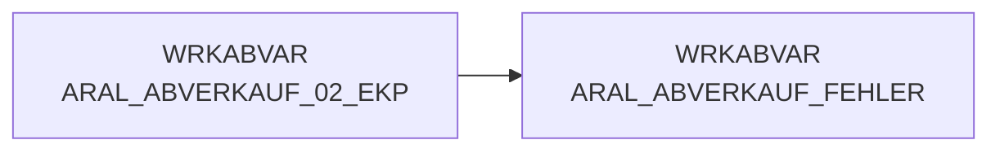

# ARAL_ABVERKAUF_FEHLER (Table)

## Table Description

**DWABVARAL** is a data warehouse application that processes **Aral fuel station sales data** (Abverkaufsdaten) within a comprehensive ETL pipeline. The application handles the complete lifecycle of Aral sales transactions from raw data ingestion to final data warehouse storage.

This table specifically stores **error records** that occur during the parsing and processing of Aral sales data files. When the main data processing script encounters malformed records that don't match expected formats (neither transaction records with satzart 'I' nor control records with satzart 'T'), these problematic records are captured in this error table for analysis and troubleshooting.

The application processes semicolon-delimited files containing detailed transaction data including sales amounts, quantities, product information, timestamps, and payment methods. The error table serves as a **quality control mechanism**, ensuring data integrity by isolating records that cannot be properly parsed, while allowing the main processing to continue with valid records.

This error tracking is essential for **monitoring data quality** from Aral's point-of-sale systems and identifying potential issues in the data transmission or format changes that require attention from both technical teams and Aral business contacts.

## Lineage / Impact



## Statements

The following statements create/modify this table:

<Util>Data Quality Check</Util> inside [DWABVARAL/snow_abv_aral_einlesen.sas](../../Applications/DWABVARAL/snow_abv_aral_einlesen.sas):
```sql:line-numbers
data WRKABVAR.ARAL_ABVERKAUF (drop=physname kennsatz)
WRKABVAR.ARAL_ABVERKAUF_KONTROLL_SATZ (KEEP = ARAL_SATZANZ ARAL_VORGAENGER ROHDATEI)
WRKABVAR.ARAL_ABVERKAUF_FEHLER;
set WRKABVAR.PHYSDAT;
[...]
* REST falsch SA *;
rest:
input
REST $ 1-300
;
output WRKABVAR.ARAL_ABVERKAUF_FEHLER;
return;
run;
```

## References

The table ARAL_ABVERKAUF_FEHLER is used in the following SAS programs:

| Application | SAS Program |
|---|---|
| [DWABVARAL](../../Applications/DWABVARAL) | [snow_abv_aral_einlesen.sas](../../Applications/DWABVARAL/snow_abv_aral_einlesen.sas) |
## Table Schema

| Field Name | Datatype | Precision | Scale | Is Nullable | Constraint | Description |
|---|---|---|---|---|---|---|
| REST | VARCHAR | 300 | 0 | TRUE |   | Fehlerhafter Datensatz aus der Rohdatei |