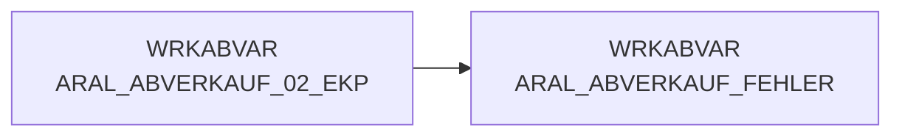

# ARAL_ABVERKAUF_FEHLER (Table)

## Table Description

_No description available_

## Lineage / Impact

## References

The table ARAL_ABVERKAUF_FEHLER is used in the following SAS programs:

| Application | SAS Program |
|---|---|
| [DWABVARAL](../../Applications/DWABVARAL) | [snow_abv_aral_einlesen.sas](../../Applications/DWABVARAL/snow_abv_aral_einlesen.sas) |
## Table Schema

| Field Name | Datatype | Precision | Scale | Is Nullable | Constraint | Description |
|---|---|---|---|---|---|---|
| REST | VARCHAR | 300 | 0 | TRUE |   | Fehlerhafter Datensatz aus der Rohdatei |