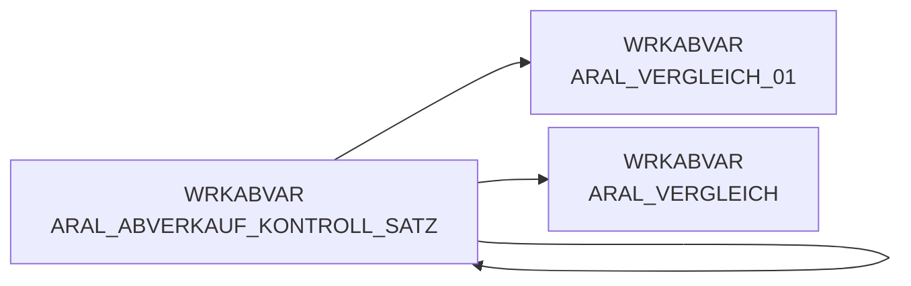

# ARAL_ABVERKAUF_KONTROLL_SATZ (Table)

## Table Description

**DWABVARAL** is a data warehouse application that processes **Aral fuel station sales data** within the REWE Group's retail analytics system.

This control record table stores **validation and control information** extracted from Aral sales data files during the ETL process. The table contains control records (identified by record type 'T') that provide **data integrity checks** including record counts and predecessor validation numbers from the source files.

The table is populated during the **snow_abv_aral_einlesen.sas** process which reads compressed Aral sales files from `/dwh/raw_data/abverkauf_aral`. Each control record validates that the number of transaction records matches expected counts, ensuring **data completeness** before further processing.

Key fields include **ARAL_SATZANZ** (record count), **ARAL_VORGAENGER** (predecessor number), and **ROHDATEI** (source filename). The application performs strict validation - if control totals don't match actual records read, processing aborts with detailed error messages.

This table supports the broader **retail sales analytics pipeline** that transforms Aral point-of-sale data into standardized formats for business intelligence reporting and financial analysis across REWE's fuel station network.

## Lineage / Impact



## Statements

The following statements create/modify this table:

<Util>CREATE TABLE</Util> inside [DWABVARAL/snow_abv_aral_einlesen.sas](../../Applications/DWABVARAL/snow_abv_aral_einlesen.sas):
```sql:line-numbers
data WRKABVAR.ARAL_ABVERKAUF (drop=physname kennsatz)
WRKABVAR.ARAL_ABVERKAUF_KONTROLL_SATZ (KEEP = ARAL_SATZANZ ARAL_VORGAENGER ROHDATEI)
WRKABVAR.ARAL_ABVERKAUF_FEHLER;
set WRKABVAR.PHYSDAT;
[...data step processing...]
kontrolle:
INPUT ARAL_SATZANZ 3 - 15
ARAL_VORGAENGER 17 - 29;
ROHDATEI = physname;
OUTPUT WRKABVAR.ARAL_ABVERKAUF_KONTROLL_SATZ;
RETURN;
```

## References

The table ARAL_ABVERKAUF_KONTROLL_SATZ is used in the following SAS programs:

| Application | SAS Program |
|---|---|
| [DWABVARAL](../../Applications/DWABVARAL) | [snow_abv_aral_einlesen.sas](../../Applications/DWABVARAL/snow_abv_aral_einlesen.sas) |
## Table Schema

| Field Name | Datatype | Precision | Scale | Is Nullable | Constraint | Description |
|---|---|---|---|---|---|---|
| ARAL_SATZANZ | INTEGER | 15 | 0 | TRUE |   | Anzahl Sätze in der Datenlieferung |
| ARAL_VORGAENGER | INTEGER | 15 | 0 | TRUE |   | fortlaufende Nummer des Vorgängersatzes |
| ROHDATEI | VARCHAR | 19 | 0 | TRUE |   | Name der Rohdatei |