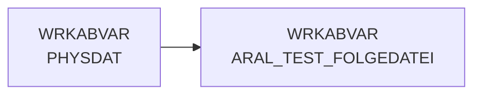

# ARAL_TEST_FOLGEDATEI (Table)

## Table Description

_No description available_

## Lineage / Impact

## References

The table ARAL_TEST_FOLGEDATEI is used in the following SAS programs:

| Application | SAS Program |
|---|---|
| [DWABVARAL](../../Applications/DWABVARAL) | [snow_abv_aral_einlesen.sas](../../Applications/DWABVARAL/snow_abv_aral_einlesen.sas) |
## Table Schema

| Field Name | Datatype | Precision | Scale | Is Nullable | Constraint | Description |
|---|---|---|---|---|---|---|
| PHYSNAME | VARCHAR | 19 | 0 | TRUE |   | Physical file name from raw data directory |
| KENNSATZ | VARCHAR | 8 | 0 | TRUE |   | File identifier extracted from filename |
| LFD_NR_ROHDATEI | INTEGER | 10 | 0 | TRUE |   | Sequential number of raw data file |
| VGL | INTEGER | 8 | 0 | TRUE |   | Comparison value for sequence validation |