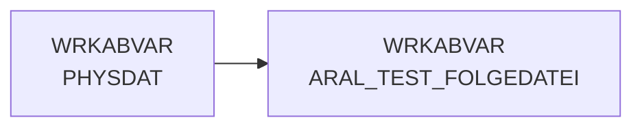

# ARAL_TEST_FOLGEDATEI (Table)

## Table Description

**DWABVARAL** is a data warehouse application that processes **Aral fuel station sales data** (Abverkaufsdaten) within a comprehensive ETL pipeline.

This table serves as a **validation checkpoint** to ensure data file sequence integrity during the Aral sales data processing workflow. It validates that incoming raw data files follow the expected sequential numbering pattern by comparing the current file's sequence number against the maximum sequence number from the metadata protocol table `METADATN.PROT_ARAL_ABVERKAUF`.

The table is created during the **data ingestion phase** and contains file metadata including physical file names, identification codes, and sequential file numbers. If sequence validation fails, the process aborts with detailed error messages and contact information for Aral support.

This validation mechanism ensures **data completeness and prevents processing gaps** in the daily Aral sales data feed, maintaining data quality standards before the files proceed to decompression, parsing, and transformation stages within the broader DWABVARAL application pipeline.

## Lineage / Impact



## Statements

The following statements create/modify this table:

<Util>CREATE TABLE</Util> inside [DWABVARAL/snow_abv_aral_einlesen.sas](../../Applications/DWABVARAL/snow_abv_aral_einlesen.sas):
```sql:line-numbers
DATA WRKABVAR.ARAL_TEST_FOLGEDATEI;
SET WRKABVAR.PHYSDAT;
RETAIN VGL &naechst.;
VGL = VGL+1;
IF LFD_NR_ROHDATEI = VGL
THEN DO; OUTPUT; END;
ELSE DO;
put 'ERRO'@; put 'R:'@; put --*;
put 'ERRO'@; put 'R:'@; put --* *;
put 'ERRO'@; put 'R:'@; put --* Achtung: Rohdatei entspricht nicht der zu erwartenden *;
put 'ERRO'@; put 'R:'@; put --* siehe METADATN.PROT_ARAL_ABVERKAUF Max LFD_NR_ROHDATEI + 1 *;
put 'ERRO'@; put 'R:'@; put --* *;
put 'ERRO'@; put 'R:'@; put --* wenn keine Rohdatei vorhanden *;
put 'ERRO'@; put 'R:'@; put --* ganze Application Complete setzen *;
put 'ERRO'@; put 'R:'@; put --* *;
put 'ERRO'@; put 'R:'@; put --* Ansprechpartner Aral: *;
put 'ERRO'@; put 'R:'@; put --* @G BOC *;
put 'ERRO'@; put 'R:'@; put --* *;
put 'ERRO'@; put 'R:'@; put --* *;
put 'ERRO'@; put 'R:'@; put --*;
ABORT ABEND 99;
END;
RUN;
```

## References

The table ARAL_TEST_FOLGEDATEI is used in the following SAS programs:

| Application | SAS Program |
|---|---|
| [DWABVARAL](../../Applications/DWABVARAL) | [snow_abv_aral_einlesen.sas](../../Applications/DWABVARAL/snow_abv_aral_einlesen.sas) |
## Table Schema

| Field Name | Datatype | Precision | Scale | Is Nullable | Constraint | Description |
|---|---|---|---|---|---|---|
| PHYSNAME | VARCHAR | 19 | 0 | TRUE |   | Physical file name from raw data directory |
| KENNSATZ | VARCHAR | 8 | 0 | TRUE |   | File identifier extracted from filename |
| LFD_NR_ROHDATEI | INTEGER | 10 | 0 | TRUE |   | Sequential number of raw data file |
| VGL | INTEGER | 8 | 0 | TRUE |   | Comparison value for sequence validation |