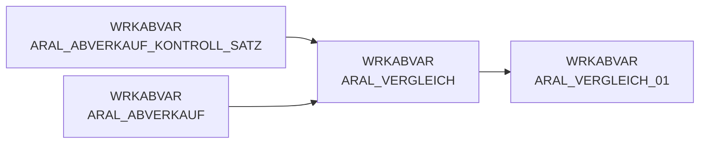

# ARAL_VERGLEICH (Table)

## Table Description

The **DWABVARAL** application processes Aral fuel station sales data through a comprehensive ETL pipeline. This table serves as a **comparison and validation dataset** within the data processing workflow.

The table is generated during the **data ingestion phase** to validate the integrity of processed Aral sales records. It contains aggregated counts of sales transactions grouped by raw data files (ROHDATEI) and load sequence numbers (LFD_NR_LOAD), enabling **quality control checks** against control records.

This validation table ensures that the number of processed sales records matches the expected counts from Aral's control records, preventing data inconsistencies. The application handles **daily sales data** from Aral fuel stations, including transaction details, product information, and pricing data.

The table supports the broader **data warehouse integration** process, where Aral sales data is transformed, validated, and prepared for loading into the enterprise data warehouse. It plays a critical role in maintaining **data quality** and ensuring complete data processing before final storage in production systems.

## Lineage / Impact



## Statements

The following statements create/modify this table:

<Util>CREATE TABLE</Util> inside [DWABVARAL/snow_abv_aral_einlesen.sas](../../Applications/DWABVARAL/snow_abv_aral_einlesen.sas):
```sql:line-numbers
CREATE TABLE WRKABVAR.ARAL_VERGLEICH AS
SELECT ROHDATEI, COUNT(*) AS VGL_ANZ
FROM WRKABVAR.ARAL_ABVERKAUF
GROUP BY ROHDATEI
ORDER BY ROHDATEI
```

## References

The table ARAL_VERGLEICH is used in the following SAS programs:

| Application | SAS Program |
|---|---|
| [DWABVARAL](../../Applications/DWABVARAL) | [snow_abv_aral_einlesen.sas](../../Applications/DWABVARAL/snow_abv_aral_einlesen.sas) |
## Table Schema

| Field Name | Datatype | Precision | Scale | Is Nullable | Constraint | Description |
|---|---|---|---|---|---|---|
| ROHDATEI | VARCHAR | 19 | 0 | TRUE |   | Name der Rohdatei |
| LFD_NR_LOAD | INTEGER | 10 | 0 | TRUE |   | Laufende Nummer der Ladedatei |
| VGL_ANZ | INTEGER | 10 | 0 | TRUE |   | Anzahl der Vergleichssätze |