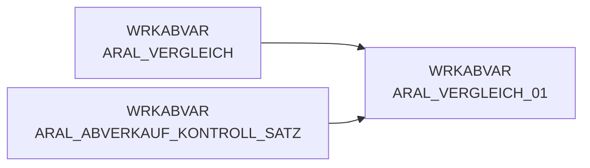

# ARAL_VERGLEICH_01 (Table)

## Table Description

**DWABVARAL** is a data warehouse application that processes **Aral fuel station sales data** for retail analytics and reporting purposes.

This table serves as a **data validation control table** that compares expected versus actual record counts during the Aral sales data processing workflow. It merges control record information from `ARAL_ABVERKAUF_KONTROLL_SATZ` with actual record counts from `ARAL_VERGLEICH` to ensure data integrity.

The table is created during the **data ingestion phase** where raw Aral sales files are read and validated. It contains fields like `ROHDATEI` (raw data file name), `ARAL_SATZANZ` (expected record count from control records), `ARAL_VORGAENGER` (predecessor record number), and `VGL_ANZ` (actual counted records).

This validation step is **critical for data quality assurance** - if the expected count from the control record doesn't match the actual processed records, the application aborts with detailed error messages. The table supports the overall ETL process that moves Aral sales data through various stages: file movement, decompression, reading, validation, enrichment with master data (MA_ID, NAN_ART_ID), purchase price evaluation, and final preparation for the data warehouse.

The application processes semicolon-delimited files containing transaction-level sales data from Aral fuel stations, including product information, quantities, prices, and timestamps.

## Lineage / Impact



## Statements

The following statements create/modify this table:

<Util>CREATE TABLE</Util> inside [DWABVARAL/snow_abv_aral_einlesen.sas](../../Applications/DWABVARAL/snow_abv_aral_einlesen.sas):
```sql:line-numbers
data WRKABVAR.ARAL_VERGLEICH_01;
merge WRKABVAR.ARAL_ABVERKAUF_KONTROLL_SATZ (in=a) WRKABVAR.ARAL_VERGLEICH (in=b);
by ROHDATEI;
run;
```

## References

The table ARAL_VERGLEICH_01 is used in the following SAS programs:

| Application | SAS Program |
|---|---|
| [DWABVARAL](../../Applications/DWABVARAL) | [snow_abv_aral_einlesen.sas](../../Applications/DWABVARAL/snow_abv_aral_einlesen.sas) |
## Table Schema

| Field Name | Datatype | Precision | Scale | Is Nullable | Constraint | Description |
|---|---|---|---|---|---|---|
| ARAL_SATZANZ | INTEGER | 13 | 0 | TRUE |   | Anzahl Sätze in der Datenlieferung |
| ARAL_VORGAENGER | INTEGER | 13 | 0 | TRUE |   | fortlaufende Nummer des Vorgängersatzes |
| ROHDATEI | VARCHAR | 19 | 0 | TRUE |   | Name der Rohdatei |
| VGL_ANZ | INTEGER | 8 | 0 | TRUE |   | Anzahl der Vergleichssätze aus ARAL_ABVERKAUF |