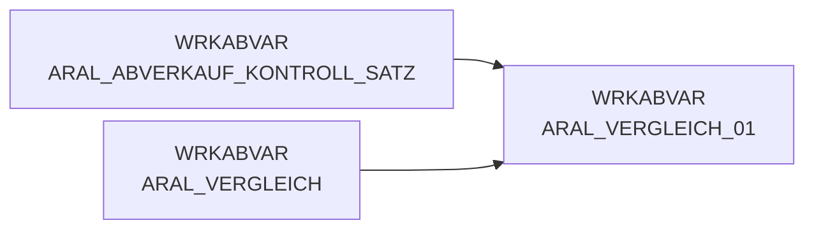

# ARAL_VERGLEICH_01 (Table)

## Table Description

_No description available_

## Lineage / Impact

## References

The table ARAL_VERGLEICH_01 is used in the following SAS programs:

| Application | SAS Program |
|---|---|
| [DWABVARAL](../../Applications/DWABVARAL) | [snow_abv_aral_einlesen.sas](../../Applications/DWABVARAL/snow_abv_aral_einlesen.sas) |
## Table Schema

| Field Name | Datatype | Precision | Scale | Is Nullable | Constraint | Description |
|---|---|---|---|---|---|---|
| ARAL_SATZANZ | INTEGER | 13 | 0 | TRUE |   | Anzahl Sätze in der Datenlieferung |
| ARAL_VORGAENGER | INTEGER | 13 | 0 | TRUE |   | fortlaufende Nummer des Vorgängersatzes |
| ROHDATEI | VARCHAR | 19 | 0 | TRUE |   | Name der Rohdatei |
| VGL_ANZ | INTEGER | 8 | 0 | TRUE |   | Anzahl der Vergleichssätze aus ARAL_ABVERKAUF |