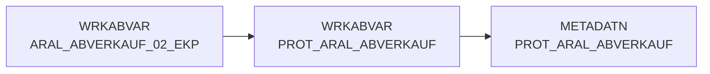

# PROT_ARAL_ABVERKAUF (Table)

## Table Description

_No description available_

## Lineage / Impact

## References

The table PROT_ARAL_ABVERKAUF is used in the following SAS programs:

| Application | SAS Program |
|---|---|
| [DWABVARAL](../../Applications/DWABVARAL) | [abv_aral_meta.sas](../../Applications/DWABVARAL/abv_aral_meta.sas) |
| [DWABVARAL](../../Applications/DWABVARAL) | [abv_aral_bereit.sas](../../Applications/DWABVARAL/abv_aral_bereit.sas) |
## Table Schema

| Field Name | Datatype | Precision | Scale | Is Nullable | Constraint | Description |
|---|---|---|---|---|---|---|
| DATUM | DATE |  |  |  |   | Datum der Verarbeitung |
| ZEIT | TIME |  |  |  |   | Zeit der Verarbeitung |
| ROHDATEI | VARCHAR | 19 |  | TRUE |   | Name der Rohdatei |
| LFD_NR_ROHDATEI | INTEGER | 10 |  | TRUE |   | Laufende Nummer der Rohdatei |
| LFD_NR_LOAD | INTEGER | 10 |  | TRUE |   | Laufende Nummer der Ladedatei |
| GELESENE_SAETZE | INTEGER | 10 |  | TRUE |   | Anzahl gelesener Sätze |
| GELADENE_SAETZE | INTEGER | 10 |  | TRUE |   | Anzahl geladener Sätze |