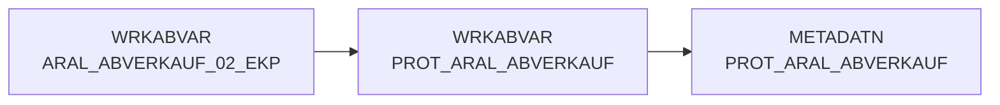

# PROT_ARAL_ABVERKAUF (Table)

## Table Description

**DWABVARAL** is a data warehouse application that processes **Aral fuel station sales data** (Abverkaufsdaten) within a comprehensive ETL pipeline.

The application handles the complete lifecycle of Aral sales transaction data, from initial file reception to final data warehouse integration. It processes daily sales files containing transaction details like EAN codes, quantities, prices, VAT information, and station identifiers.

Key processing steps include:
- **File Movement & Validation**: Moving raw data files from staging areas and validating file sequences
- **Data Extraction**: Reading semicolon-delimited sales transaction files with comprehensive error handling
- **Data Enrichment**: Adding market IDs (MA_ID), article numbers (NAN_ART_ID), and purchase price evaluations
- **Quality Control**: Validating record counts against control records and checking data consistency
- **Data Integration**: Loading processed data into staging tables and final data warehouse tables

The application supports **restart capability** and includes extensive error handling with specific contact information for Aral-related issues. It processes both transaction records (I-type) and control records (T-type), ensuring data integrity through automated validation checks.

The processed data feeds into various data mart tables and supports business intelligence reporting for fuel station sales analysis across the Aral network.

## Lineage / Impact



## Statements

The following statements create/modify this table:

<Util>CREATE TABLE</Util> inside [DWABVARAL/snow_abv_aral_einlesen.sas](../../Applications/DWABVARAL/snow_abv_aral_einlesen.sas):
```sql:line-numbers
data WRKABVAR.PROT_ARAL_ABVERKAUF(DROP=KENNSATZ PHYSNAME)
attrib
DATUM format = yymmddn8.
ZEIT format = hhmm.
ROHDATEI format = $19.
LFD_NR_ROHDATEI format = 10.
LFD_NR_LOAD format = 10.
GELESENE_SAETZE format = 10.
GELADENE_SAETZE format = 10.
set WRKABVAR.PHYSDAT
* Vermeidung der 'uninitialized'-NOTE
LFD_NR_LOAD = 0
GELESENE_SAETZE = 0
GELADENE_SAETZE = 0
datum=today() zeit=time() rohdatei=physname
run
```

## References

The table PROT_ARAL_ABVERKAUF is used in the following SAS programs:

| Application | SAS Program |
|---|---|
| [DWABVARAL](../../Applications/DWABVARAL) | [abv_aral_meta.sas](../../Applications/DWABVARAL/abv_aral_meta.sas) |
| [DWABVARAL](../../Applications/DWABVARAL) | [abv_aral_bereit.sas](../../Applications/DWABVARAL/abv_aral_bereit.sas) |
## Table Schema

| Field Name | Datatype | Precision | Scale | Is Nullable | Constraint | Description |
|---|---|---|---|---|---|---|
| DATUM | DATE |  |  |  |   | Datum der Verarbeitung |
| ZEIT | TIME |  |  |  |   | Zeit der Verarbeitung |
| ROHDATEI | VARCHAR | 19 |  | TRUE |   | Name der Rohdatei |
| LFD_NR_ROHDATEI | INTEGER | 10 |  | TRUE |   | Laufende Nummer der Rohdatei |
| LFD_NR_LOAD | INTEGER | 10 |  | TRUE |   | Laufende Nummer der Ladedatei |
| GELESENE_SAETZE | INTEGER | 10 |  | TRUE |   | Anzahl gelesener Sätze |
| GELADENE_SAETZE | INTEGER | 10 |  | TRUE |   | Anzahl geladener Sätze |